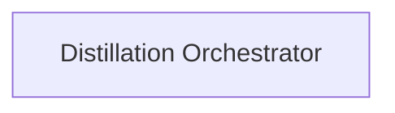

## Details

### Distillation Orchestrator [[Expand]](./Distillation_Orchestrator.md)
High-level entry point and primary orchestrator for the distillation process.

**Related Classes/Methods**:

### [FAQ](https://github.com/CodeBoarding/GeneratedOnBoardings/tree/main?tab=readme-ov-file#faq)