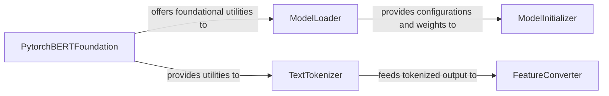

## Details

The `Model & Data Handler` subsystem is responsible for the entire lifecycle of preparing models for inference or training, encompassing the loading of pre-trained model weights, the architectural initialization of these models, and the comprehensive transformation of raw text data into a format directly consumable by the models. It acts as the crucial interface between raw inputs (models and text) and the core distillation or inference processes.

### ModelLoader
Manages the loading of pre-trained model weights and configurations for both Teacher and Student models. This includes handling various sources (local files, cached paths, TensorFlow checkpoints) and converting weights to the PyTorch format, ensuring models are ready to be initialized with specific parameters.

**Related Classes/Methods**:

- <a href="https://github.com/airaria/TextBrewer/blob/master/examples/cmrc2018_example/pytorch_pretrained_bert/modeling.py#L541-L671" target="_blank" rel="noopener noreferrer">`examples.cmrc2018_example.pytorch_pretrained_bert.modeling.from_pretrained`:541-671</a>

### ModelInitializer
Constructs the architectural backbone of the Teacher and Student models. It often involves calling an `initializer_builder` to define how model weights are initialized and setting up internal model components, preparing the model for receiving loaded weights and subsequent operations.

**Related Classes/Methods**:

- <a href="https://github.com/airaria/TextBrewer/blob/master/examples/cmrc2018_example/modeling.py#L103-L112" target="_blank" rel="noopener noreferrer">`examples.cmrc2018_example.modeling.__init__`:103-112</a>

### TextTokenizer
Converts raw text input into a sequence of tokens suitable for neural network models. This involves preprocessing steps like cleaning, accent stripping, and splitting on punctuation, adhering to the specific tokenization rules of the pre-trained models (e.g., BERT's WordPiece tokenization).

**Related Classes/Methods**:

- <a href="https://github.com/airaria/TextBrewer/blob/master/examples/cmrc2018_example/tokenization.py#L247-L298" target="_blank" rel="noopener noreferrer">`examples.cmrc2018_example.tokenization.tokenize`:247-298</a>

### FeatureConverter
Transforms tokenized text and other raw example data into numerical `InputFeatures` (e.g., input IDs, attention masks, segment IDs) that can be directly fed into the models. This component often includes task-specific logic for feature generation, adapting the tokenized data to the model's expected input format.

**Related Classes/Methods**:

- <a href="https://github.com/airaria/TextBrewer/blob/master/examples/cmrc2018_example/processing.py#L232-L429" target="_blank" rel="noopener noreferrer">`examples.cmrc2018_example.processing.convert_examples_to_features`:232-429</a>
- <a href="https://github.com/airaria/TextBrewer/blob/master/examples/conll2003_example/utils_ner.py#L90-L210" target="_blank" rel="noopener noreferrer">`examples.conll2003_example.utils_ner.convert_examples_to_features`:90-210</a>
- <a href="https://github.com/airaria/TextBrewer/blob/master/examples/mnli_example/utils_glue.py#L378-L488" target="_blank" rel="noopener noreferrer">`examples.mnli_example.utils_glue.convert_examples_to_features`:378-488</a>

### PytorchBERTFoundation
Provides foundational utilities for BERT model loading and text tokenization. This component acts as a common base for BERT-specific operations, ensuring consistency and reusability across different parts of the model and data preparation pipeline.

**Related Classes/Methods**:

- <a href="https://github.com/airaria/TextBrewer/blob/master/examples/cmrc2018_example/pytorch_pretrained_bert/modeling.py#L541-L671" target="_blank" rel="noopener noreferrer">`examples.cmrc2018_example.pytorch_pretrained_bert.modeling.from_pretrained`:541-671</a>
- <a href="https://github.com/airaria/TextBrewer/blob/master/examples/cmrc2018_example/tokenization.py#L247-L298" target="_blank" rel="noopener noreferrer">`examples.cmrc2018_example.tokenization.tokenize`:247-298</a>

### [FAQ](https://github.com/CodeBoarding/GeneratedOnBoardings/tree/main?tab=readme-ov-file#faq)