```mermaid
graph LR
    Application_Entry_Point["Application Entry Point"]
    Configuration_Manager["Configuration Manager"]
    Model_Data_Handler["Model & Data Handler"]
    Distillation_Orchestrator["Distillation Orchestrator"]
    Loss_Functions["Loss Functions"]
    Projections_Adaptors["Projections/Adaptors"]
    Evaluation_Module["Evaluation Module"]
    Application_Entry_Point -- "loads configurations from" --> Configuration_Manager
    Application_Entry_Point -- "requests preparation from" --> Model_Data_Handler
    Application_Entry_Point -- "starts training loop in" --> Distillation_Orchestrator
    Application_Entry_Point -- "triggers final assessment by" --> Evaluation_Module
    Configuration_Manager -- "supplies parameters to" --> Distillation_Orchestrator
    Configuration_Manager -- "defines parameters for" --> Model_Data_Handler
    Model_Data_Handler -- "provides models and data to" --> Distillation_Orchestrator
    Distillation_Orchestrator -- "provides inputs to" --> Loss_Functions
    Distillation_Orchestrator -- "sends data to" --> Projections_Adaptors
    Projections_Adaptors -- "returns adapted outputs to" --> Distillation_Orchestrator
    Distillation_Orchestrator -- "sends models and data to" --> Evaluation_Module
    Evaluation_Module -- "returns final results to" --> Application_Entry_Point
    click Application_Entry_Point href "https://github.com/CodeBoarding/GeneratedOnBoardings/blob/main/TextBrewer/Application_Entry_Point.md" "Details"
    click Configuration_Manager href "https://github.com/CodeBoarding/GeneratedOnBoardings/blob/main/TextBrewer/Configuration_Manager.md" "Details"
    click Model_Data_Handler href "https://github.com/CodeBoarding/GeneratedOnBoardings/blob/main/TextBrewer/Model_Data_Handler.md" "Details"
    click Distillation_Orchestrator href "https://github.com/CodeBoarding/GeneratedOnBoardings/blob/main/TextBrewer/Distillation_Orchestrator.md" "Details"
```

## Details

TextBrewer's architecture is centered around a flexible knowledge distillation pipeline. An Application Entry Point initiates the process, leveraging a Configuration Manager to define parameters. The Model & Data Handler prepares the necessary Teacher and Student models and their corresponding datasets. The core Distillation Orchestrator then takes charge, utilizing these models and data, applying various Loss Functions (potentially aided by Projections/Adaptors for output transformation), and managing the training loop. Throughout distillation, the Evaluation Module provides performance feedback, ensuring the student model's progress is monitored. This design promotes modularity, allowing for easy extension and customization of distillation strategies and model types.

### Application Entry Point [[Expand]](./Application_Entry_Point.md)
Orchestrates the overall distillation, training, and evaluation processes, serving as the main execution point for specific tasks.

**Related Classes/Methods**:

- <a href="https://github.com/airaria/TextBrewer/blob/master/examples/cmrc2018_example/main.distill.py#L47-L206" target="_blank" rel="noopener noreferrer">`examples.cmrc2018_example.main.distill.main`:47-206</a>
- <a href="https://github.com/airaria/TextBrewer/blob/master/examples/conll2003_example/run_ner.py#L301-L528" target="_blank" rel="noopener noreferrer">`examples.conll2003_example.run_ner.main`:301-528</a>
- <a href="https://github.com/airaria/TextBrewer/blob/master/examples/mnli_example/main.distill.py#L49-L196" target="_blank" rel="noopener noreferrer">`examples.mnli_example.main.distill.main`:49-196</a>

### Configuration Manager [[Expand]](./Configuration_Manager.md)
Manages all configuration parameters for distillation and training, including model paths, hyperparameters, and strategy definitions.

**Related Classes/Methods**:

- <a href="https://github.com/airaria/TextBrewer/blob/master/src/textbrewer/configurations.py" target="_blank" rel="noopener noreferrer">`src.textbrewer.configurations`</a>

### Model & Data Handler [[Expand]](./Model_Data_Handler.md)
Responsible for loading and initializing pre-trained Teacher and Student models, and for preparing raw text data into model-ready input formats.

**Related Classes/Methods**:

- <a href="https://github.com/airaria/TextBrewer/blob/master/examples/cmrc2018_example/modeling.py#L103-L112" target="_blank" rel="noopener noreferrer">`examples.cmrc2018_example.modeling.__init__`:103-112</a>
- <a href="https://github.com/airaria/TextBrewer/blob/master/examples/cmrc2018_example/pytorch_pretrained_bert/modeling.py#L541-L671" target="_blank" rel="noopener noreferrer">`examples.cmrc2018_example.pytorch_pretrained_bert.modeling.from_pretrained`:541-671</a>
- <a href="https://github.com/airaria/TextBrewer/blob/master/examples/cmrc2018_example/tokenization.py#L247-L298" target="_blank" rel="noopener noreferrer">`examples.cmrc2018_example.tokenization.tokenize`:247-298</a>
- <a href="https://github.com/airaria/TextBrewer/blob/master/examples/cmrc2018_example/processing.py#L232-L429" target="_blank" rel="noopener noreferrer">`examples.cmrc2018_example.processing.convert_examples_to_features`:232-429</a>
- <a href="https://github.com/airaria/TextBrewer/blob/master/examples/conll2003_example/utils_ner.py#L90-L210" target="_blank" rel="noopener noreferrer">`examples.conll2003_example.utils_ner.convert_examples_to_features`:90-210</a>
- <a href="https://github.com/airaria/TextBrewer/blob/master/examples/mnli_example/utils_glue.py#L378-L488" target="_blank" rel="noopener noreferrer">`examples.mnli_example.utils_glue.convert_examples_to_features`:378-488</a>

### Distillation Orchestrator [[Expand]](./Distillation_Orchestrator.md)
The core component that implements and manages the knowledge distillation process, coordinating models, applying losses, and controlling the training loop.

**Related Classes/Methods**:

- <a href="https://github.com/airaria/TextBrewer/blob/master/src/textbrewer/distiller_basic.py#L250-L283" target="_blank" rel="noopener noreferrer">`src.textbrewer.distiller_basic.train`:250-283</a>
- <a href="https://github.com/airaria/TextBrewer/blob/master/src/textbrewer/distiller_general.py#L72-L81" target="_blank" rel="noopener noreferrer">`src.textbrewer.distiller_general.train_on_batch`:72-81</a>
- <a href="https://github.com/airaria/TextBrewer/blob/master/src/textbrewer/distiller_multitask.py#L36-L126" target="_blank" rel="noopener noreferrer">`src.textbrewer.distiller_multitask.train`:36-126</a>
- <a href="https://github.com/airaria/TextBrewer/blob/master/src/textbrewer/distiller_multiteacher.py" target="_blank" rel="noopener noreferrer">`src.textbrewer.distiller_multiteacher`</a>
- <a href="https://github.com/airaria/TextBrewer/blob/master/src/textbrewer/distillers.py" target="_blank" rel="noopener noreferrer">`src.textbrewer.distillers`</a>
- <a href="https://github.com/airaria/TextBrewer/blob/master/src/textbrewer/distiller_train.py" target="_blank" rel="noopener noreferrer">`src.textbrewer.distiller_train`</a>

### Loss Functions
Provides various loss functions, including standard training losses and specific distillation losses (e.g., KD loss, attention loss, hidden state loss).

**Related Classes/Methods**:

- <a href="https://github.com/airaria/TextBrewer/blob/master/src/textbrewer/losses.py" target="_blank" rel="noopener noreferrer">`src.textbrewer.losses`</a>

### Projections/Adaptors
Implements mechanisms to transform or adapt model outputs (e.g., hidden states, attention scores) from teacher or student models for distillation loss calculations.

**Related Classes/Methods**:

- <a href="https://github.com/airaria/TextBrewer/blob/master/src/textbrewer/projections.py" target="_blank" rel="noopener noreferrer">`src.textbrewer.projections`</a>

### Evaluation Module
Assesses the performance of trained models on specific tasks using various metrics, invoked by the orchestrator or entry points.

**Related Classes/Methods**:

- <a href="https://github.com/airaria/TextBrewer/blob/master/examples/cmrc2018_example/cmrc2018_evaluate.py#L79-L105" target="_blank" rel="noopener noreferrer">`examples.cmrc2018_example.cmrc2018_evaluate.evaluate`:79-105</a>
- <a href="https://github.com/airaria/TextBrewer/blob/master/examples/mnli_example/utils_glue.py#L532-L555" target="_blank" rel="noopener noreferrer">`examples.mnli_example.utils_glue.compute_metrics`:532-555</a>
- <a href="https://github.com/airaria/TextBrewer/blob/master/examples/conll2003_example/run_ner.py#L183-L253" target="_blank" rel="noopener noreferrer">`examples.conll2003_example.run_ner.evaluate`:183-253</a>

### [FAQ](https://github.com/CodeBoarding/GeneratedOnBoardings/tree/main?tab=readme-ov-file#faq)