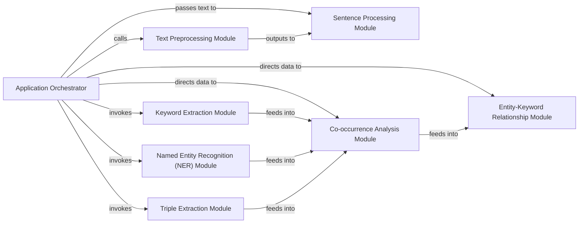

## Details

The TextGrapher project is designed to transform raw text into a structured knowledge graph. The Application Orchestrator, primarily embodied by the CrimeMining.main method, serves as the central control flow. It initiates the process by directing raw text to the Text Preprocessing Module for cleaning and segmentation. The preprocessed text is then passed to the Sentence Processing Module for basic linguistic analysis. Subsequently, the Application Orchestrator coordinates the invocation of specialized modules: Keyword Extraction Module to identify key terms, Named Entity Recognition (NER) Module to classify entities, and Triple Extraction Module to uncover subject-predicate-object relationships. The outputs from these extraction modules feed into the Co-occurrence Analysis Module, which identifies implicit connections between entities and keywords. Finally, the Entity-Keyword Relationship Module leverages this co-occurrence data to establish explicit relationships, culminating in the generation of the knowledge graph. This sequential and interconnected flow ensures a comprehensive transformation of unstructured text into a rich, relational data structure.

### Application Orchestrator [[Expand]](./Application_Orchestrator.md)
The primary control unit, managing the overall data flow and orchestrating the sequence of operations for the entire text-to-graph pipeline. It acts as the main entry point and coordinator.

**Related Classes/Methods**:

- <a href="https://github.com/liuhuanyong/TextGrapher/blob/master/text_grapher.py#L147-L213" target="_blank" rel="noopener noreferrer">`text_grapher.CrimeMining.main`:147-213</a>

### Text Preprocessing Module
Responsible for preparing raw text data for subsequent NLP processing. This includes tasks like content segmentation (both general and short content) and the removal of noisy or irrelevant elements from the text.

**Related Classes/Methods**:

- <a href="https://github.com/liuhuanyong/TextGrapher/blob/master/text_grapher.py#L27-L30" target="_blank" rel="noopener noreferrer">`text_grapher.CrimeMining.remove_noisy`:27-30</a>
- <a href="https://github.com/liuhuanyong/TextGrapher/blob/master/text_grapher.py#L41-L42" target="_blank" rel="noopener noreferrer">`text_grapher.CrimeMining.seg_content`:41-42</a>
- <a href="https://github.com/liuhuanyong/TextGrapher/blob/master/text_grapher.py#L143-L144" target="_blank" rel="noopener noreferrer">`text_grapher.CrimeMining.seg_short_content`:143-144</a>

### Sentence Processing Module
Focuses on the initial processing of individual sentences. This module likely performs foundational NLP tasks at the sentence level, such as tokenization or basic parsing, before deeper information extraction.

**Related Classes/Methods**:

- <a href="https://github.com/liuhuanyong/TextGrapher/blob/master/text_grapher.py#L45-L47" target="_blank" rel="noopener noreferrer">`text_grapher.CrimeMining.process_sent`:45-47</a>

### Keyword Extraction Module
Identifies and extracts significant keywords from the processed text. These keywords are crucial for forming initial graph nodes or for enriching existing entities.

**Related Classes/Methods**:

- <a href="https://github.com/liuhuanyong/TextGrapher/blob/master/text_grapher.py#L114-L115" target="_blank" rel="noopener noreferrer">`text_grapher.CrimeMining.extract_keywords`:114-115</a>

### Named Entity Recognition (NER) Module
Detects and classifies named entities (e.g., persons, organizations, locations, dates) within the text. These entities typically form the primary nodes of the knowledge graph.

**Related Classes/Methods**:

- <a href="https://github.com/liuhuanyong/TextGrapher/blob/master/text_grapher.py#L33-L38" target="_blank" rel="noopener noreferrer">`text_grapher.CrimeMining.collect_ners`:33-38</a>

### Triple Extraction Module
Extracts subject-predicate-object (SPO) triples from sentences. These triples represent the fundamental relational facts that form the edges and relationships within the knowledge graph.

**Related Classes/Methods**:

- <a href="https://github.com/liuhuanyong/TextGrapher/blob/master/text_grapher.py#L74-L89" target="_blank" rel="noopener noreferrer">`text_grapher.CrimeMining.extract_triples`:74-89</a>
- <a href="https://github.com/liuhuanyong/TextGrapher/blob/master/text_grapher.py#L92-L98" target="_blank" rel="noopener noreferrer">`text_grapher.CrimeMining.filter_triples`:92-98</a>

### Co-occurrence Analysis Module
Analyzes the frequency and proximity of entities and keywords appearing together in the text. This analysis helps in inferring implicit relationships and strengthening connections between graph elements.

**Related Classes/Methods**:

- <a href="https://github.com/liuhuanyong/TextGrapher/blob/master/text_grapher.py#L50-L59" target="_blank" rel="noopener noreferrer">`text_grapher.CrimeMining.collect_coexist`:50-59</a>

### Entity-Keyword Relationship Module
Establishes and refines explicit relationships between identified entities and keywords based on the extracted information and co-occurrence analysis, contributing to the final structured graph.

**Related Classes/Methods**:

- <a href="https://github.com/liuhuanyong/TextGrapher/blob/master/text_grapher.py#L118-L139" target="_blank" rel="noopener noreferrer">`text_grapher.CrimeMining.rel_entity_keyword`:118-139</a>

### [FAQ](https://github.com/CodeBoarding/GeneratedOnBoardings/tree/main?tab=readme-ov-file#faq)