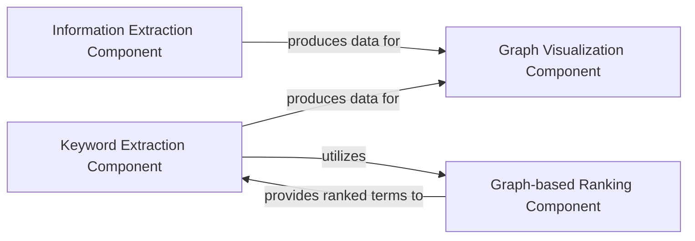

## Details

The TextGrapher system is designed to transform raw text into a visual knowledge graph. It comprises four main architectural components. The Information Extraction Component and Keyword Extraction Component work in tandem to identify key entities and significant keywords, with the latter leveraging the Graph-based Ranking Component for term importance. All extracted and processed information is then channeled to the Graph Visualization Component, which is responsible for structuring this data into a graph model and generating an interactive HTML visualization. The CrimeMining class serves as the central orchestrator, coordinating the data flow and interactions among these components to produce the final graphical output.

### Information Extraction Component
This component is dedicated to identifying and extracting Named Entities (NER) from the preprocessed text. It also focuses on establishing direct relationships between these identified entities and relevant keywords. This component is crucial for enriching the extracted data with semantic context.

**Related Classes/Methods**:

- <a href="https://github.com/liuhuanyong/TextGrapher/blob/master/text_grapher.py#L33-L38" target="_blank" rel="noopener noreferrer">`collect_ners`:33-38</a>
- <a href="https://github.com/liuhuanyong/TextGrapher/blob/master/text_grapher.py#L118-L139" target="_blank" rel="noopener noreferrer">`rel_entity_keyword`:118-139</a>

### Keyword Extraction Component
This component is responsible for identifying and extracting the most significant keywords from the text. It leverages graph-based ranking algorithms to determine the importance and relevance of terms, providing a concise summary of the text's main topics.

**Related Classes/Methods**:

- <a href="https://github.com/liuhuanyong/TextGrapher/blob/master/keywords_textrank.py#L74-L92" target="_blank" rel="noopener noreferrer">`extract_keywords`:74-92</a>

### Graph-based Ranking Component
This foundational component constructs an internal graph representation of the text (e.g., a co-occurrence graph). It then applies a ranking algorithm, such as TextRank, to the nodes (words/phrases) within this graph to determine their overall significance, which directly informs the keyword extraction process.

**Related Classes/Methods**:

- <a href="https://github.com/liuhuanyong/TextGrapher/blob/master/keywords_textrank.py#L12-L65" target="_blank" rel="noopener noreferrer">`textrank_graph`:12-65</a>

### Graph Visualization Component
This component receives processed event data (entities, keywords, and their relationships) and transforms it into a structured graph format (nodes and edges). It then generates an interactive HTML page, embedding the graph data for visual representation using a JavaScript visualization library.

**Related Classes/Methods**:

- <a href="https://github.com/liuhuanyong/TextGrapher/blob/master/GraphShow.py#L63-L87" target="_blank" rel="noopener noreferrer">`create_page`:63-87</a>
- <a href="https://github.com/liuhuanyong/TextGrapher/blob/master/GraphShow.py#L90-L94" target="_blank" rel="noopener noreferrer">`create_html`:90-94</a>

### [FAQ](https://github.com/CodeBoarding/GeneratedOnBoardings/tree/main?tab=readme-ov-file#faq)