```mermaid
graph LR
    Application_Orchestrator["Application Orchestrator"]
    Text_Preprocessing_Module["Text Preprocessing Module"]
    Information_Extraction_Module["Information Extraction Module"]
    Knowledge_Graph_Builder_Module["Knowledge Graph Builder Module"]
    Graph_Visualization_Module["Graph Visualization Module"]
    Application_Orchestrator -- "initiates process with" --> Text_Preprocessing_Module
    Application_Orchestrator -- "triggers processes in" --> Information_Extraction_Module
    Application_Orchestrator -- "triggers processes in" --> Knowledge_Graph_Builder_Module
    Text_Preprocessing_Module -- "passes cleaned text to" --> Information_Extraction_Module
    Text_Preprocessing_Module -- "provides parsed entities to" --> Knowledge_Graph_Builder_Module
    Information_Extraction_Module -- "supplies extracted information to" --> Knowledge_Graph_Builder_Module
    Knowledge_Graph_Builder_Module -- "delivers structured graph data to" --> Graph_Visualization_Module
    click Application_Orchestrator href "https://github.com/CodeBoarding/GeneratedOnBoardings/blob/main/TextGrapher/Application_Orchestrator.md" "Details"
    click Information_Extraction_Module href "https://github.com/CodeBoarding/GeneratedOnBoardings/blob/main/TextGrapher/Information_Extraction_Module.md" "Details"
```

## Details

The TextGrapher project implements a clear, unidirectional data processing pipeline for transforming raw text into interactive knowledge graphs. The process begins with the Application Orchestrator, which coordinates the entire workflow. Raw text is first handled by the Text Preprocessing Module, responsible for cleaning, segmenting, and parsing the input into a structured format. This preprocessed data then flows into the Information Extraction Module, where keywords, named entities, and relationships are identified. The extracted information, along with parsed entities, is then consumed by the Knowledge Graph Builder Module to construct the core knowledge graph structure, primarily through SVO triple and co-occurrence identification. Finally, the structured graph data is passed to the Graph Visualization Module, which renders it into an interactive HTML representation. This modular design emphasizes a clear separation of concerns, facilitating maintainability, extensibility, and a straightforward visual representation of the data flow.

### Application Orchestrator [[Expand]](./Application_Orchestrator.md)
Serves as the central control unit, managing the overall data flow and orchestrating the sequence of operations for the entire text-to-graph pipeline. It acts as the main entry point and coordinator.

**Related Classes/Methods**:

- <a href="https://github.com/liuhuanyong/TextGrapher/blob/master/text_grapher.py#L147-L213" target="_blank" rel="noopener noreferrer">`text_grapher.main`:147-213</a>
- <a href="https://github.com/liuhuanyong/TextGrapher/blob/master/text_grapher.py#L45-L47" target="_blank" rel="noopener noreferrer">`text_grapher.process_sent`:45-47</a>

### Text Preprocessing Module
Handles raw text input, performing essential preprocessing steps such as content segmentation, noise removal, and basic linguistic parsing (e.g., part-of-speech tagging, dependency parsing). It prepares the text into a structured format.

**Related Classes/Methods**:

- <a href="https://github.com/liuhuanyong/TextGrapher/blob/master/sentence_parser.py#L152-L155" target="_blank" rel="noopener noreferrer">`sentence_parser.parser_main`:152-155</a>
- <a href="https://github.com/liuhuanyong/TextGrapher/blob/master/sentence_parser.py#L158-L163" target="_blank" rel="noopener noreferrer">`sentence_parser.basic_process`:158-163</a>
- <a href="https://github.com/liuhuanyong/TextGrapher/blob/master/sentence_parser.py" target="_blank" rel="noopener noreferrer">`sentence_parser.seg_content`</a>
- <a href="https://github.com/liuhuanyong/TextGrapher/blob/master/sentence_parser.py" target="_blank" rel="noopener noreferrer">`sentence_parser.remove_noisy`</a>
- <a href="https://github.com/liuhuanyong/TextGrapher/blob/master/sentence_parser.py#L25-L28" target="_blank" rel="noopener noreferrer">`sentence_parser.basic_parser`:25-28</a>
- <a href="https://github.com/liuhuanyong/TextGrapher/blob/master/sentence_parser.py#L123-L133" target="_blank" rel="noopener noreferrer">`sentence_parser.syntax_parser`:123-133</a>

### Information Extraction Module [[Expand]](./Information_Extraction_Module.md)
Focuses on extracting meaningful linguistic elements from the preprocessed text. It identifies keywords, named entities (NER), and potential relationships between these entities, forming the raw data for graph construction.

**Related Classes/Methods**:

- <a href="https://github.com/liuhuanyong/TextGrapher/blob/master/keywords_textrank.py#L74-L92" target="_blank" rel="noopener noreferrer">`keywords_textrank.extract_keywords`:74-92</a>
- <a href="https://github.com/liuhuanyong/TextGrapher/blob/master/keywords_textrank.py#L12-L65" target="_blank" rel="noopener noreferrer">`keywords_textrank.textrank_graph`:12-65</a>
- <a href="https://github.com/liuhuanyong/TextGrapher/blob/master/text_grapher.py#L33-L38" target="_blank" rel="noopener noreferrer">`text_grapher.collect_ners`:33-38</a>
- <a href="https://github.com/liuhuanyong/TextGrapher/blob/master/text_grapher.py#L118-L139" target="_blank" rel="noopener noreferrer">`text_grapher.rel_entity_keyword`:118-139</a>

### Knowledge Graph Builder Module
The core component for constructing the knowledge graph. It takes the extracted information (entities, keywords, relationships) and transforms it into structured graph data, primarily by identifying subject-verb-object (SVO) triples and co-occurrence relationships.

**Related Classes/Methods**:

- <a href="https://github.com/liuhuanyong/TextGrapher/blob/master/text_grapher.py#L74-L89" target="_blank" rel="noopener noreferrer">`text_grapher.extract_triples`:74-89</a>
- <a href="https://github.com/liuhuanyong/TextGrapher/blob/master/text_grapher.py#L50-L59" target="_blank" rel="noopener noreferrer">`text_grapher.collect_coexist`:50-59</a>
- <a href="https://github.com/liuhuanyong/TextGrapher/blob/master/text_grapher.py#L101-L111" target="_blank" rel="noopener noreferrer">`text_grapher.complete_VOB`:101-111</a>
- <a href="https://github.com/liuhuanyong/TextGrapher/blob/master/text_grapher.py#L62-L71" target="_blank" rel="noopener noreferrer">`text_grapher.combination`:62-71</a>

### Graph Visualization Module
Responsible for generating visual representations of the constructed knowledge graph. It takes the structured graph data and renders it into a displayable and interactive format, typically an HTML page using a JavaScript library.

**Related Classes/Methods**:

- <a href="https://github.com/liuhuanyong/TextGrapher/blob/master/GraphShow.py#L63-L87" target="_blank" rel="noopener noreferrer">`GraphShow.create_page`:63-87</a>
- <a href="https://github.com/liuhuanyong/TextGrapher/blob/master/GraphShow.py#L90-L94" target="_blank" rel="noopener noreferrer">`GraphShow.create_html`:90-94</a>

### [FAQ](https://github.com/CodeBoarding/GeneratedOnBoardings/tree/main?tab=readme-ov-file#faq)