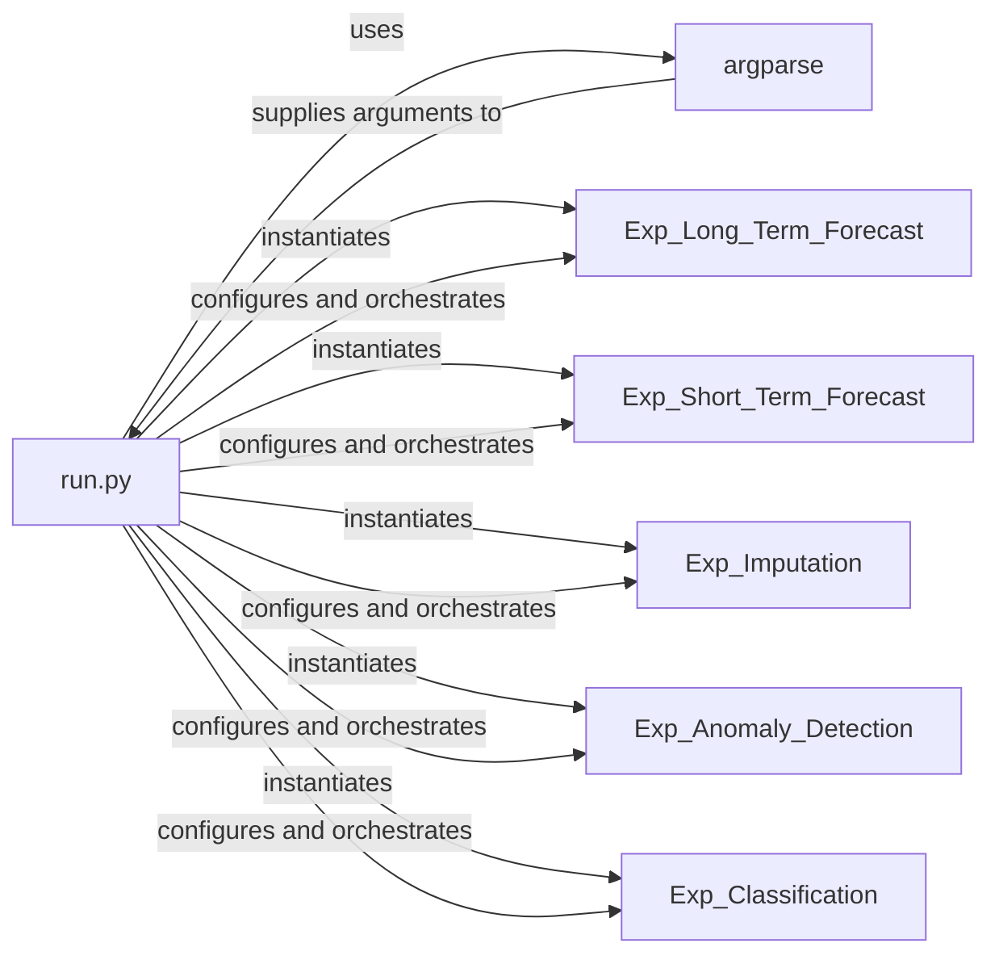

## Details

The `TimeMixer` project's core execution flow is orchestrated by `run.py`, which serves as the main entry point. It leverages the standard `argparse` library to process command-line arguments, allowing users to specify experiment parameters such as the `task_name`. Based on this input, `run.py` dynamically instantiates and subsequently configures and orchestrates the appropriate experiment class (e.g., `Exp_Long_Term_Forecast`, `Exp_Imputation`, etc.). Each `Exp_` component encapsulates the specialized logic for a particular time series task, handling data loading, model training, and evaluation, thereby centralizing the experiment-specific functionalities. This design promotes modularity, allowing new experiment types to be integrated by adding new `Exp_` classes.

### run.py
The main entry point of the application. It is responsible for defining and parsing all command-line arguments, setting up global configurations (e.g., random seeds, GPU usage), dynamically selecting the appropriate experiment class based on the `task_name` argument, and initiating the training and testing phases.

**Related Classes/Methods**:

- <a href="https://github.com/kwuking/TimeMixer/blob/main/run.py#L1-L9999" target="_blank" rel="noopener noreferrer">`run.py`:1-9999</a>

### argparse
A standard Python library component used by `run.py` to define and parse command-line arguments. It provides the structured mechanism for users to input experiment parameters such as `task_name`, `model_id`, `seq_len`, `learning_rate`, and `use_gpu`. As a standard library, its source is external to this project.

**Related Classes/Methods**:

### Exp_Long_Term_Forecast
Encapsulates the specific logic for long-term time series forecasting experiments. This includes data loading, model definition, the training loop, evaluation metrics, and checkpointing mechanisms tailored for this task.

**Related Classes/Methods**:

- <a href="https://github.com/kwuking/TimeMixer/blob/main/exp/exp_long_term_forecasting.py#L18-L297" target="_blank" rel="noopener noreferrer">`Exp_Long_Term_Forecast`:18-297</a>

### Exp_Short_Term_Forecast
Manages the specific logic for short-term time series forecasting experiments, covering data handling, model training, and evaluation relevant to shorter prediction horizons.

**Related Classes/Methods**:

- <a href="https://github.com/kwuking/TimeMixer/blob/main/exp/exp_short_term_forecasting.py#L21-L252" target="_blank" rel="noopener noreferrer">`Exp_Short_Term_Forecast`:21-252</a>

### Exp_Imputation
Handles the experiment logic for time series imputation, including the specific data preparation, model application, and evaluation strategies required to fill missing values in time series data.

**Related Classes/Methods**:

- <a href="https://github.com/kwuking/TimeMixer/blob/main/exp/exp_imputation.py#L19-L245" target="_blank" rel="noopener noreferrer">`Exp_Imputation`:19-245</a>

### Exp_Anomaly_Detection
Contains the specialized logic for conducting anomaly detection experiments on time series data. This involves unique data loading, model training, and evaluation methods designed to identify unusual patterns.

**Related Classes/Methods**:

- <a href="https://github.com/kwuking/TimeMixer/blob/main/exp/exp_anomaly_detection.py#L22-L222" target="_blank" rel="noopener noreferrer">`Exp_Anomaly_Detection`:22-222</a>

### Exp_Classification
Manages the experiment flow for time series classification tasks. It defines how data is loaded, models are trained, and predictions are evaluated for categorizing time series.

**Related Classes/Methods**:

- <a href="https://github.com/kwuking/TimeMixer/blob/main/exp/exp_classification.py#L18-L205" target="_blank" rel="noopener noreferrer">`Exp_Classification`:18-205</a>

### [FAQ](https://github.com/CodeBoarding/GeneratedOnBoardings/tree/main?tab=readme-ov-file#faq)