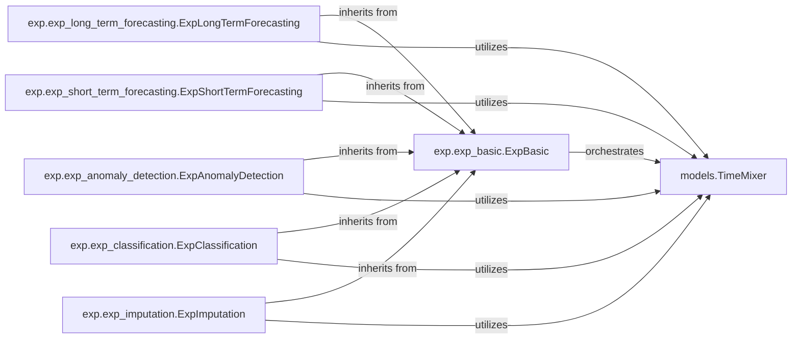

## Details

The Experiment Management Framework subsystem is the core orchestrator for machine learning experiments within the TimeMixer project, managing the entire lifecycle from model building to evaluation across various time series tasks.

### exp.exp_basic.ExpBasic
The foundational abstract base class for all experiments. It establishes the common interface and core functionalities for experiment setup, model initialization, data loading, training loops, validation, testing, and result saving. It acts as the blueprint for conducting any time series experiment within the TimeMixer framework, ensuring consistency and extensibility.

**Related Classes/Methods**:

- <a href="https://github.com/kwuking/TimeMixer/blob/main/exp/exp_basic.py" target="_blank" rel="noopener noreferrer">`exp.exp_basic.ExpBasic`</a>

### exp.exp_long_term_forecasting.ExpLongTermForecasting
A concrete implementation of `ExpBasic` specifically designed for long-term time series forecasting experiments. It extends the base class to incorporate task-specific logic, such as appropriate loss functions (e.g., MSE, MAE) and evaluation metrics relevant to long prediction horizons.

**Related Classes/Methods**:

- <a href="https://github.com/kwuking/TimeMixer/blob/main/exp/exp_long_term_forecasting.py" target="_blank" rel="noopener noreferrer">`exp.exp_long_term_forecasting.ExpLongTermForecasting`</a>

### exp.exp_short_term_forecasting.ExpShortTermForecasting
A concrete implementation of `ExpBasic` for short-term time series forecasting experiments. Similar to its long-term counterpart, it adapts the general experiment flow for shorter prediction horizons and potentially different evaluation criteria.

**Related Classes/Methods**:

- <a href="https://github.com/kwuking/TimeMixer/blob/main/exp/exp_short_term_forecasting.py" target="_blank" rel="noopener noreferrer">`exp.exp_short_term_forecasting.ExpShortTermForecasting`</a>

### exp.exp_anomaly_detection.ExpAnomalyDetection
A concrete implementation of `ExpBasic` tailored for time series anomaly detection experiments. This component focuses on defining anomaly scoring mechanisms, thresholding strategies, and specific evaluation metrics (e.g., precision, recall, F1-score for anomalies).

**Related Classes/Methods**:

- <a href="https://github.com/kwuking/TimeMixer/blob/main/exp/exp_anomaly_detection.py" target="_blank" rel="noopener noreferrer">`exp.exp_anomaly_detection.ExpAnomalyDetection`</a>

### exp.exp_classification.ExpClassification
A concrete implementation of `ExpBasic` for time series classification experiments. It handles multi-class or binary classification tasks, integrating appropriate loss functions (e.g., cross-entropy) and classification-specific metrics (e.g., accuracy, F1-score).

**Related Classes/Methods**:

- <a href="https://github.com/kwuking/TimeMixer/blob/main/exp/exp_classification.py" target="_blank" rel="noopener noreferrer">`exp.exp_classification.ExpClassification`</a>

### exp.exp_imputation.ExpImputation
A concrete implementation of `ExpBasic` for time series imputation experiments. Its primary responsibility is to manage the process of filling missing values in time series data, utilizing metrics like MSE or MAE to evaluate the quality of imputation.

**Related Classes/Methods**:

- <a href="https://github.com/kwuking/TimeMixer/blob/main/exp/exp_imputation.py" target="_blank" rel="noopener noreferrer">`exp.exp_imputation.ExpImputation`</a>

### models.TimeMixer
The core TimeMixer model, representing the machine learning algorithm that processes time series data. This component is instantiated, trained, validated, and tested by the various `Exp*` components.

**Related Classes/Methods**:

- <a href="https://github.com/kwuking/TimeMixer/blob/main/models/timemixer.py" target="_blank" rel="noopener noreferrer">`models.TimeMixer`</a>

### [FAQ](https://github.com/CodeBoarding/GeneratedOnBoardings/tree/main?tab=readme-ov-file#faq)