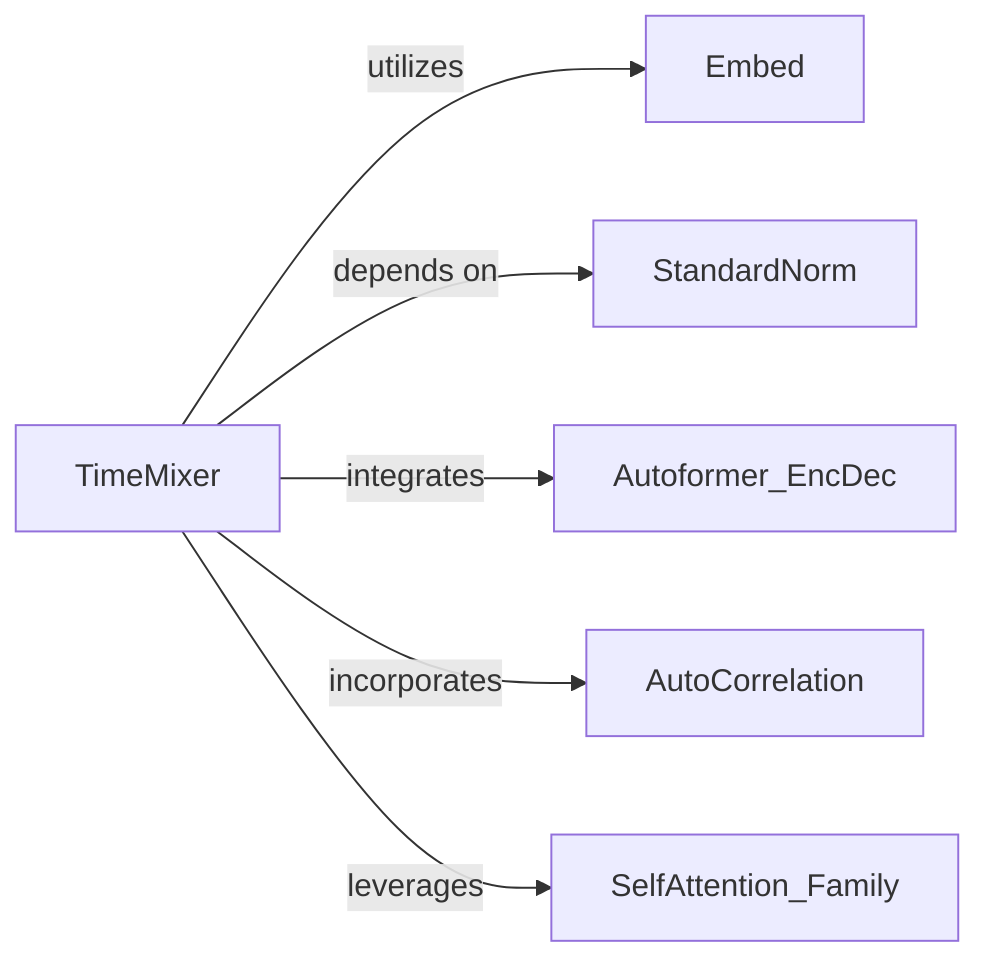

## Details

The `TimeMixer Model Core` subsystem is the neural network architecture responsible for time series processing, including unique decomposition, Past-Decomposable Mixing (PDM), and Future-Multipredictor Mixing (FMM) operations.

### TimeMixer
The primary entry point and orchestrator of the TimeMixer model. It initializes and coordinates the data flow through the decomposition, PDM, and FMM blocks.

**Related Classes/Methods**:

- <a href="https://github.com/kwuking/TimeMixer/blob/main/models/TimeMixer.py" target="_blank" rel="noopener noreferrer">`TimeMixer`</a>

### Autoformer_EncDec
Responsible for performing series decomposition and moving average calculations, which are fundamental to TimeMixer's unique decomposition strategy.

**Related Classes/Methods**:

- <a href="https://github.com/kwuking/TimeMixer/blob/main/layers/Autoformer_EncDec.py" target="_blank" rel="noopener noreferrer">`Autoformer_EncDec`</a>

### Embed
Handles the transformation of raw time series data into various embedded representations (e.g., time features, temporal, token, positional embeddings), making the data suitable for neural network consumption.

**Related Classes/Methods**:

- <a href="https://github.com/kwuking/TimeMixer/blob/main/layers/Embed.py" target="_blank" rel="noopener noreferrer">`Embed`</a>

### StandardNorm
Provides essential data normalization and de-normalization services, ensuring consistent data scales throughout the model's processing pipeline, crucial for stability and performance.

**Related Classes/Methods**:

- <a href="https://github.com/kwuking/TimeMixer/blob/main/layers/StandardNorm.py" target="_blank" rel="noopener noreferrer">`StandardNorm`</a>

### AutoCorrelation
Implements mechanisms to identify and aggregate time delays based on auto-correlation, enabling the model to capture significant temporal dependencies within the time series.

**Related Classes/Methods**:

- <a href="https://github.com/kwuking/TimeMixer/blob/main/layers/AutoCorrelation.py#L11-L128" target="_blank" rel="noopener noreferrer">`AutoCorrelation`:11-128</a>

### SelfAttention_Family
Offers a suite of self-attention mechanisms (e.g., AttentionLayer, FullAttention) that are utilized as fundamental building blocks within the PDM and FMM mixing operations to weigh and combine information across different time steps.

**Related Classes/Methods**:

- <a href="https://github.com/kwuking/TimeMixer/blob/main/layers/SelfAttention_Family.py" target="_blank" rel="noopener noreferrer">`SelfAttention_Family`</a>

### [FAQ](https://github.com/CodeBoarding/GeneratedOnBoardings/tree/main?tab=readme-ov-file#faq)