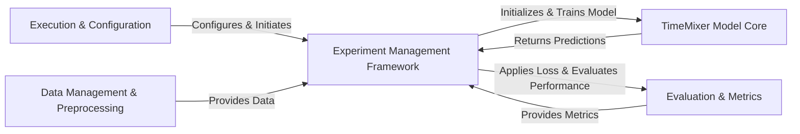

## Details

The TimeMixer project implements a robust, modular architecture for time series analysis, designed as an ML toolkit. Its primary data flow initiates from Execution & Configuration scripts, which hand over control to the Experiment Management Framework. This framework orchestrates the entire ML pipeline, fetching data from the Data Management & Preprocessing component, training and invoking the central TimeMixer Model Core, and leveraging the Evaluation & Metrics component for performance assessment. The TimeMixer Model Core itself is a sophisticated neural network that processes time series data through specialized decomposition and mixing layers. This clear separation of concerns into distinct components—data handling, experiment orchestration, core model logic, and evaluation—facilitates a highly maintainable, scalable, and extensible system, ideal for diverse time series forecasting, anomaly detection, classification, and imputation tasks.

### Execution & Configuration [[Expand]](./Execution_Configuration.md)
The project's entry point, responsible for parsing command-line arguments, setting up configurations, and initiating the overall experiment flow.

**Related Classes/Methods**:

- <a href="https://github.com/kwuking/TimeMixer/blob/main/run.py" target="_blank" rel="noopener noreferrer">`run.py`</a>

### Data Management & Preprocessing
Handles the loading, transformation, normalization, and instance generation of various time series datasets, serving as the primary data source for all experiments.

**Related Classes/Methods**:

- <a href="https://github.com/kwuking/TimeMixer/blob/main/data_provider/data_loader.py" target="_blank" rel="noopener noreferrer">`data_provider/data_loader.py`</a>
- <a href="https://github.com/kwuking/TimeMixer/blob/main/data_provider/data_factory.py" target="_blank" rel="noopener noreferrer">`data_provider/data_factory.py`</a>
- <a href="https://github.com/kwuking/TimeMixer/blob/main/data_provider/m4.py" target="_blank" rel="noopener noreferrer">`data_provider/m4.py`</a>
- <a href="https://github.com/kwuking/TimeMixer/blob/main/data_provider/uea.py" target="_blank" rel="noopener noreferrer">`data_provider/uea.py`</a>

### Experiment Management Framework [[Expand]](./Experiment_Management_Framework.md)
The central orchestrator for machine learning experiments, managing the entire lifecycle including model building, training loops, validation, and testing across different time series tasks.

**Related Classes/Methods**:

- <a href="https://github.com/kwuking/TimeMixer/blob/main/exp/exp_basic.py" target="_blank" rel="noopener noreferrer">`exp/exp_basic.py`</a>
- <a href="https://github.com/kwuking/TimeMixer/blob/main/exp/exp_long_term_forecasting.py" target="_blank" rel="noopener noreferrer">`exp/exp_long_term_forecasting.py`</a>
- <a href="https://github.com/kwuking/TimeMixer/blob/main/exp/exp_short_term_forecasting.py" target="_blank" rel="noopener noreferrer">`exp/exp_short_term_forecasting.py`</a>
- <a href="https://github.com/kwuking/TimeMixer/blob/main/exp/exp_anomaly_detection.py" target="_blank" rel="noopener noreferrer">`exp/exp_anomaly_detection.py`</a>
- <a href="https://github.com/kwuking/TimeMixer/blob/main/exp/exp_classification.py" target="_blank" rel="noopener noreferrer">`exp/exp_classification.py`</a>
- <a href="https://github.com/kwuking/TimeMixer/blob/main/exp/exp_imputation.py" target="_blank" rel="noopener noreferrer">`exp/exp_imputation.py`</a>

### TimeMixer Model Core [[Expand]](./TimeMixer_Model_Core.md)
The core neural network architecture of TimeMixer, implementing its unique decomposition, Past-Decomposable Mixing (PDM), and Future-Multipredictor Mixing (FMM) operations for time series processing. It internally utilizes various neural network utility layers.

**Related Classes/Methods**:

- <a href="https://github.com/kwuking/TimeMixer/blob/main/models/TimeMixer.py" target="_blank" rel="noopener noreferrer">`models/TimeMixer.py`</a>
- <a href="https://github.com/kwuking/TimeMixer/blob/main/layers/Autoformer_EncDec.py" target="_blank" rel="noopener noreferrer">`layers/Autoformer_EncDec.py`</a>
- <a href="https://github.com/kwuking/TimeMixer/blob/main/layers/Embed.py" target="_blank" rel="noopener noreferrer">`layers/Embed.py`</a>
- <a href="https://github.com/kwuking/TimeMixer/blob/main/layers/StandardNorm.py" target="_blank" rel="noopener noreferrer">`layers/StandardNorm.py`</a>
- <a href="https://github.com/kwuking/TimeMixer/blob/main/layers/AutoCorrelation.py" target="_blank" rel="noopener noreferrer">`layers/AutoCorrelation.py`</a>
- <a href="https://github.com/kwuking/TimeMixer/blob/main/layers/SelfAttention_Family.py" target="_blank" rel="noopener noreferrer">`layers/SelfAttention_Family.py`</a>

### Evaluation & Metrics
Contains the necessary components for quantifying model performance, including various loss functions used during training and a suite of metrics for comprehensive evaluation.

**Related Classes/Methods**:

- <a href="https://github.com/kwuking/TimeMixer/blob/main/utils/losses.py" target="_blank" rel="noopener noreferrer">`utils/losses.py`</a>
- <a href="https://github.com/kwuking/TimeMixer/blob/main/utils/metrics.py" target="_blank" rel="noopener noreferrer">`utils/metrics.py`</a>
- <a href="https://github.com/kwuking/TimeMixer/blob/main/utils/m4_summary.py" target="_blank" rel="noopener noreferrer">`utils/m4_summary.py`</a>

### [FAQ](https://github.com/CodeBoarding/GeneratedOnBoardings/tree/main?tab=readme-ov-file#faq)