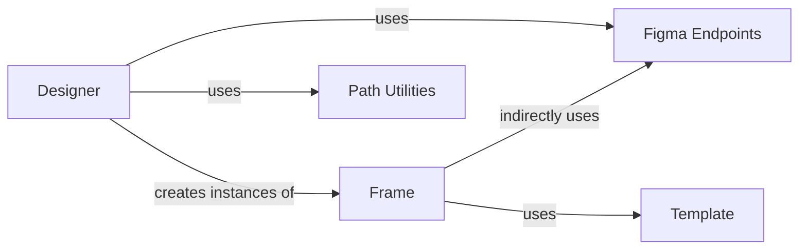

## Component Details

The core logic for designing Tkinter GUIs, coordinating the entire end-to-end process from fetching Figma design data to generating Tkinter Python code and associated assets.

### Designer
The central control unit. It initializes the Figma API client, fetches the design file, iterates through design frames, delegates code generation for each frame, and writes the final Tkinter Python code and assets to the specified output path.

**Related Classes/Methods**:

- <a href="https://github.com/ParthJadhav/Tkinter-Designer/blob/master/tkdesigner/designer.py#L7-L37" target="_blank" rel="noopener noreferrer">`tkdesigner.designer.Designer` (7:37)</a>

### Figma Endpoints
Provides the interface for interacting with the Figma API. Specifically, the `Files` class within this module is used by the `Designer` to retrieve the raw design data from a given Figma file key.

**Related Classes/Methods**:

- <a href="https://github.com/ParthJadhav/Tkinter-Designer/blob/master/tkdesigner/figma/endpoints.py#L0-L0" target="_blank" rel="noopener noreferrer">`tkdesigner.figma.endpoints.Files` (0:0)</a>

### Frame
Represents a single design frame from the Figma file. Its primary responsibility is to parse the frame's content, extract design elements, and convert them into corresponding Tkinter Python code snippets, often utilizing a template for structured output. It also handles the generation of associated assets (e.g., images) for its specific frame.

**Related Classes/Methods**:

- <a href="https://github.com/ParthJadhav/Tkinter-Designer/blob/master/tkdesigner/figma/frame.py#L11-L140" target="_blank" rel="noopener noreferrer">`tkdesigner.figma.frame.Frame` (11:140)</a>

### Template
A static string constant that defines the boilerplate structure for the generated Tkinter Python code. The `Frame` component populates this template with dynamic content derived from the Figma design elements.

**Related Classes/Methods**:

- <a href="https://github.com/ParthJadhav/Tkinter-Designer/blob/master/tkdesigner/template.py#L0-L0" target="_blank" rel="noopener noreferrer">`tkdesigner.template.TEMPLATE` (0:0)</a>

### Path Utilities
A standard Python library module used for object-oriented filesystem path manipulation. The `Designer` component leverages this to construct and manage output file paths for writing the generated Python code and assets.

**Related Classes/Methods**:

- `pathlib.Path` (0:0)

### [FAQ](https://github.com/CodeBoarding/GeneratedOnBoardings/tree/main?tab=readme-ov-file#faq)