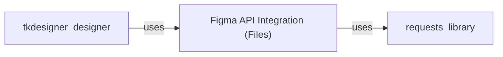

## Component Details

Final Component Overview

### Figma API Integration (Files)
This component, primarily embodied by the `Files` class within `tkdesigner.figma.endpoints`, is solely responsible for all interactions with the Figma REST API. It encapsulates the logic for authenticating requests using a Figma token, fetching raw design file data, and retrieving specific image assets by their IDs. It also includes robust error handling for network and API-related issues, ensuring reliable communication with the Figma platform.

**Related Classes/Methods**:

- <a href="https://github.com/ParthJadhav/Tkinter-Designer/blob/master/tkdesigner/figma/endpoints.py#L0-L0" target="_blank" rel="noopener noreferrer">`tkdesigner.figma.endpoints.Files` (0:0)</a>
- <a href="https://github.com/ParthJadhav/Tkinter-Designer/blob/master/tkdesigner/figma/endpoints.py#L0-L0" target="_blank" rel="noopener noreferrer">`tkdesigner.figma.endpoints.Files:get_file` (0:0)</a>
- <a href="https://github.com/ParthJadhav/Tkinter-Designer/blob/master/tkdesigner/figma/endpoints.py#L0-L0" target="_blank" rel="noopener noreferrer">`tkdesigner.figma.endpoints.Files:get_image` (0:0)</a>

### [FAQ](https://github.com/CodeBoarding/GeneratedOnBoardings/tree/main?tab=readme-ov-file#faq)