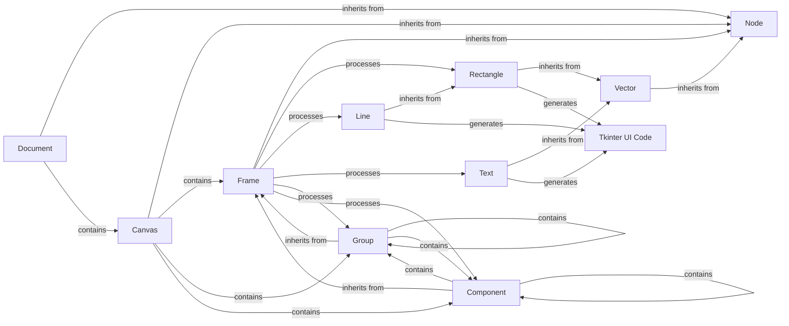

## Component Details

The Figma Data Parser subsystem is designed to transform raw JSON data from the Figma API into a structured representation that can be used to generate Tkinter UI code. This process involves parsing generic Figma nodes, extracting relevant properties, and preparing this data for code generation and asset management.

### Node
The foundational abstract component for all Figma elements. It encapsulates raw Figma node data and provides common properties like id, name, visible, and type. It serves as the base class for all other Figma element representations, ensuring a consistent interface for basic node attributes.

**Related Classes/Methods**:

- <a href="https://github.com/ParthJadhav/Tkinter-Designer/blob/master/tkdesigner/figma/node.py#L1-L1" target="_blank" rel="noopener noreferrer">`Node` (1:1)</a>

### Document
Represents the top-level Figma document. It inherits from Node and provides access to its children, which are typically canvases. It acts as the primary entry point for parsing a Figma file, initiating the traversal of the design hierarchy.

**Related Classes/Methods**:

- `Document` (1:1)

### Canvas
Represents a Figma canvas within a document. It inherits from Node and provides access to its children (frames, groups, etc.) and background color. Canvases are the primary drawing surfaces in Figma, organizing the top-level design elements.

**Related Classes/Methods**:

- `Canvas` (1:1)

### Frame
Represents a Figma Frame, a crucial container for other elements. It extends Node and adds functionality to determine its size, color, and, most importantly, to create element instances for its children. It manages output paths for assets and is central to organizing and processing groups of UI elements.

**Related Classes/Methods**:

- <a href="https://github.com/ParthJadhav/Tkinter-Designer/blob/master/tkdesigner/figma/frame.py#L11-L140" target="_blank" rel="noopener noreferrer">`Frame` (11:140)</a>

### Group
A specialized type of Frame used for grouping elements. It inherits all the functionalities of Frame, allowing it to act as a container for other Figma nodes. Groups help in logically organizing and manipulating collections of UI elements.

**Related Classes/Methods**:

- `Group` (1:1)

### Component
Represents a Figma Component, which is a reusable UI element. It inherits from Frame, allowing it to encapsulate a set of child elements and their properties for reusability across the design. Components are vital for maintaining consistency and efficiency in UI development.

**Related Classes/Methods**:

- `Component` (1:1)

### Vector
An abstract base class for all vector-based Figma elements (e.g., rectangles, ellipses, lines, text). It inherits from Node and provides common methods for determining color, size, and position relative to a frame. It serves as a blueprint for concrete graphical elements.

**Related Classes/Methods**:

- `Vector` (1:1)

### Rectangle
A concrete implementation of a vector element representing a rectangle. It inherits from Vector and adds properties like corner_radius. It also provides a to_code method to generate Tkinter create_rectangle code, directly contributing to the UI generation.

**Related Classes/Methods**:

- `Rectangle` (1:1)

### Line
A concrete implementation of a vector element representing a line. It inherits from Rectangle (likely for re-using position/size logic) and overrides color, size, and position to account for line-specific properties like strokeWeight. It provides a to_code method for Tkinter create_line generation.

**Related Classes/Methods**:

- `Line` (1:1)

### Text
Represents a Figma text element. It inherits from Vector and provides methods to extract text content, color, font properties (font_property), and generate Tkinter create_text code. This component is crucial for rendering textual information in the generated UI.

**Related Classes/Methods**:

- `Text` (1:1)

### Tkinter UI Code
Generated Tkinter UI code.

**Related Classes/Methods**: _None_

### [FAQ](https://github.com/CodeBoarding/GeneratedOnBoardings/tree/main?tab=readme-ov-file#faq)