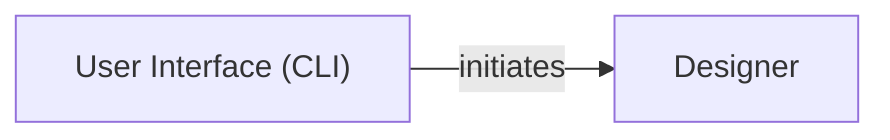

## Component Details

The `User Interface (CLI)` component is fundamental because it serves as the direct entry point for users to interact with the Tkinter-Designer application via the command line. It handles argument parsing, input validation, and orchestrates the design generation process by invoking the `Designer` component.

### User Interface (CLI)
This component provides the command-line interface for users to interact with the Tkinter-Designer application. It is responsible for parsing command-line arguments, performing initial validation of essential inputs (such as the Figma file URL, API token, and desired output directory), and initiating the design generation process.

**Related Classes/Methods**:

- <a href="https://github.com/ParthJadhav/Tkinter-Designer/blob/master/tkdesigner/designer.py#L7-L37" target="_blank" rel="noopener noreferrer">`tkdesigner.designer.Designer` (7:37)</a>
- <a href="https://github.com/ParthJadhav/Tkinter-Designer/blob/master/tkdesigner/designer.py#L28-L37" target="_blank" rel="noopener noreferrer">`tkdesigner.designer.Designer:design` (28:37)</a>

### Designer
This component is responsible for the core logic of generating the Tkinter GUI code from the Figma design. It takes the Figma token, file key, and output path as input and orchestrates the process of fetching design data, parsing it, and generating the final output.

**Related Classes/Methods**:

- <a href="https://github.com/ParthJadhav/Tkinter-Designer/blob/master/tkdesigner/designer.py#L1-L1000" target="_blank" rel="noopener noreferrer">`tkdesigner.designer` (1:1000)</a>

### [FAQ](https://github.com/CodeBoarding/GeneratedOnBoardings/tree/main?tab=readme-ov-file#faq)