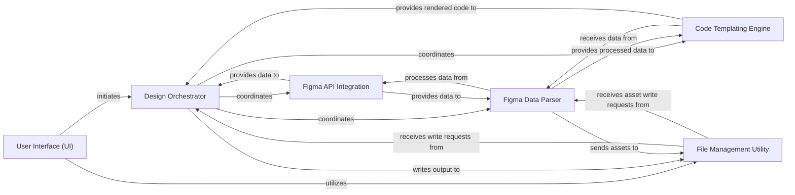

## Component Details

The analysis of the Control Flow Graph (CFG) and the Source Analysis reveals a clear, modular architecture for `Tkinter-Designer`. The application's core functionality revolves around transforming Figma designs into Tkinter code, orchestrated through distinct, interacting components.

### User Interface (UI)
This component serves as the primary interaction point for users, offering both a Graphical User Interface (GUI) and a Command-Line Interface (CLI). It is responsible for collecting essential inputs such as the Figma file URL, API token, and desired output directory, performing initial validation, and initiating the design generation process.

**Related Classes/Methods**:

- <a href="https://github.com/ParthJadhav/Tkinter-Designer/blob/master/gui/gui.py#L1-L1" target="_blank" rel="noopener noreferrer">`gui.gui` (1:1)</a>
- <a href="https://github.com/ParthJadhav/Tkinter-Designer/blob/master/tkdesigner/cli.py#L1-L1" target="_blank" rel="noopener noreferrer">`tkdesigner.cli` (1:1)</a>

### Design Orchestrator
The central control unit of the application, coordinating the entire end-to-end process. It manages the flow from fetching Figma design data, through its processing and templating, to the final generation and writing of Tkinter Python code and associated assets.

**Related Classes/Methods**:

- <a href="https://github.com/ParthJadhav/Tkinter-Designer/blob/master/tkdesigner/designer.py#L1-L1" target="_blank" rel="noopener noreferrer">`tkdesigner.designer` (1:1)</a>

### Figma API Integration
Dedicated to handling all communication with the Figma REST API. This component manages authentication using the provided Figma token, fetches raw design file data, and retrieves specific image assets based on their IDs. It also incorporates error handling for network and API-related issues.

**Related Classes/Methods**:

- <a href="https://github.com/ParthJadhav/Tkinter-Designer/blob/master/tkdesigner/figma/endpoints.py#L1-L1" target="_blank" rel="noopener noreferrer">`tkdesigner.figma.endpoints` (1:1)</a>

### Figma Data Parser
A collection of classes responsible for parsing and interpreting the raw JSON data received from the Figma API. These processors transform generic Figma nodes into specific Tkinter UI element representations, extracting relevant properties like dimensions, colors, text content, and image URLs, and preparing this data for insertion into the Tkinter code template. It also manages the download of necessary image assets.

**Related Classes/Methods**:

- <a href="https://github.com/ParthJadhav/Tkinter-Designer/blob/master/tkdesigner/figma/frame.py#L1-L1" target="_blank" rel="noopener noreferrer">`tkdesigner.figma.frame` (1:1)</a>
- <a href="https://github.com/ParthJadhav/Tkinter-Designer/blob/master/tkdesigner/figma/node.py#L1-L1" target="_blank" rel="noopener noreferrer">`tkdesigner.figma.node` (1:1)</a>
- <a href="https://github.com/ParthJadhav/Tkinter-Designer/blob/master/tkdesigner/figma/custom_elements.py#L1-L1" target="_blank" rel="noopener noreferrer">`tkdesigner.figma.custom_elements` (1:1)</a>
- <a href="https://github.com/ParthJadhav/Tkinter-Designer/blob/master/tkdesigner/figma/vector_elements.py#L1-L1" target="_blank" rel="noopener noreferrer">`tkdesigner.figma.vector_elements` (1:1)</a>

### Code Templating Engine
Defines the foundational structure and boilerplate code for the generated Tkinter Python application. It utilizes a templating system (Jinja2) to dynamically populate placeholders with data processed by the Figma Data Parser, ensuring the output is a syntactically correct and runnable Tkinter GUI application.

**Related Classes/Methods**:

- <a href="https://github.com/ParthJadhav/Tkinter-Designer/blob/master/tkdesigner/template.py#L1-L1" target="_blank" rel="noopener noreferrer">`tkdesigner.template` (1:1)</a>

### File Management Utility
Manages all interactions with the local file system. This includes creating necessary output directories, writing the generated Python source code files (e.g., `gui.py`, `guiX.py`), and saving downloaded image assets into the appropriate subdirectories. It also handles checks for existing directories and files, and manages overwrite prompts.

**Related Classes/Methods**:

- <a href="https://github.com/ParthJadhav/Tkinter-Designer/blob/master/tkdesigner/designer.py#L1-L1" target="_blank" rel="noopener noreferrer">`tkdesigner.designer` (1:1)</a>
- <a href="https://github.com/ParthJadhav/Tkinter-Designer/blob/master/tkdesigner/cli.py#L1-L1" target="_blank" rel="noopener noreferrer">`tkdesigner.cli` (1:1)</a>
- <a href="https://github.com/ParthJadhav/Tkinter-Designer/blob/master/gui/gui.py#L1-L1" target="_blank" rel="noopener noreferrer">`gui.gui` (1:1)</a>
- <a href="https://github.com/ParthJadhav/Tkinter-Designer/blob/master/tkdesigner/figma/frame.py#L1-L1" target="_blank" rel="noopener noreferrer">`tkdesigner.figma.frame` (1:1)</a>

### [FAQ](https://github.com/CodeBoarding/GeneratedOnBoardings/tree/main?tab=readme-ov-file#faq)