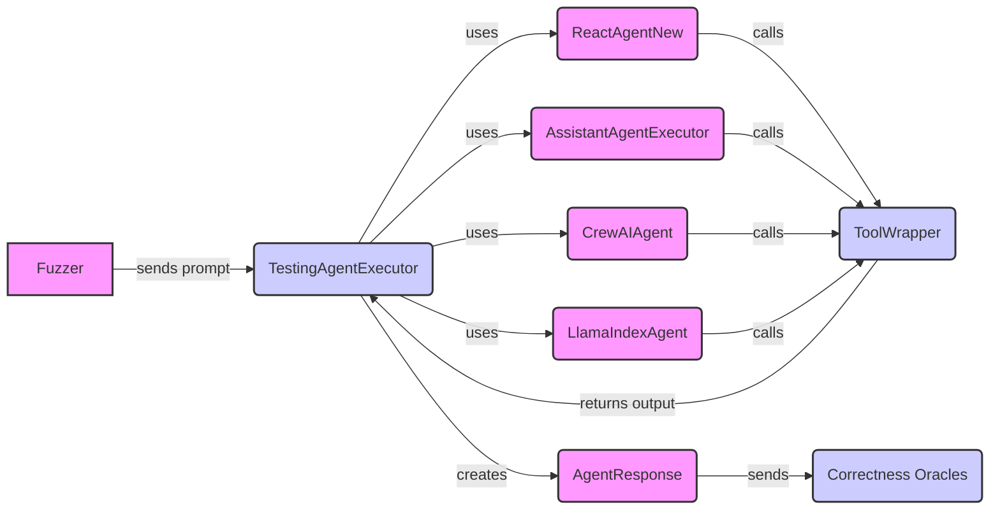

## Agent Execution Framework Overview

This component provides a unified interface for executing agents from different frameworks (Langchain, Autogen, CrewAI, Llama Index). It handles the execution of prompts and tool calls, and captures the agent's responses, tool outputs, and any exceptions raised. It interacts with Tool Definition & Extraction to get tool information, and with Fuzzers and Correctness Oracles to evaluate agent behavior.

Here's a data flow diagram illustrating the interaction between the core components:

### Component Descriptions:

*   **Fuzzer**: Responsible for generating prompts and test cases for the agents. It sends prompts to the `TestingAgentExecutor` to initiate agent execution.
    *   **Source Files**: N/A (External Component)

*   **TestingAgentExecutor**: An abstract base class that provides a common interface for executing agents. It receives prompts from the `Fuzzer`, orchestrates the agent execution, and creates an `AgentResponse` object.
    *   **Source Files**: `src.toolfuzz.agent_executors.agent_executor.TestingAgentExecutor`

*   **ReactAgentNew**: A Langchain agent executor that uses the ReAct framework. It interacts with `ToolWrapper` to execute tools based on observations and decides on the next action.
    *   **Source Files**: `src.toolfuzz.agent_executors.langchain.react_new.ReactAgentNew`

*   **AssistantAgentExecutor**: An agent executor based on the Autogen framework, acting as an assistant. It interacts with `ToolWrapper` to execute tools and extract information from their output.
    *   **Source Files**: `src.toolfuzz.agent_executors.autogen.assistant_agent.AssistantAgentExecutor`

*   **CrewAIAgent**: An agent executor based on the CrewAI framework, managing a crew of agents to solve tasks. It interacts with `ToolWrapper` to execute tools.
    *   **Source Files**: `src.toolfuzz.agent_executors.crewai.agent.CrewAIAgent`

*   **LlamaIndexAgent**: A base class for LlamaIndex-based agent executors, providing common functionality for interacting with LlamaIndex. It interacts with `ToolWrapper` to execute tools.
    *   **Source Files**: `src.toolfuzz.agent_executors.llama_index.llama_index_agent.LlamaIndexAgent`

*   **ToolWrapper**: Abstracts the interaction with external tools, providing a unified interface for invoking tools and retrieving their documentation. It receives tool calls from the agent executors (e.g., `ReactAgentNew`, `AssistantAgentExecutor`) and returns the tool output to the `TestingAgentExecutor`.
    *   **Source Files**: `src.toolfuzz.tools.info_extractors.tool_wrapper.ToolWrapper`

*   **AgentResponse**: Represents the response from an agent execution, encapsulating the agent's output, trace, tool output, and any exceptions raised. It is created by the `TestingAgentExecutor` and sent to the `Correctness Oracles`.
    *   **Source Files**: `src.toolfuzz.agent_executors.agent_executor.AgentResponse`

*   **Correctness Oracles**: Responsible for evaluating the agent's behavior based on the `AgentResponse`. It receives the `AgentResponse` from the `TestingAgentExecutor` and determines if the agent's response is correct.
    *   **Source Files**: N/A (External Component)
