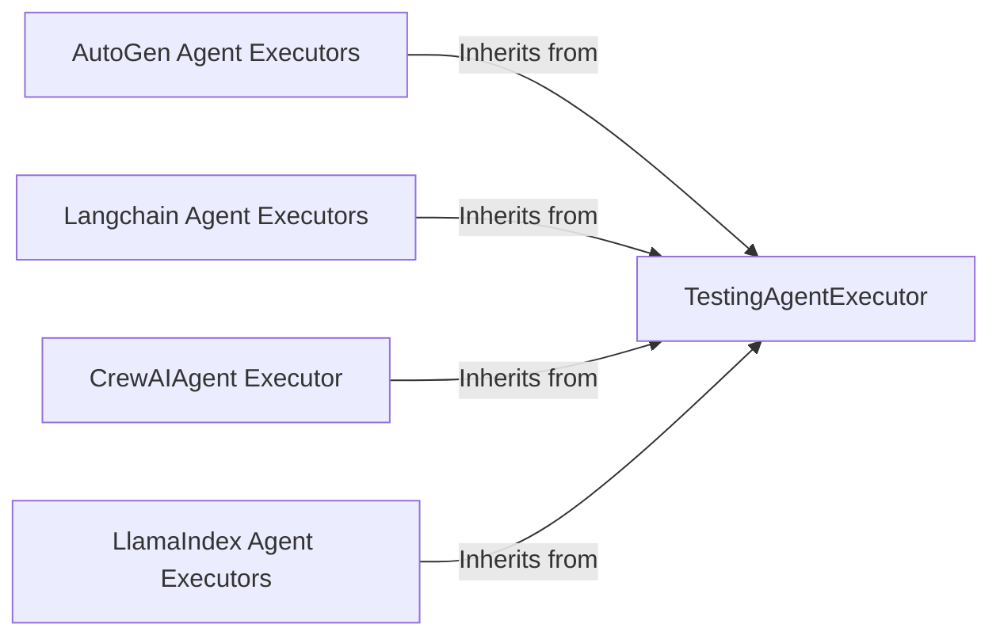

## Component Details

The Agent Execution component provides a unified interface for executing agents from different frameworks (Langchain, Autogen, LlamaIndex, CrewAI) with various tools. It abstracts away the complexities of different agent frameworks, allowing the fuzzer to focus on testing the tools themselves. The core flow involves selecting an agent executor based on the framework, initializing the agent, executing the agent with a given tool and input, and returning the result. This component enables consistent fuzzing across different agent implementations.

### TestingAgentExecutor
This abstract base class defines the interface for all agent executors. It provides a common execution method and setup functionalities for testing agents across different frameworks. All concrete agent executors inherit from this class, ensuring a consistent way to interact with agents during fuzzing.
- **Related Classes/Methods**: `src.toolfuzz.agent_executors.agent_executor.TestingAgentExecutor`

### AutoGen Agent Executors
This component encompasses the executors for AutoGen agents, specifically AssistantAgentExecutor and RoutedAgentExecutor. AssistantAgentExecutor executes standard AutoGen assistant agents, while RoutedAgentExecutor handles agents designed for routing tasks to other agents. These executors manage the initialization and execution of AutoGen agents within the ToolFuzz environment.
- **Related Classes/Methods**: `src.toolfuzz.agent_executors.autogen.assistant_agent.AssistantAgentExecutor`, `src.toolfuzz.agent_executors.autogen.routed_agent.RoutedAgentExecutor`

### Langchain Agent Executors
This component includes executors for Langchain agents, such as OpenAiFunctionExecutor, ReactAgentNew, and ReactAgentOld. OpenAiFunctionExecutor leverages OpenAI function calling, while ReactAgentNew and ReactAgentOld implement the ReAct paradigm with potentially different implementations. These executors facilitate the execution of Langchain agents and their interaction with external tools and APIs.
- **Related Classes/Methods**: `src.toolfuzz.agent_executors.langchain.openai_function.OpenAiFunctionExecutor`, `src.toolfuzz.agent_executors.langchain.react_new.ReactAgentNew`, `src.toolfuzz.agent_executors.langchain.react_old.ReactAgentOld`

### CrewAIAgent Executor
This component is responsible for executing agents built with the CrewAI framework, which is designed for collaborative agent setups. It manages the execution of individual agents within a CrewAI environment, enabling the fuzzing of multi-agent systems.
- **Related Classes/Methods**: `src.toolfuzz.agent_executors.crewai.agent.CrewAIAgent`

### LlamaIndex Agent Executors
This component comprises various executors for LlamaIndex agents, including ReactAgentExecutor, OpenAIAgentExecutor, LlamaIndexAgent, FunctionCallingAgentExecutor, LanguageAgentTreeSearchExecutor, and ChainOfAbstractionAgentExecutor. These executors support different agent types and reasoning approaches within the LlamaIndex framework, providing a comprehensive set of agent execution capabilities.
- **Related Classes/Methods**: `src.toolfuzz.agent_executors.llama_index.react_agent.ReactAgentExecutor`, `src.toolfuzz.agent_executors.llama_index.openai_agent.OpenAIAgentExecutor`, `src.toolfuzz.agent_executors.llama_index.llama_index_agent.LlamaIndexAgent`, `src.toolfuzz.agent_executors.llama_index.function_calling_agent.FunctionCallingAgentExecutor`, `src.toolfuzz.agent_executors.llama_index.lats_agent.LanguageAgentTreeSearchExecutor`, `src.toolfuzz.agent_executors.llama_index.coa_agent.ChainOfAbstractionAgentExecutor`
