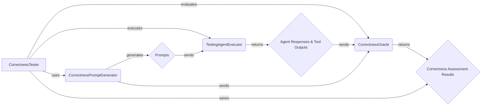

## Correctness Assessment Component Overview

This component focuses on evaluating the correctness of tool outputs and agent behavior within the ToolFuzz framework. It leverages a `CorrectnessOracle` to assess tool outputs, agent responses, and the relevance of agent outputs to the given prompts. The component interacts with the Agent Execution Framework to obtain agent responses and tool outputs, and with Prompt Generation to get the expected behavior.

Here's a data flow diagram illustrating the interactions between the key components:

### Component Descriptions:

*   **CorrectnessTester:** Orchestrates the entire correctness testing process. It generates prompts using `CorrectnessPromptGenerator`, executes the agent with the generated prompts using `TestingAgentExecutor`, evaluates the results using `CorrectnessOracle`, and saves the assessment results.
    *   Relevant source files: `src.toolfuzz.correctness.correctness_fuzzer.CorrectnessTester`

*   **CorrectnessPromptGenerator:** Generates prompts and expected answers for testing tool correctness. It provides diverse prompts to cover various scenarios and edge cases.
    *   Relevant source files: `src.toolfuzz.correctness.prompt_generation.prompt_generator.CorrectnessPromptGenerator`

*   **TestingAgentExecutor:** Executes the agent with a given prompt and tool, capturing the agent's responses and tool outputs. It acts as an intermediary between the `CorrectnessTester` and the agent.
    *   Relevant source files: `src.toolfuzz.agent_executors.agent_executor.TestingAgentExecutor`

*   **CorrectnessOracle:** Evaluates the correctness and relevance of tool outputs and agent outputs using LLMs. It determines if tool outputs are correct, if agent outputs are correct given the tool outputs, and if agent outputs are relevant to the original prompt.
    *   Relevant source files: `src.toolfuzz.correctness.correctness_oracle.CorrectnessOracle`
