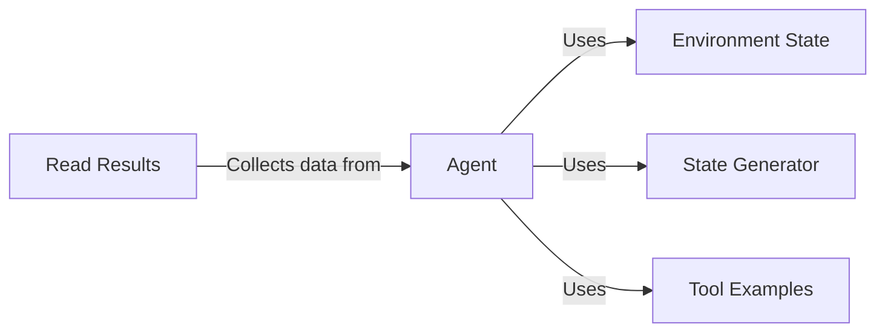

## Component Details

The Environment Control component provides a controlled Git environment for testing tools. It involves setting up the environment, generating different environment states, running prompts using an agent, and evaluating the results. The agent interacts with the environment using various tool examples, such as creating files, creating branches, commenting on issues, and creating pull requests. The environment state is managed to ensure consistent and repeatable evaluation runs. The results of the agent's interactions are collected and analyzed to assess performance.

### Agent
The Agent component is responsible for interacting with the Git environment based on prompts. It sets up the environment, runs the prompts, and orchestrates the execution of various tool examples.
- **Related Classes/Methods**: `src.eval.controlled_git.agent:setup`, `src.eval.controlled_git.agent:run_prompts`, `src.eval.controlled_git.agent:main`

### Environment State
The Environment State component manages the state of the Git environment. It provides functionality to reset the environment to a clean state, ensuring consistent and repeatable evaluation runs. It likely involves operations like cleaning up files, branches, and commits.
- **Related Classes/Methods**: `src.eval.controlled_git.environment_state:reset_state`

### State Generator
The State Generator component is responsible for creating different Git environment states. These states serve as diverse scenarios for the agent to interact with, allowing for a more comprehensive evaluation. It might involve creating files, branches, and commits with varying content and structure.
- **Related Classes/Methods**: `src.eval.controlled_git.generate_states:main`

### Tool Examples
The Tool Examples component provides a set of example tools that the agent can use to interact with the Git environment. These examples cover various Git operations like creating files, deleting files, creating branches, commenting on issues, updating files, and creating pull requests. Each example represents a different scenario or variation of the corresponding Git operation.
- **Related Classes/Methods**: `src.eval.controlled_git.examples.comment_on_issue`, `src.eval.controlled_git.examples.create_file`, `src.eval.controlled_git.examples.create_pr`, `src.eval.controlled_git.examples.delete_file`, `src.eval.controlled_git.examples.new_branch`, `src.eval.controlled_git.examples.update_files`

### Read Results
The Read Results component is responsible for collecting and analyzing the results of the agent's interactions with the Git environment. It provides functions to gather statistics on files and environments, enabling performance assessment. This includes metrics like file size, number of commits, and branch activity.
- **Related Classes/Methods**: `src.eval.controlled_git.read_results:files_stats`, `src.eval.controlled_git.read_results:file_stats`, `src.eval.controlled_git.read_results:stats_per_env`
