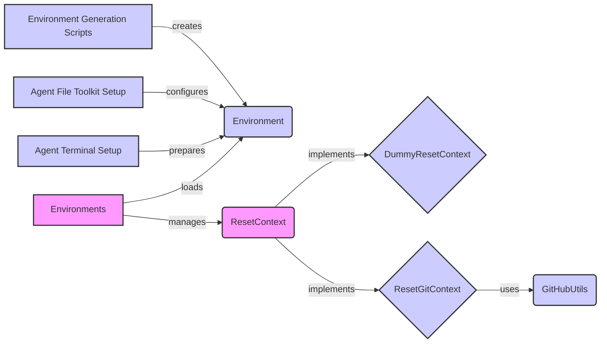

## Environment Management Overview

This component manages the execution environment for agents and tools, including resetting the context between tests and setting up controlled Docker and Git environments. It interacts with the Agent Execution Framework to provide a clean and consistent environment for testing.

