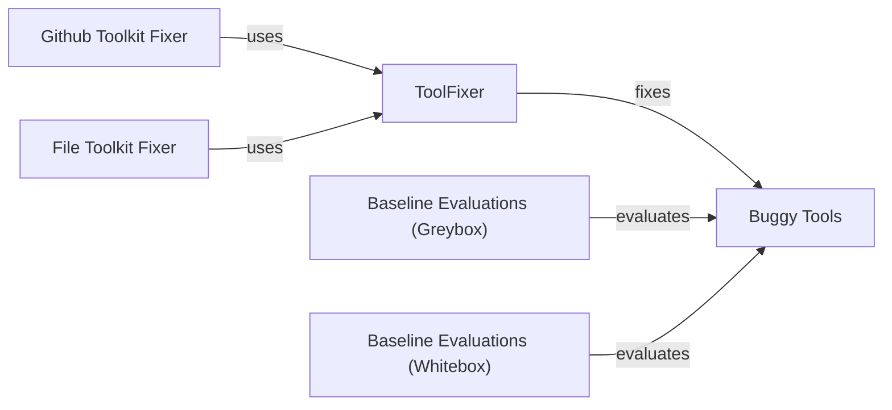

## Component Details

The Evaluation and Repair component focuses on assessing the effectiveness of ToolFuzz and automatically fixing buggy tools. It includes baseline evaluation methods (greybox and whitebox) for comparing ToolFuzz against traditional testing approaches. The ToolFixer class attempts to correct flaws in tool source code and examples. The component also includes a collection of buggy tools with various issues, which serve as test cases for the tool fixing mechanisms. The overall flow involves evaluating buggy tools, attempting to fix them using ToolFixer, and then re-evaluating the fixed tools to measure the improvement.

### ToolFixer
The ToolFixer class provides functionalities to fix buggy tools. It includes methods to fix source code and examples. It interacts with the buggy tools by modifying their code or examples to improve their performance.
- **Related Classes/Methods**: `src.eval.tool_fixing.tool_fixer.ToolFixer`

### Baseline Evaluations (Greybox)
The greybox baseline evaluation provides a way to measure the performance of the buggy tools before and after fixing, using a greybox approach.
- **Related Classes/Methods**: `src.eval.baseline.baseline_greybox`

### Baseline Evaluations (Whitebox)
The whitebox baseline evaluation provides a way to measure the performance of the buggy tools before and after fixing, using a whitebox approach.
- **Related Classes/Methods**: `src.eval.baseline.baseline_whitebox`

### Buggy Tools
This module contains a collection of buggy tools with various issues like underspecified fields, mismatched examples, insufficient permissions, etc. These tools are used as test cases for the tool fixing mechanisms. They interact with the ToolFixer by providing examples of buggy behavior and are evaluated by the baseline evaluations.
- **Related Classes/Methods**: `src.eval.buggy_tools.underspecified_fields`, `src.eval.buggy_tools.mismatched_examples`, `src.eval.buggy_tools.insufficient_permissions`, `src.eval.buggy_tools.well_known_parameters`, `src.eval.buggy_tools.relational_constraints`, `src.eval.buggy_tools.long_output`, `src.eval.buggy_tools.open_street_map`, `src.eval.buggy_tools.underspecified_tools`, `src.eval.buggy_tools.decorators`

### Github Toolkit Fixer
This module contains the main function for fixing tools using a github toolkit.
- **Related Classes/Methods**: `src.eval.tool_fixing.github_toolkit_fixer`

### File Toolkit Fixer
This module contains the main function for fixing tools using a file toolkit.
- **Related Classes/Methods**: `src.eval.tool_fixing.fix_file_toolkit`
