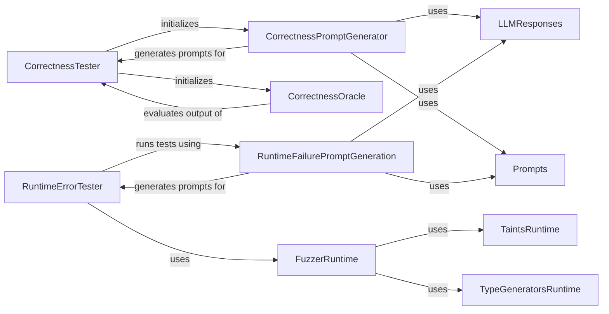

## Component Details

The Fuzzing Engine orchestrates the process of generating inputs, executing the tool with those inputs, and analyzing the outputs for both correctness and runtime errors. It leverages prompt generators to create diverse inputs, oracles to evaluate correctness, and runtime monitoring to detect failures. The engine aims to identify vulnerabilities and weaknesses in the tool's functionality and robustness.

### CorrectnessTester
The CorrectnessTester orchestrates correctness fuzzing. It initializes a prompt generator and a correctness oracle. It generates prompts, executes the tool with those prompts, and evaluates the output using a correctness oracle, saving the results.
- **Related Classes/Methods**: `src.toolfuzz.correctness.correctness_fuzzer.CorrectnessTester`

### CorrectnessPromptGenerator
The CorrectnessPromptGenerator generates prompts for testing the correctness of tool outputs. It generates prompts and humanizes them before converting them to a suitable format. It uses LLM responses and predefined prompts to create diverse test cases.
- **Related Classes/Methods**: `src.toolfuzz.correctness.prompt_generation.prompt_generator.CorrectnessPromptGenerator`

### CorrectnessOracle
The CorrectnessOracle evaluates the correctness of tool outputs. It determines if the agent's output is correct, evaluates the tool output, and evaluates the tool arguments. It provides the evaluation logic for the CorrectnessTester.
- **Related Classes/Methods**: `src.toolfuzz.correctness.correctness_oracle.CorrectnessOracle`

### RuntimeErrorTester
The RuntimeErrorTester orchestrates runtime fuzzing. It runs tests, performs sanity checks, and saves the results. It generates prompts, executes the tool with those prompts, and monitors for runtime errors.
- **Related Classes/Methods**: `src.toolfuzz.runtime.runtime_fuzzer.RuntimeErrorTester`

### RuntimeFailurePromptGeneration
The RuntimeFailurePromptGeneration generates prompts that might cause runtime failures in tools. It generates prompts for testing. It uses LLM responses and predefined prompts to create test cases designed to trigger runtime errors.
- **Related Classes/Methods**: `src.toolfuzz.runtime.prompt_generation.prompt_generator.RuntimeFailurePromptGeneration`

### FuzzerRuntime
The FuzzerRuntime module implements the core fuzzing logic for runtime error detection. It uses taint analysis and type generators to create diverse inputs and monitor for runtime errors during tool execution.
- **Related Classes/Methods**: `src.toolfuzz.runtime.fuzz.fuzzer`

### TaintsRuntime
The TaintsRuntime module handles taint analysis for runtime fuzzing. It tracks the flow of data to identify potential vulnerabilities and runtime errors.
- **Related Classes/Methods**: `src.toolfuzz.runtime.fuzz.taints`

### TypeGeneratorsRuntime
The TypeGeneratorsRuntime module generates different types of inputs for runtime fuzzing. It provides a variety of input types to the FuzzerRuntime to ensure comprehensive testing.
- **Related Classes/Methods**: `src.toolfuzz.runtime.fuzz.type_generators`

### LLMResponses
The LLMResponses module stores the responses from the LLM for prompt generation.
- **Related Classes/Methods**: `src.toolfuzz.correctness.prompt_generation.llm_responses`, `src.toolfuzz.runtime.prompt_generation.llm_responses`

### Prompts
The Prompts module stores the predefined prompts for prompt generation.
- **Related Classes/Methods**: `src.toolfuzz.correctness.prompt_generation.prompts`, `src.toolfuzz.runtime.prompt_generation.prompts`
