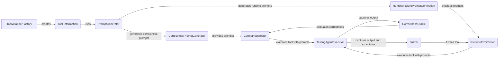

## Prompt Management Component Overview

This component focuses on generating prompts for testing tool correctness and runtime failures. It employs different prompt generation strategies to create prompts designed to trigger specific behaviors or vulnerabilities in the tools. It interacts with Runtime Fuzzing Engine and Correctness Assessment to provide prompts for testing.

Here's a data flow diagram illustrating the interaction between the key components:

### Component Descriptions:

*   **ToolWrapperFactory**: Creates ToolWrapper objects that extract information about the tool, such as its name, description, and arguments. This information is used by the PromptGenerator to create relevant prompts.
    *   Relevant source files: `src.toolfuzz.tools.info_extractors.tool_wrapper_factory.ToolWrapperFactory`

*   **Tool Information**: Represents the extracted information about the tool, including its name, description, and arguments. This information is used by the PromptGenerator to create relevant prompts.
    *   Relevant source files: `src.toolfuzz.tools.info_extractors.tool_wrapper_factory.ToolWrapperFactory`

*   **PromptGenerator**: Abstract base class for generating prompts. It uses a language model to generate prompts based on templates and tool documentation. It provides a common interface for CorrectnessPromptGenerator and RuntimeFailurePromptGeneration.
    *   Relevant source files: `src.toolfuzz.prompt_generation.prompt_generator.PromptGenerator`

*   **CorrectnessPromptGenerator**: Generates prompts specifically designed to test the correctness of a tool. It inherits from PromptGenerator and uses templates and LLMs to create diverse prompts and expected answers. It provides prompts to CorrectnessTester.
    *   Relevant source files: `src.toolfuzz.correctness.prompt_generation.prompt_generator.CorrectnessPromptGenerator`

*   **RuntimeFailurePromptGeneration**: Generates prompts intended to trigger runtime failures in a tool. It inherits from PromptGenerator and focuses on creating prompts with potentially problematic arguments. It provides prompts to RuntimeErrorTester.
    *   Relevant source files: `src.toolfuzz.runtime.prompt_generation.prompt_generator.RuntimeFailurePromptGeneration`

*   **CorrectnessTester**: Tests the correctness of a tool by generating prompts using CorrectnessPromptGenerator, executing the tool with those prompts, and comparing the output to expected answers using CorrectnessOracle. It uses TestingAgentExecutor to execute the tool and CorrectnessOracle to evaluate the results.
    *   Relevant source files: `src.toolfuzz.correctness.correctness_fuzzer.CorrectnessTester`

*   **RuntimeErrorTester**: Tests for runtime errors in a tool by generating prompts using RuntimeFailurePromptGeneration, executing the tool, and checking if the expected exceptions are raised. It uses TestingAgentExecutor to execute the tool and Fuzzer to generate more complex inputs.
    *   Relevant source files: `src.toolfuzz.runtime.runtime_fuzzer.RuntimeErrorTester`

*   **TestingAgentExecutor**: Executes the tool with the generated prompts and captures the output, arguments, and any exceptions that occur. It provides the output to CorrectnessOracle and Fuzzer.
    *   Relevant source files: `src.toolfuzz.agent_executors.agent_executor.TestingAgentExecutor`

*   **CorrectnessOracle**: Evaluates the correctness of the tool's output and arguments based on the generated prompts and expected answers. It provides feedback to CorrectnessTester.
    *   Relevant source files: `src.toolfuzz.correctness.correctness_oracle.CorrectnessOracle`

*   **Fuzzer**: Fuzzes the tool to find bad arguments that cause exceptions. It uses taint analysis and type generators to create potentially problematic inputs. It provides inputs to RuntimeErrorTester.
    *   Relevant source files: `src.toolfuzz.runtime.fuzz.fuzzer.Fuzzer`
