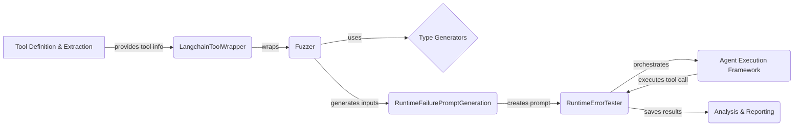

**Component: Tool Definition & Extraction**
*Description*: Extracts information about the tool's arguments, types, and constraints. It provides the necessary information for the `LangchainToolWrapper` to adapt the tool for fuzzing.
*Interaction*: Provides tool information to `LangchainToolWrapper`.
*Relevant source files*: N/A

**Component: LangchainToolWrapper**
*Description*: Adapts Langchain tools for use within the fuzzing framework. It extracts information about the tool's arguments, invokes the tool with the generated inputs, and handles any exceptions that occur during execution.
*Interaction*: Receives tool information from `Tool Definition & Extraction`, wraps the tool for use by the `Fuzzer`.
*Relevant source files*: `src.toolfuzz.tools.info_extractors.langchain_tool_wrapper.LangchainToolWrapper`

**Component: Fuzzer**
*Description*: Generates invalid inputs for a given tool to trigger runtime errors. It uses type generators to create diverse inputs based on the tool's argument types and constraints, and invokes the tool with these inputs, catching any exceptions that occur.
*Interaction*: Uses `Type Generators` to create inputs, sends generated inputs to `RuntimeFailurePromptGeneration` and is used by `RuntimeErrorTester`.
*Relevant source files*: `src.toolfuzz.runtime.fuzz.fuzzer.Fuzzer`

**Component: Type Generators**
*Description*: A collection of classes responsible for generating different types of fuzzed values, such as strings, integers, booleans, lists, and dictionaries. These generators are used by the Fuzzer to create a wide range of invalid inputs for the tool.
*Interaction*: Used by `Fuzzer` to generate fuzzed values.
*Relevant source files*: `src.toolfuzz.runtime.fuzz.type_generators`

**Component: RuntimeFailurePromptGeneration**
*Description*: Generates prompts based on the tool's definition and the generated invalid arguments, to provide context for the agent during testing. These prompts are used to guide the agent in reproducing the runtime failures.
*Interaction*: Receives generated inputs from `Fuzzer`, creates prompts for `RuntimeErrorTester`.
*Relevant source files*: `src.toolfuzz.runtime.prompt_generation.prompt_generator.RuntimeFailurePromptGeneration`

**Component: RuntimeErrorTester**
*Description*: Tests a tool for runtime errors by fuzzing its inputs and checking for exceptions. It orchestrates the fuzzing process, prompt generation, and test execution, saving the results for analysis.
*Interaction*: Orchestrates the fuzzing process, uses `RuntimeFailurePromptGeneration` to create prompts, interacts with `Agent Execution Framework` to execute the tool, and sends results to `Analysis & Reporting`.
*Relevant source files*: `src.toolfuzz.runtime.runtime_fuzzer.RuntimeErrorTester`

**Component: Agent Execution Framework**
*Description*: Executes the tool calls with the generated fuzzed inputs.
*Interaction*: Executes tool calls for `RuntimeErrorTester`.
*Relevant source files*: N/A

**Component: Analysis & Reporting**
*Description*: Analyzes the results of the fuzzing process and generates reports on any identified runtime errors or vulnerabilities.
*Interaction*: Receives results from `RuntimeErrorTester`.
*Relevant source files*: N/A
