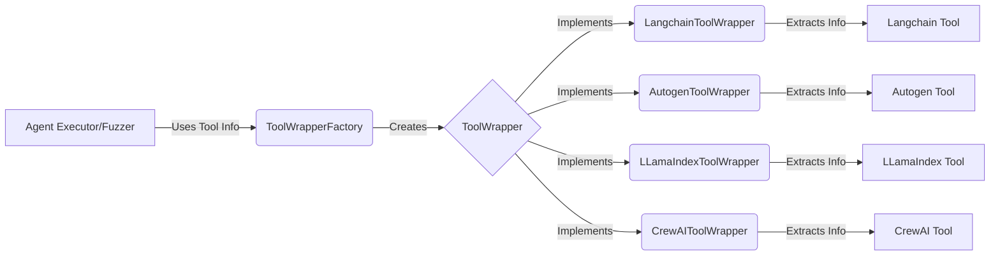

## Tool Definition & Extraction Overview

This diagram illustrates the flow of information within the Tool Definition & Extraction component. It shows how tool information is extracted from different frameworks using ToolWrappers and how this information is used by other components.

### Component Descriptions:

*   **Agent Executor/Fuzzer:** This component represents the parts of the system that utilize tool information, such as agent executors or fuzzers. It requests tool information from the `ToolWrapperFactory`. **Relevant files:** N/A (Represents external components)
*   **ToolWrapperFactory:** This component is responsible for creating the appropriate `ToolWrapper` based on the type of tool being used (e.g., Langchain, Autogen). It receives requests for tool wrappers and returns the appropriate implementation. **Relevant files:** `src.toolfuzz.tools.info_extractors.tool_wrapper_factory.ToolWrapperFactory`
*   **ToolWrapper:** This is an abstract component that defines the interface for all tool wrappers. It provides methods for extracting tool information such as arguments, documentation, and source code. **Relevant files:** `src.toolfuzz.tools.info_extractors.tool_wrapper.ToolWrapper`
*   **LangchainToolWrapper:** This component implements the `ToolWrapper` interface for Langchain tools. It extracts tool information specific to Langchain tools. **Relevant files:** `src.toolfuzz.tools.info_extractors.langchain_tool_wrapper.LangchainToolWrapper`
*   **AutogenToolWrapper:** This component implements the `ToolWrapper` interface for Autogen tools. It extracts tool information specific to Autogen tools. **Relevant files:** `src.toolfuzz.tools.info_extractors.autogen_tool_wrapper.AutogenToolWrapper`
*   **LLamaIndexToolWrapper:** This component implements the `ToolWrapper` interface for LlamaIndex tools. It extracts tool information specific to LlamaIndex tools. **Relevant files:** `src.toolfuzz.tools.info_extractors.llama_index_tool_wrapper.LLamaIndexToolWrapper`
*   **CrewAIToolWrapper:** This component implements the `ToolWrapper` interface for CrewAI tools. It extracts tool information specific to CrewAI tools. **Relevant files:** `src.toolfuzz.tools.info_extractors.crew_ai_tool_wrapper.CrewAIToolWrapper`
*   **Langchain Tool:** Represents a tool from the Langchain framework. **Relevant files:** N/A (Represents external components)
*   **Autogen Tool:** Represents a tool from the Autogen framework. **Relevant files:** N/A (Represents external components)
*   **LLamaIndex Tool:** Represents a tool from the LlamaIndex framework. **Relevant files:** N/A (Represents external components)
*   **CrewAI Tool:** Represents a tool from the CrewAI framework. **Relevant files:** N/A (Represents external components)