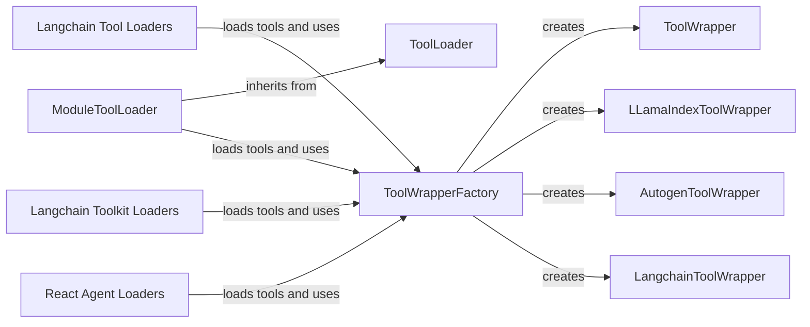

## Component Details

The Tool Management component is responsible for loading, wrapping, and providing access to tools from various sources like Langchain, Autogen, and CrewAI. It uses loaders to retrieve tools and a factory pattern with tool wrappers to standardize the interface for accessing tool metadata, arguments, and documentation. This ensures a consistent view of the tools for other parts of the system, such as prompt generation and fuzzing.

### ToolLoader
Abstract base class defining the interface for loading tools from different sources. It provides a `get_tools` method to retrieve tools and an `inherits_base_tool` method to check if a tool inherits from a base tool class.
- **Related Classes/Methods**: `src.eval.toolfuzz.utils.tool_loader`

### ModuleToolLoader
Loads tools from Python modules. It inherits from `ToolLoader` and implements the `load_tools` method to load tools from a specified module path. It uses introspection to find callable objects within the module and wraps them as tools.
- **Related Classes/Methods**: `src.eval.toolfuzz.loaders.module_tool_loader`

### Langchain Tool Loaders
Loaders for specific Langchain tools, including mocking functionalities for testing purposes. It uses `MockResponse` and `MockedDalEEClient` to simulate the Dalle API.
- **Related Classes/Methods**: `src.eval.toolfuzz.loaders.langchain_tool_loaders`

### Langchain Toolkit Loaders
Loaders for Langchain toolkits like Nasa, FileManagement, RequestsAll, PlayWrightBrowser, Gmail, and Github. Each toolkit loader has a `can_load` method that determines if the toolkit can be loaded based on certain conditions (e.g., required dependencies are installed).
- **Related Classes/Methods**: `src.eval.toolfuzz.loaders.langchain_toolkit_loaders`

### React Agent Loaders
Loaders for React agents (both new and old versions). `ReactNewAgentLoader` and `ReactOldAgentLoader` provide `get_agent` methods to create and configure React agents for use with the tool fuzzing system.
- **Related Classes/Methods**: `src.eval.toolfuzz.loaders.langchain_loader`

### ToolWrapperFactory
A factory class responsible for creating the appropriate `ToolWrapper` instance based on the type of tool being wrapped. The `create_extractor` method takes a tool as input and returns the corresponding wrapper (e.g., `LLamaIndexToolWrapper`, `AutogenToolWrapper`, `LangchainToolWrapper`, or `CrewAIToolWrapper`).
- **Related Classes/Methods**: `src.toolfuzz.tools.info_extractors.tool_wrapper_factory`

### ToolWrapper
Base class for tool wrappers. Provides a common interface for accessing tool information like arguments and documentation. Subclasses implement the specific logic for extracting information from different tool types.
- **Related Classes/Methods**: `src.toolfuzz.tools.info_extractors.tool_wrapper`

### LLamaIndexToolWrapper
A tool wrapper specifically for Llama Index tools. It extracts tool arguments, documentation, and transforms types as needed.
- **Related Classes/Methods**: `src.toolfuzz.tools.info_extractors.llama_index_tool_wrapper`

### AutogenToolWrapper
A tool wrapper for Autogen tools. It extracts tool arguments, source code, documentation, and declaration names.
- **Related Classes/Methods**: `src.toolfuzz.tools.info_extractors.autogen_tool_wrapper`

### LangchainToolWrapper
A tool wrapper for Langchain tools. It extracts tool arguments and documentation.
- **Related Classes/Methods**: `src.toolfuzz.tools.info_extractors.langchain_tool_wrapper`
