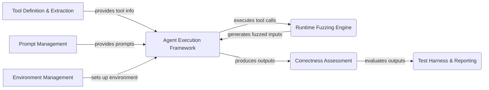

# ToolFuzz: High-Level Data Flow Overview

ToolFuzz is a framework designed to automatically test and evaluate the robustness and correctness of tools used by AI agents. It employs fuzzing techniques, correctness oracles, and diverse execution environments to identify potential runtime failures, incorrect outputs, and vulnerabilities in these tools.

## Component Descriptions:

**A. Tool Definition & Extraction:**
This component extracts information about tools from various frameworks (Langchain, Autogen, CrewAI, Llama Index). It uses ToolWrappers to provide a unified interface for accessing tool arguments, documentation, and source code. It provides tool information to the Agent Execution Framework, enabling it to execute tools correctly. 

*Related Files:*
*   `src.toolfuzz.tools.info_extractors.tool_wrapper_factory.ToolWrapperFactory`: Creates tool extractors for different frameworks.
*   `src.toolfuzz.tools.info_extractors.tool_wrapper.ToolWrapper`: Base class for tool wrappers.
*   `src.toolfuzz.tools.info_extractors.llama_index_tool_wrapper.LLamaIndexToolWrapper`: Extracts information from Llama Index tools.
*   `src.toolfuzz.tools.info_extractors.autogen_tool_wrapper.AutogenToolWrapper`: Extracts information from Autogen tools.
*   `src.toolfuzz.tools.info_extractors.langchain_tool_wrapper.LangchainToolWrapper`: Extracts information from Langchain tools.
*   `src.toolfuzz.tools.info_extractors.crew_ai_tool_wrapper.CrewAIToolWrapper`: Extracts information from CrewAI tools.

**B. Agent Execution Framework:**
This component provides a unified interface for executing agents from different frameworks (Langchain, Autogen, CrewAI, Llama Index). It handles the execution of prompts and tool calls, and captures the agent's responses, tool outputs, and any exceptions raised. It receives tool information from Tool Definition & Extraction, executes fuzzed tool calls from the Runtime Fuzzing Engine, receives prompts from Prompt Management, and sends outputs to Correctness Assessment. It also relies on Environment Management to set up the execution environment.

*Related Files:*
*   `src.toolfuzz.agent_executors.agent_executor.TestingAgentExecutor`: Base class for agent executors.
*   `src.toolfuzz.agent_executors.autogen.assistant_agent.AssistantAgentExecutor`: Executes Autogen assistant agents.
*   `src.toolfuzz.agent_executors.langchain.react_new.ReactAgentNew`: Executes Langchain React agents.
*   `src.toolfuzz.agent_executors.crewai.agent.CrewAIAgent`: Executes CrewAI agents.
*   `src.toolfuzz.agent_executors.llama_index.llama_index_agent.LlamaIndexAgent`: Executes Llama Index agents.
*   `src.toolfuzz.agent_executors.llama_index.function_calling_agent.FunctionCallingAgentExecutor`: Executes Llama Index function calling agents.

**C. Runtime Fuzzing Engine:**
This component is responsible for fuzzing tool inputs at runtime to identify potential errors and vulnerabilities. It generates a variety of inputs based on the tool's argument types and constraints, and then executes the tool with these inputs. It receives tool information from Tool Definition & Extraction and sends fuzzed inputs to the Agent Execution Framework.

*Related Files:*
*   `src.toolfuzz.runtime.runtime_fuzzer.RuntimeErrorTester`: Tests tools for runtime errors.
*   `src.toolfuzz.runtime.fuzz.fuzzer.Fuzzer`: Base class for fuzzers.
*   `src.toolfuzz.runtime.fuzz.type_generators.StringGenerator`: Generates string inputs.
*   `src.toolfuzz.runtime.fuzz.type_generators`: Contains various type generators.

**D. Correctness Assessment:**
This component determines the correctness of tool outputs and agent behavior. It uses a CorrectnessOracle to evaluate tool outputs, agent responses, and the relevance of agent outputs to the given prompts. It receives outputs from the Agent Execution Framework, prompts from Prompt Management, and sends evaluation results to the Test Harness & Reporting component.

*Related Files:*
*   `src.toolfuzz.correctness.correctness_oracle.CorrectnessOracle`: Evaluates the correctness of tool outputs and agent behavior.
*   `src.toolfuzz.correctness.correctness_oracle:flatten`: Utility function for flattening data structures.

**E. Prompt Management:**
This component generates prompts for testing tool correctness and runtime failures. It uses different prompt generation strategies to create prompts that are designed to trigger specific behaviors or vulnerabilities in the tools. It provides prompts to the Agent Execution Framework and Correctness Assessment components.

*Related Files:*
*   `src.toolfuzz.prompt_generation.prompt_generator.PromptGenerator`: Base class for prompt generators.
*   `src.toolfuzz.correctness.prompt_generation.prompt_generator.CorrectnessPromptGenerator`: Generates prompts for testing tool correctness.
*   `src.toolfuzz.runtime.prompt_generation.prompt_generator.RuntimeFailurePromptGeneration`: Generates prompts for testing runtime failures.

**F. Test Harness & Reporting:**
This component provides the infrastructure for running tests, collecting results, and generating reports. It includes functions for saving test results in JSON and HTML formats, and for transforming test results into a more human-readable format. It receives evaluation results from the Correctness Assessment component.

*Related Files:*
*   `src.toolfuzz.utils.save_test_results`: Saves test results in JSON format.
*   `src.toolfuzz.utils.save_test_results_html`: Saves test results in HTML format.
*   `src.toolfuzz.utils.transform_test_results`: Transforms test results into a more human-readable format.
*   `src.toolfuzz.dataclasses.TestResult`: Data class for storing test results.
*   `src.toolfuzz.dataclasses.TestFailureResult`: Data class for storing test failure results.

**G. Environment Management:**
This component manages the execution environment for the agents and tools. It includes functionality for resetting the context between tests, and for setting up controlled Docker and Git environments. It sets up the environment for the Agent Execution Framework.

*Related Files:*
*   `src.eval.toolfuzz.envs.reset_context.DummyResetContext`: Dummy reset context.
*   `src.eval.toolfuzz.envs.reset_context.ResetContext`: Resets the context between tests.
*   `repos.ToolFuzz.src.eval.controlled_docker_env.agent_terminal:main`: Sets up and runs agents in a controlled Docker environment.
*   `repos.ToolFuzz.src.eval.controlled_git.agent:setup`: Sets up agents in a controlled Git environment.