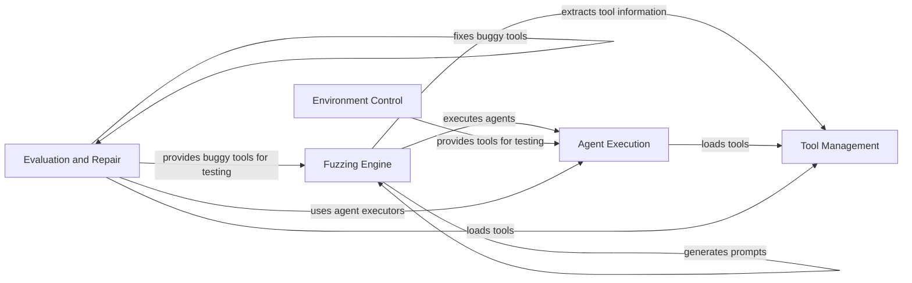

## Component Details

ToolFuzz is a framework for fuzzing tools used by AI agents. It focuses on identifying correctness and runtime issues in tools from various sources, including Langchain, Autogen, LlamaIndex and CrewAI. The framework provides components for loading tools, generating prompts, executing agents, and evaluating results. It also includes features for managing controlled environments, defining buggy tools, and automatically fixing tool flaws. The main flow involves loading tools, generating prompts based on tool specifications, executing agents with those tools, and then evaluating the results to identify potential issues.

### Agent Execution
This component provides a unified interface for executing agents from different frameworks (Langchain, Autogen, LlamaIndex, CrewAI) with various tools. It handles the execution of agents, manages tool interactions, and provides a consistent environment for fuzzing. It abstracts away the complexities of different agent frameworks, allowing the fuzzer to focus on testing the tools themselves.
- **Related Classes/Methods**: `src.toolfuzz.agent_executors.agent_executor`, `src.toolfuzz.agent_executors.autogen.assistant_agent`, `src.toolfuzz.agent_executors.autogen.routed_agent`, `src.toolfuzz.agent_executors.langchain.openai_function`, `src.toolfuzz.agent_executors.langchain.react_new`, `src.toolfuzz.agent_executors.langchain.react_old`, `src.toolfuzz.agent_executors.crewai.agent`, `src.toolfuzz.agent_executors.llama_index.react_agent`, `src.toolfuzz.agent_executors.llama_index.openai_agent`, `src.toolfuzz.agent_executors.llama_index.llama_index_agent`, `src.toolfuzz.agent_executors.llama_index.function_calling_agent`, `src.toolfuzz.agent_executors.llama_index.lats_agent`, `src.toolfuzz.agent_executors.llama_index.coa_agent`

### Tool Management
This component is responsible for loading, extracting, wrapping, and managing information about tools from different sources. It provides a standardized interface for accessing tool metadata, arguments, and documentation, which is crucial for prompt generation and fuzzing. It handles the complexities of different tool formats and provides a consistent view of the tools to the rest of the system.
- **Related Classes/Methods**: `src.toolfuzz.tools.info_extractors.tool_wrapper_factory`, `src.toolfuzz.tools.info_extractors.tool_wrapper`, `src.toolfuzz.tools.info_extractors.llama_index_tool_wrapper`, `src.toolfuzz.tools.info_extractors.autogen_tool_wrapper`, `src.toolfuzz.tools.info_extractors.langchain_tool_wrapper`, `src.toolfuzz.tools.info_extractors.crew_ai_tool_wrapper`, `src.eval.toolfuzz.loaders.langchain_tool_loaders`, `src.eval.toolfuzz.loaders.langchain_toolkit_loaders`, `src.eval.toolfuzz.loaders.module_tool_loader`, `src.eval.toolfuzz.utils.tools`, `src.eval.toolfuzz.utils.tool_loader`, `src.eval.toolfuzz.loaders.custom_tools_loader`, `src.eval.toolfuzz.loaders.langchain_loader`, `src.toolfuzz.tools.info_extractors.dataclasses`

### Fuzzing Engine
This component encompasses the core fuzzing logic, including prompt generation, agent execution, and result evaluation. It includes both correctness and runtime fuzzing strategies, focusing on identifying different types of tool-related issues. It orchestrates the entire fuzzing process, from generating inputs to analyzing outputs.
- **Related Classes/Methods**: `src.toolfuzz.correctness.correctness_fuzzer`, `src.toolfuzz.runtime.runtime_fuzzer`, `src.toolfuzz.correctness.prompt_generation.prompt_generator`, `src.toolfuzz.runtime.prompt_generation.prompt_generator`, `src.toolfuzz.correctness.prompt_generation.llm_responses`, `src.toolfuzz.runtime.prompt_generation.llm_responses`, `src.toolfuzz.correctness.prompt_generation.prompts`, `src.toolfuzz.runtime.prompt_generation.prompts`, `src.toolfuzz.runtime.fuzz.fuzzer`, `src.toolfuzz.runtime.fuzz.taints`, `src.toolfuzz.runtime.fuzz.type_generators`

### Evaluation and Repair
This component provides functionalities for evaluating the effectiveness of ToolFuzz and automatically fixing buggy tools. It includes baseline evaluation methods for comparing ToolFuzz against traditional testing approaches, as well as a ToolFixer class that attempts to correct flaws in tool source code and examples. It closes the loop by not only identifying issues but also attempting to resolve them.
- **Related Classes/Methods**: `src.eval.baseline.baseline_greybox`, `src.eval.baseline.baseline_whitebox`, `src.eval.tool_fixing.tool_fixer`, `src.eval.tool_fixing.github_toolkit_fixer`, `src.eval.tool_fixing.fix_file_toolkit`, `src.eval.buggy_tools.underspecified_fields`, `src.eval.buggy_tools.mismatched_examples`, `src.eval.buggy_tools.insufficient_permissions`, `src.eval.buggy_tools.well_known_parameters`, `src.eval.buggy_tools.relational_constraints`, `src.eval.buggy_tools.long_output`, `src.eval.buggy_tools.open_street_map`, `src.eval.buggy_tools.underspecified_tools`, `src.eval.buggy_tools.decorators`

### Environment Control
This component provides controlled environments, such as a Git environment, for testing tools that interact with external systems. It includes functionalities for setting up the environment, running prompts, and evaluating the results. This allows for testing tools in realistic scenarios without affecting real-world systems.
- **Related Classes/Methods**: `src.eval.controlled_git.agent`, `src.eval.controlled_git.environment_state`, `src.eval.controlled_git.generate_states`, `src.eval.controlled_git.examples.comment_on_issue`, `src.eval.controlled_git.examples.create_file`, `src.eval.controlled_git.examples.create_pr`, `src.eval.controlled_git.examples.delete_file`, `src.eval.controlled_git.examples.new_branch`, `src.eval.controlled_git.examples.update_files`, `src.eval.controlled_git.tool_example`