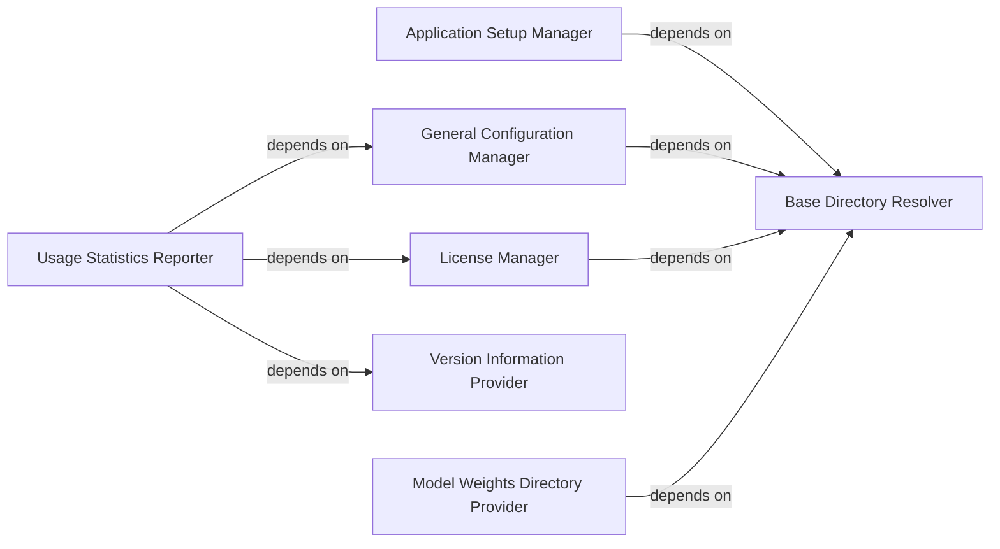

## Details

The Configuration & Utility Services subsystem, primarily within totalsegmentator/config.py, centralizes application-wide settings, directory management, licensing, and usage statistics for TotalSegmentator.

### Base Directory Resolver
Establishes and provides the canonical root directory for all TotalSegmentator-related data, including configuration files, model weights, and license information. It acts as the foundational component for locating persistent application data.

**Related Classes/Methods**:

- <a href="https://github.com/wasserth/TotalSegmentator/blob/master/totalsegmentator/config.py#L16-L23" target="_blank" rel="noopener noreferrer">`totalsegmentator.config.get_totalseg_dir`:16-23</a>

### Application Setup Manager
Manages the initial setup and configuration of the TotalSegmentator environment. This includes creating necessary directories and configuring external dependencies, such as nnUNet, ensuring the application is ready for operation.

**Related Classes/Methods**:

- <a href="https://github.com/wasserth/TotalSegmentator/blob/master/totalsegmentator/config.py#L54-L73" target="_blank" rel="noopener noreferrer">`totalsegmentator.config.setup_totalseg`:54-73</a>
- <a href="https://github.com/wasserth/TotalSegmentator/blob/master/totalsegmentator/config.py#L36-L51" target="_blank" rel="noopener noreferrer">`totalsegmentator.config.setup_nnunet`:36-51</a>

### General Configuration Manager
Provides a centralized mechanism for reading, retrieving, and modifying general application-wide configuration settings. This component ensures consistent access to user preferences and operational parameters.

**Related Classes/Methods**:

- <a href="https://github.com/wasserth/TotalSegmentator/blob/master/totalsegmentator/config.py#L175-L183" target="_blank" rel="noopener noreferrer">`totalsegmentator.config.get_config`:175-183</a>
- <a href="https://github.com/wasserth/TotalSegmentator/blob/master/totalsegmentator/config.py#L193-L201" target="_blank" rel="noopener noreferrer">`totalsegmentator.config.get_config_key`:193-201</a>
- <a href="https://github.com/wasserth/TotalSegmentator/blob/master/totalsegmentator/config.py#L204-L215" target="_blank" rel="noopener noreferrer">`totalsegmentator.config.set_config_key`:204-215</a>

### License Manager
Handles the setting, retrieval, and validation of user licenses. It supports both online and offline checks to ensure compliance with licensing agreements, critical for commercial or restricted use cases.

**Related Classes/Methods**:

- <a href="https://github.com/wasserth/TotalSegmentator/blob/master/totalsegmentator/config.py#L76-L92" target="_blank" rel="noopener noreferrer">`totalsegmentator.config.set_license_number`:76-92</a>
- <a href="https://github.com/wasserth/TotalSegmentator/blob/master/totalsegmentator/config.py#L95-L104" target="_blank" rel="noopener noreferrer">`totalsegmentator.config.get_license_number`:95-104</a>
- <a href="https://github.com/wasserth/TotalSegmentator/blob/master/totalsegmentator/config.py#L124-L140" target="_blank" rel="noopener noreferrer">`totalsegmentator.config.has_valid_license`:124-140</a>
- <a href="https://github.com/wasserth/TotalSegmentator/blob/master/totalsegmentator/config.py#L144-L160" target="_blank" rel="noopener noreferrer">`totalsegmentator.config.has_valid_license_offline`:144-160</a>
- <a href="https://github.com/wasserth/TotalSegmentator/blob/master/totalsegmentator/config.py#L107-L120" target="_blank" rel="noopener noreferrer">`totalsegmentator.config.is_valid_license`:107-120</a>

### Usage Statistics Reporter
Responsible for collecting and anonymously reporting usage data and prediction counts. This component aids in application improvement, understanding user behavior, and potentially for feature prioritization.

**Related Classes/Methods**:

- <a href="https://github.com/wasserth/TotalSegmentator/blob/master/totalsegmentator/config.py#L163-L172" target="_blank" rel="noopener noreferrer">`totalsegmentator.config.increase_prediction_counter`:163-172</a>
- <a href="https://github.com/wasserth/TotalSegmentator/blob/master/totalsegmentator/config.py#L218-L252" target="_blank" rel="noopener noreferrer">`totalsegmentator.config.send_usage_stats`:218-252</a>
- <a href="https://github.com/wasserth/TotalSegmentator/blob/master/totalsegmentator/config.py#L255-L279" target="_blank" rel="noopener noreferrer">`totalsegmentator.config.send_usage_stats_application`:255-279</a>

### Version Information Provider
Provides the current version string of the TotalSegmentator application. This is essential for logging, reporting, and ensuring compatibility across different components or external systems.

**Related Classes/Methods**:

- <a href="https://github.com/wasserth/TotalSegmentator/blob/master/totalsegmentator/config.py#L186-L190" target="_blank" rel="noopener noreferrer">`totalsegmentator.config.get_version`:186-190</a>

### Model Weights Directory Provider
Specifies and provides the file system location where pre-trained ML model weights are stored or should be downloaded. This ensures that the ML Model Inference Engine can correctly locate and load necessary models.

**Related Classes/Methods**:

- <a href="https://github.com/wasserth/TotalSegmentator/blob/master/totalsegmentator/config.py#L26-L33" target="_blank" rel="noopener noreferrer">`totalsegmentator.config.get_weights_dir`:26-33</a>

### [FAQ](https://github.com/CodeBoarding/GeneratedOnBoardings/tree/main?tab=readme-ov-file#faq)