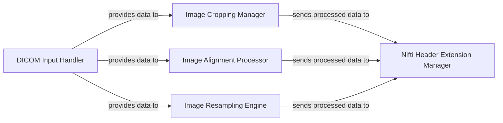

## Details

This subsystem encompasses all functionalities related to handling input medical image data, converting formats, managing Nifti headers, and performing essential image transformations before any machine learning inference. Its scope is defined by the `totalsegmentator/dicom_io.py`, `totalsegmentator/cropping.py`, `totalsegmentator/alignment.py`, `totalsegmentator/resampling.py`, and `totalsegmentator/nifti_ext_header.py` modules. These components are chosen based on their distinct and fundamental roles in the medical image processing pipeline, aligning with the project's architectural bias towards a processing pipeline focus and separation of concerns. Each component addresses a specific, critical step in preparing raw medical image data for AI inference: `DICOM Input Handler` handles the initial data ingestion and format standardization, a prerequisite for any further processing; `Image Cropping Manager` optimizes performance and memory usage by reducing irrelevant data; `Image Alignment Processor` ensures data consistency and compatibility across different models and processing stages; `Image Resampling Engine` standardizes resolution and enables performance tuning, directly impacting model input requirements; `Nifti Header Extension Manager` guarantees data integrity and adherence to medical standards by managing metadata crucial for post-processing and analysis. Together, they form a cohesive `Data Management & Preprocessing` layer, ensuring that data is correctly prepared and optimized before being fed into the core ML inference engine.

### DICOM Input Handler
Responsible for ingesting medical images in DICOM format, ensuring the availability of necessary external conversion tools (e.g., `dcm2niix`), and converting DICOM data into the standardized Nifti format for subsequent processing. This component is fundamental for handling the primary input data format in medical imaging.

**Related Classes/Methods**:

- <a href="https://github.com/wasserth/TotalSegmentator/blob/master/totalsegmentator/dicom_io.py" target="_blank" rel="noopener noreferrer">`totalsegmentator/dicom_io.py`</a>

### Image Cropping Manager
Manages spatial reduction of image data by applying cropping operations based on defined bounding boxes or masks. It also provides functionality to reverse these operations. This component is crucial for performance optimization by reducing data size and focusing processing on relevant regions.

**Related Classes/Methods**:

- <a href="https://github.com/wasserth/TotalSegmentator/blob/master/totalsegmentator/cropping.py" target="_blank" rel="noopener noreferrer">`totalsegmentator/cropping.py`</a>

### Image Alignment Processor
Ensures consistent image orientation and spatial properties by undoing canonical Nifti transformations. This standardization of input is vital for maintaining compatibility with various downstream processing steps and machine learning models, ensuring reliable and reproducible results.

**Related Classes/Methods**:

- <a href="https://github.com/wasserth/TotalSegmentator/blob/master/totalsegmentator/alignment.py" target="_blank" rel="noopener noreferrer">`totalsegmentator/alignment.py`</a>

### Image Resampling Engine
Adjusts the resolution and voxel spacing of images. This is a critical step for standardizing inputs to match the requirements of different models (e.g., nnUNet) and for optimizing processing performance, particularly through options like `--fast`. It supports various resampling backends for flexibility.

**Related Classes/Methods**:

- <a href="https://github.com/wasserth/TotalSegmentator/blob/master/totalsegmentator/resampling.py" target="_blank" rel="noopener noreferrer">`totalsegmentator/resampling.py`</a>

### Nifti Header Extension Manager
Manages the extended header of Nifti files, specifically for embedding and retrieving custom metadata, such as multi-label information. This component is essential for adhering to medical data standards and for facilitating post-segmentation analysis by preserving crucial contextual information within the Nifti files.

**Related Classes/Methods**:

- <a href="https://github.com/wasserth/TotalSegmentator/blob/master/totalsegmentator/nifti_ext_header.py" target="_blank" rel="noopener noreferrer">`totalsegmentator/nifti_ext_header.py`</a>

### [FAQ](https://github.com/CodeBoarding/GeneratedOnBoardings/tree/main?tab=readme-ov-file#faq)