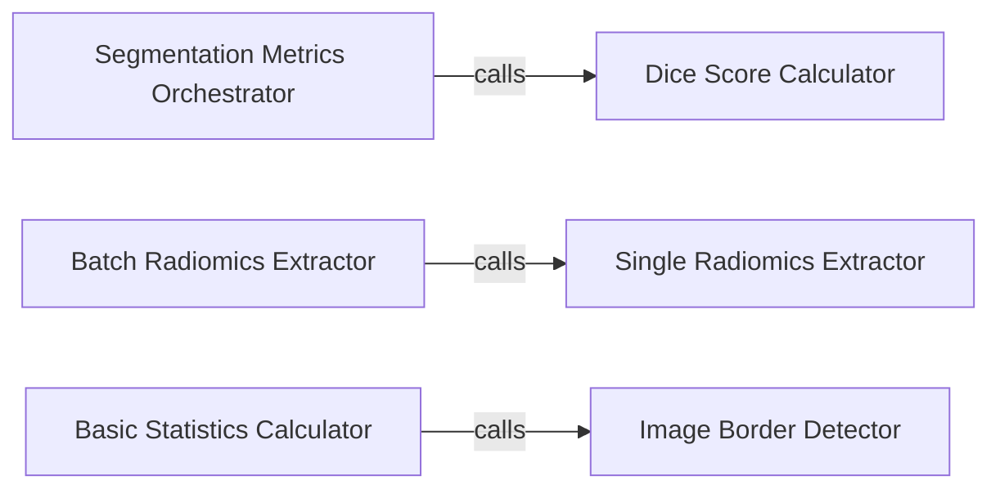

## Details

The Evaluation & Statistics subsystem focuses on quantitative assessment of segmentation performance and extraction of statistical features, including radiomics, from segmented regions.

### Segmentation Metrics Orchestrator
Acts as the primary entry point for initiating segmentation performance evaluation. It coordinates the application of various metrics to assess the quality of segmentation outputs against ground truth.

**Related Classes/Methods**:

- <a href="https://github.com/wasserth/TotalSegmentator/blob/master/resources/evaluate.py" target="_blank" rel="noopener noreferrer">`resources/evaluate.py`</a>

### Dice Score Calculator
A fundamental utility for computing the Dice similarity coefficient, a standard metric in medical image segmentation. It calculates the overlap between two input segmentation masks (ground truth and prediction).

**Related Classes/Methods**:

- <a href="https://github.com/wasserth/TotalSegmentator/blob/master/resources/evaluate.py" target="_blank" rel="noopener noreferrer">`resources/evaluate.py`</a>

### Batch Radiomics Extractor
Manages the automated extraction of radiomic features across multiple datasets or directories, supporting large-scale analysis. It streamlines batch processing for research or clinical applications.

**Related Classes/Methods**:

- <a href="https://github.com/wasserth/TotalSegmentator/blob/master/totalsegmentator/statistics.py" target="_blank" rel="noopener noreferrer">`totalsegmentator/statistics.py`</a>

### Single Radiomics Extractor
Performs the detailed, low-level extraction of radiomic features (e.g., shape, first-order, texture) from a single segmented region, likely integrating with external libraries like `pyradiomics`.

**Related Classes/Methods**:

- <a href="https://github.com/wasserth/TotalSegmentator/blob/master/totalsegmentator/statistics.py" target="_blank" rel="noopener noreferrer">`totalsegmentator/statistics.py`</a>

### Basic Statistics Calculator
Computes essential statistical measures (e.g., volume, intensity statistics) for segmented anatomical structures, providing quick quantitative insights.

**Related Classes/Methods**:

- <a href="https://github.com/wasserth/TotalSegmentator/blob/master/totalsegmentator/statistics.py" target="_blank" rel="noopener noreferrer">`totalsegmentator/statistics.py`</a>

### Image Border Detector
A utility function that determines if a segmented region extends to the image boundaries, useful for quality control or specific statistical analyses.

**Related Classes/Methods**:

- <a href="https://github.com/wasserth/TotalSegmentator/blob/master/totalsegmentator/statistics.py" target="_blank" rel="noopener noreferrer">`totalsegmentator/statistics.py`</a>

### [FAQ](https://github.com/CodeBoarding/GeneratedOnBoardings/tree/main?tab=readme-ov-file#faq)