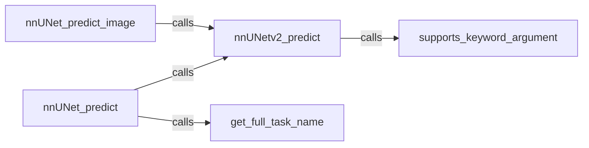

## Details

The `ML Inference Engine` subsystem is primarily encapsulated within the `totalsegmentator/nnunet.py` file. Its core functionality revolves around the execution of nnUNet models for medical image segmentation.

### nnUNetv2_predict
The foundational component responsible for executing the nnUNetv2 model inference. It handles the loading of trained models, applying them to input image data, and generating raw segmentation outputs. This component embodies the core machine learning logic.

**Related Classes/Methods**:

- <a href="https://github.com/wasserth/TotalSegmentator/blob/master/totalsegmentator/nnunet.py#L185-L291" target="_blank" rel="noopener noreferrer">`nnUNetv2_predict`:185-291</a>

### nnUNet_predict
This component orchestrates the broader nnUNet prediction workflow, serving as a higher-level entry point for the CLI tool. It manages setup tasks such as resolving task names, handling input/output paths, and coordinating calls to `nnUNetv2_predict` for various prediction scenarios.

**Related Classes/Methods**:

- <a href="https://github.com/wasserth/TotalSegmentator/blob/master/totalsegmentator/nnunet.py#L137-L182" target="_blank" rel="noopener noreferrer">`nnUNet_predict`:137-182</a>

### nnUNet_predict_image
Provides a simplified, direct interface for performing predictions on a single input image. It acts as a convenient Python API wrapper, abstracting complexities of the full `nnUNet_predict` workflow, enabling programmatic integration of segmentation capabilities.

**Related Classes/Methods**:

- <a href="https://github.com/wasserth/TotalSegmentator/blob/master/totalsegmentator/nnunet.py#L324-L794" target="_blank" rel="noopener noreferrer">`nnUNet_predict_image`:324-794</a>

### get_full_task_name
A helper function crucial for `nnUNet_predict` to correctly identify and load the appropriate models and configurations based on a given segmentation task name.

**Related Classes/Methods**:

- <a href="https://github.com/wasserth/TotalSegmentator/blob/master/totalsegmentator/nnunet.py#L67-L95" target="_blank" rel="noopener noreferrer">`get_full_task_name`:67-95</a>

### supports_keyword_argument
A utility function used by `nnUNetv2_predict` to dynamically adapt its behavior by checking for supported keyword arguments, ensuring compatibility and flexibility with different nnUNet versions or configurations.

**Related Classes/Methods**:

- <a href="https://github.com/wasserth/TotalSegmentator/blob/master/totalsegmentator/nnunet.py#L123-L133" target="_blank" rel="noopener noreferrer">`supports_keyword_argument`:123-133</a>

### [FAQ](https://github.com/CodeBoarding/GeneratedOnBoardings/tree/main?tab=readme-ov-file#faq)