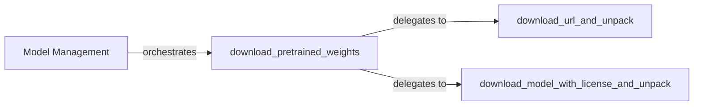

## Details

The `Model Management` subsystem is a critical part of `TotalSegmentator`, focusing on the secure and efficient handling of pre-trained machine learning models. Its boundaries encompass the discovery, downloading, and local storage of model weights, ensuring that the necessary models are readily available for inference. This subsystem is primarily contained within `totalsegmentator/libs.py`, indicating a cohesive set of functionalities. The subsystem exhibits a clear hierarchical and delegation-based relationship, typical for an ML Toolkit/Library managing external assets.

### Model Management [[Expand]](./Model_Management.md)
The overarching conceptual component responsible for the entire lifecycle of pre-trained machine learning models. It ensures models are discovered, securely downloaded, and stored locally, acting as the logical container for all model-related operations within the `TotalSegmentator` project.

**Related Classes/Methods**:

- <a href="https://github.com/wasserth/TotalSegmentator/blob/master/totalsegmentator/libs.py" target="_blank" rel="noopener noreferrer">`totalsegmentator.libs`</a>

### download_pretrained_weights
This component serves as the central entry point and orchestrator for initiating model downloads. It acts as the primary interface for other parts of the system (e.g., CLI, Python API) to request and manage models, delegating the actual download and unpacking tasks to specialized utilities based on specific requirements (e.g., licensing).

**Related Classes/Methods**:

- <a href="https://github.com/wasserth/TotalSegmentator/blob/master/totalsegmentator/libs.py" target="_blank" rel="noopener noreferrer">`totalsegmentator.libs:download_pretrained_weights`</a>

### download_url_and_unpack
A foundational utility component responsible for the generic process of downloading files from a given URL and unpacking them. It provides a reusable, low-level mechanism for general file retrieval and decompression, independent of specific model licensing or complex handling.

**Related Classes/Methods**:

- <a href="https://github.com/wasserth/TotalSegmentator/blob/master/totalsegmentator/libs.py" target="_blank" rel="noopener noreferrer">`totalsegmentator.libs:download_url_and_unpack`</a>

### download_model_with_license_and_unpack
A specialized component that handles the download and unpacking of models requiring specific license considerations. This indicates a more complex workflow for certain model types, ensuring compliance with licensing agreements during the download process, potentially involving additional verification steps.

**Related Classes/Methods**:

- <a href="https://github.com/wasserth/TotalSegmentator/blob/master/totalsegmentator/libs.py" target="_blank" rel="noopener noreferrer">`totalsegmentator.libs:download_model_with_license_and_unpack`</a>

### [FAQ](https://github.com/CodeBoarding/GeneratedOnBoardings/tree/main?tab=readme-ov-file#faq)