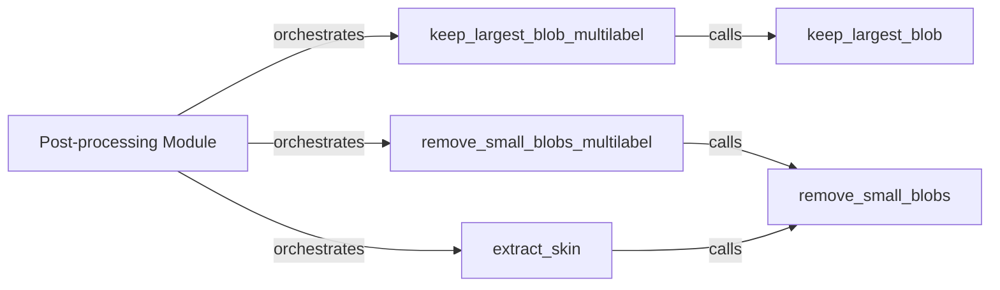

## Details

This subsystem is a critical part of the `TotalSegmentator` project, focusing on refining raw segmentation outputs from the ML Inference Engine. It applies various algorithms to enhance quality, correct artifacts, and ensure anatomical plausibility, acting as a crucial cleanup step.

### Post-processing Module [[Expand]](./Post_processing_Module.md)
The overarching module responsible for housing and orchestrating various post-processing functions. It defines the scope of operations for refining segmentation results.

**Related Classes/Methods**:

- <a href="https://github.com/wasserth/TotalSegmentator/blob/master/totalsegmentator/postprocessing.py" target="_blank" rel="noopener noreferrer">`totalsegmentator.postprocessing`</a>

### keep_largest_blob
A fundamental utility that identifies and retains only the largest connected component (blob) within a single 3D segmentation mask, effectively removing smaller, disconnected artifacts or noise.

**Related Classes/Methods**:

- <a href="https://github.com/wasserth/TotalSegmentator/blob/master/totalsegmentator/postprocessing.py#L13-L21" target="_blank" rel="noopener noreferrer">`totalsegmentator.postprocessing.keep_largest_blob`:13-21</a>

### keep_largest_blob_multilabel
Manages the application of `keep_largest_blob` across multiple segmentation labels. It iterates through each label in a multi-label mask, applying the largest blob retention logic independently to each structure.

**Related Classes/Methods**:

- <a href="https://github.com/wasserth/TotalSegmentator/blob/master/totalsegmentator/postprocessing.py#L24-L43" target="_blank" rel="noopener noreferrer">`totalsegmentator.postprocessing.keep_largest_blob_multilabel`:24-43</a>

### remove_small_blobs
Detects and removes connected components (blobs) that fall below a predefined size threshold within a single 3D segmentation mask, eliminating minor false positives or speckle noise.

**Related Classes/Methods**:

- <a href="https://github.com/wasserth/TotalSegmentator/blob/master/totalsegmentator/postprocessing.py#L46-L74" target="_blank" rel="noopener noreferrer">`totalsegmentator.postprocessing.remove_small_blobs`:46-74</a>

### remove_small_blobs_multilabel
Adapts the `remove_small_blobs` functionality for multi-label segmentation masks. It applies the small blob removal logic to each label individually, ensuring consistent cleanup across all segmented structures.

**Related Classes/Methods**:

- <a href="https://github.com/wasserth/TotalSegmentator/blob/master/totalsegmentator/postprocessing.py#L77-L98" target="_blank" rel="noopener noreferrer">`totalsegmentator.postprocessing.remove_small_blobs_multilabel`:77-98</a>

### extract_skin
A specialized function designed to refine the skin segmentation mask. This likely involves initial processing to identify skin regions, followed by a cleanup step to ensure a clean and accurate skin boundary.

**Related Classes/Methods**:

- <a href="https://github.com/wasserth/TotalSegmentator/blob/master/totalsegmentator/postprocessing.py#L116-L146" target="_blank" rel="noopener noreferrer">`totalsegmentator.postprocessing.extract_skin`:116-146</a>

### [FAQ](https://github.com/CodeBoarding/GeneratedOnBoardings/tree/main?tab=readme-ov-file#faq)