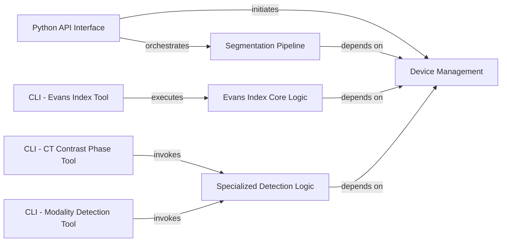

## Details

TotalSegmentator provides both a programmatic Python API and several specialized Command-Line Interface (CLI) tools for various medical image analysis tasks. The `Python API Interface` serves as the primary entry point for comprehensive segmentation workflows, directly interacting with `Device Management` for resource allocation and orchestrating the `Segmentation Pipeline` for core image processing. Each specialized CLI tool (`CLI - CT Contrast Phase Tool`, `CLI - Modality Detection Tool`, `CLI - Evans Index Tool`) acts as a dedicated interface for specific functionalities. The `CLI - CT Contrast Phase Tool` and `CLI - Modality Detection Tool` both invoke the `Specialized Detection Logic` component, which houses the algorithms for their respective detection tasks. The `CLI - Evans Index Tool` executes the `Evans Index Core Logic`, responsible for the specific calculations, including image preprocessing and external model execution. All core processing components (`Segmentation Pipeline`, `Specialized Detection Logic`, `Evans Index Core Logic`) implicitly or explicitly depend on `Device Management` for optimized computational resource utilization.

### Python API Interface
The main programmatic entry point for TotalSegmentator. It orchestrates initial setup, including device selection and license validation, and serves as the primary interface for users to initiate segmentation tasks programmatically.

**Related Classes/Methods**:

- <a href="https://github.com/wasserth/TotalSegmentator/blob/master/totalsegmentator/python_api.py" target="_blank" rel="noopener noreferrer">`totalsegmentator.python_api`</a>

### CLI - CT Contrast Phase Tool
The command-line interface dedicated to detecting CT contrast phases. It handles argument parsing and initiates the workflow for analyzing CT contrast phases.

**Related Classes/Methods**:

- <a href="https://github.com/wasserth/TotalSegmentator/blob/master/totalsegmentator/bin/totalseg_get_phase.py" target="_blank" rel="noopener noreferrer">`totalsegmentator.bin.totalseg_get_phase`</a>

### CLI - Modality Detection Tool
The command-line interface for identifying medical image modalities. It processes command-line arguments and triggers the core logic for modality detection.

**Related Classes/Methods**:

- <a href="https://github.com/wasserth/TotalSegmentator/blob/master/totalsegmentator/bin/totalseg_get_modality.py" target="_blank" rel="noopener noreferrer">`totalsegmentator.bin.totalseg_get_modality`</a>

### CLI - Evans Index Tool
The command-line interface for calculating the Evans Index. It handles argument parsing and orchestrates the entire calculation process.

**Related Classes/Methods**:

- <a href="https://github.com/wasserth/TotalSegmentator/blob/master/totalsegmentator/bin/totalseg_evans_index.py" target="_blank" rel="noopener noreferrer">`totalsegmentator.bin.totalseg_evans_index`</a>

### Device Management
Responsible for managing and configuring computational devices (CPU/GPU) to optimize performance for various image processing and analysis tasks within TotalSegmentator. It ensures efficient resource utilization.

**Related Classes/Methods**: _None_

### Segmentation Pipeline
The core processing engine for image segmentation. It encapsulates the sequence of operations, including data loading, model inference, and post-processing, to generate segmented medical images. It relies on `Device Management` for execution.

**Related Classes/Methods**: _None_

### Specialized Detection Logic
Provides specialized algorithms and models for specific detection tasks. This includes the logic for identifying CT contrast phases and determining medical image modalities based on input data.

**Related Classes/Methods**: _None_

### Evans Index Core Logic
Contains the specific computational workflow for calculating the Evans Index. This component handles necessary image preprocessing steps and orchestrates the execution of external machine learning models required for the index calculation.

**Related Classes/Methods**: _None_

### [FAQ](https://github.com/CodeBoarding/GeneratedOnBoardings/tree/main?tab=readme-ov-file#faq)