```mermaid
graph LR
    Preview_Orchestrator["Preview Orchestrator"]
    Subject_Plotter["Subject Plotter"]
    ROI_Group_Plotter["ROI Group Plotter"]
    Mask_Renderer["Mask Renderer"]
    Contour_Smoother["Contour Smoother"]
    VTK_Input_Configurator["VTK Input Configurator"]
    Preview_Orchestrator -- "calls" --> Subject_Plotter
    Subject_Plotter -- "delegates tasks to" --> ROI_Group_Plotter
    ROI_Group_Plotter -- "invokes" --> Mask_Renderer
    Mask_Renderer -- "relies on" --> Contour_Smoother
    Contour_Smoother -- "utilizes" --> VTK_Input_Configurator
```

## Details

The Visualization Module is responsible for generating visual representations and interactive previews of input images and segmentation results, crucial for qualitative assessment and debugging within the TotalSegmentator project. The Visualization Module operates as a pipeline, starting from a high-level request for preview generation and progressively delegating to more specialized components for data preparation and rendering. The Preview Orchestrator (generate_preview) initiates the process, which then flows through Subject Plotter and ROI Group Plotter to prepare the data for visualization. The Mask Renderer (plot_mask) is the central rendering component, relying on Contour Smoother for data refinement and VTK Input Configurator for low-level VTK data handling. This structured flow ensures that raw segmentation results are transformed into high-quality visual outputs.

### Preview Orchestrator
This component serves as the high-level entry point and orchestrator for the entire preview generation process. It initiates the visualization workflow, coordinating subsequent steps to produce the final visual output.

**Related Classes/Methods**:

- <a href="https://github.com/wasserth/TotalSegmentator/blob/master/totalsegmentator/preview.py#L327-L331" target="_blank" rel="noopener noreferrer">`totalsegmentator.preview.generate_preview`:327-331</a>

### Subject Plotter
Manages the plotting of the complete subject, handling multiple views or slices of the medical image and its segmentations. It prepares the overall context for visualization.

**Related Classes/Methods**:

- <a href="https://github.com/wasserth/TotalSegmentator/blob/master/totalsegmentator/preview.py#L273-L324" target="_blank" rel="noopener noreferrer">`totalsegmentator.preview.plot_subject`:273-324</a>

### ROI Group Plotter
Focuses on plotting specific collections of regions of interest (ROIs). It prepares and organizes data for individual ROI visualization, ensuring that specific anatomical structures are correctly represented.

**Related Classes/Methods**:

- <a href="https://github.com/wasserth/TotalSegmentator/blob/master/totalsegmentator/preview.py#L257-L267" target="_blank" rel="noopener noreferrer">`totalsegmentator.preview.plot_roi_group`:257-267</a>

### Mask Renderer
This is the core visualization component responsible for rendering the segmentation masks into a graphical representation using VTK (Visualization Toolkit). It takes processed ROI data and converts it into visual elements.

**Related Classes/Methods**:

- <a href="https://github.com/wasserth/TotalSegmentator/blob/master/totalsegmentator/vtk_utils.py#L34-L50" target="_blank" rel="noopener noreferrer">`totalsegmentator.vtk_utils.plot_mask`:34-50</a>

### Contour Smoother
Pre-processes raw region of interest data to generate smoothed contours. This step is crucial for improving the visual quality and aesthetic appeal of the segmentation masks before rendering.

**Related Classes/Methods**:

- <a href="https://github.com/wasserth/TotalSegmentator/blob/master/totalsegmentator/vtk_utils.py#L72-L198" target="_blank" rel="noopener noreferrer">`totalsegmentator.vtk_utils.contour_from_roi_smooth`:72-198</a>

### VTK Input Configurator
A low-level utility component responsible for configuring VTK input data. It ensures that data structures are correctly formatted and passed to VTK functions for processing and rendering.

**Related Classes/Methods**:

- <a href="https://github.com/wasserth/TotalSegmentator/blob/master/totalsegmentator/vtk_utils.py#L6-L31" target="_blank" rel="noopener noreferrer">`totalsegmentator.vtk_utils.set_input`:6-31</a>

### [FAQ](https://github.com/CodeBoarding/GeneratedOnBoardings/tree/main?tab=readme-ov-file#faq)