```mermaid
graph LR
    User_Interface_Layer["User Interface Layer"]
    Data_Management_Preprocessing["Data Management & Preprocessing"]
    Model_Management["Model Management"]
    ML_Inference_Engine["ML Inference Engine"]
    Post_processing_Module["Post-processing Module"]
    Configuration_Utility_Services["Configuration & Utility Services"]
    Evaluation_Statistics["Evaluation & Statistics"]
    Visualization_Module["Visualization Module"]
    User_Interface_Layer -- "initiates processing flow" --> Data_Management_Preprocessing
    User_Interface_Layer -- "requests configuration" --> Configuration_Utility_Services
    Data_Management_Preprocessing -- "provides preprocessed data" --> ML_Inference_Engine
    Post_processing_Module -- "sends refined masks for saving" --> Data_Management_Preprocessing
    Model_Management -- "provides model weights" --> ML_Inference_Engine
    Configuration_Utility_Services -- "provides configuration" --> Model_Management
    ML_Inference_Engine -- "outputs raw masks" --> Post_processing_Module
    Data_Management_Preprocessing -- "provides data for analysis" --> Evaluation_Statistics
    Evaluation_Statistics -- "outputs reports" --> User_Interface_Layer
    Data_Management_Preprocessing -- "provides data for rendering" --> Visualization_Module
    Visualization_Module -- "displays representations" --> User_Interface_Layer
    Configuration_Utility_Services -- "provides configuration" --> User_Interface_Layer
    Configuration_Utility_Services -- "provides configuration" --> Data_Management_Preprocessing
    Configuration_Utility_Services -- "provides configuration" --> ML_Inference_Engine
    Configuration_Utility_Services -- "provides configuration" --> Post_processing_Module
    Configuration_Utility_Services -- "provides configuration" --> Evaluation_Statistics
    Configuration_Utility_Services -- "provides configuration" --> Visualization_Module
    click User_Interface_Layer href "https://github.com/CodeBoarding/GeneratedOnBoardings/blob/main/TotalSegmentator/User_Interface_Layer.md" "Details"
    click Data_Management_Preprocessing href "https://github.com/CodeBoarding/GeneratedOnBoardings/blob/main/TotalSegmentator/Data_Management_Preprocessing.md" "Details"
    click Model_Management href "https://github.com/CodeBoarding/GeneratedOnBoardings/blob/main/TotalSegmentator/Model_Management.md" "Details"
    click ML_Inference_Engine href "https://github.com/CodeBoarding/GeneratedOnBoardings/blob/main/TotalSegmentator/ML_Inference_Engine.md" "Details"
    click Post_processing_Module href "https://github.com/CodeBoarding/GeneratedOnBoardings/blob/main/TotalSegmentator/Post_processing_Module.md" "Details"
    click Configuration_Utility_Services href "https://github.com/CodeBoarding/GeneratedOnBoardings/blob/main/TotalSegmentator/Configuration_Utility_Services.md" "Details"
    click Evaluation_Statistics href "https://github.com/CodeBoarding/GeneratedOnBoardings/blob/main/TotalSegmentator/Evaluation_Statistics.md" "Details"
    click Visualization_Module href "https://github.com/CodeBoarding/GeneratedOnBoardings/blob/main/TotalSegmentator/Visualization_Module.md" "Details"
```

## Details

The `TotalSegmentator` project is structured around a clear data processing pipeline, starting with user interaction and culminating in segmented medical images and analytical insights. The **User Interface Layer** serves as the primary entry point, allowing users to initiate segmentation tasks via a Python API or CLI. This layer interacts with **Configuration & Utility Services** to retrieve application settings.

Once a task is initiated, the **Data Management & Preprocessing** component takes charge, handling input data, performing necessary format conversions, and applying image transformations to prepare the data for analysis. This preprocessed data is then supplied to the **ML Inference Engine**, which leverages pre-trained models managed by the **Model Management** component to generate raw segmentation masks. Both the ML Inference Engine and Model Management receive essential configurations from the **Configuration & Utility Services**.

The raw segmentation masks are then passed to the **Post-processing Module**, which refines these outputs to improve quality and anatomical accuracy. The refined masks are subsequently sent back to **Data Management & Preprocessing** for saving. For quantitative assessment, **Evaluation & Statistics** receives processed data from **Data Management & Preprocessing** and generates reports that can be displayed by the **User Interface Layer**. Similarly, the **Visualization Module** receives data from **Data Management & Preprocessing** to generate visual representations, which are then displayed through the **User Interface Layer**. Throughout this entire workflow, the **Configuration & Utility Services** provides critical configuration parameters to all relevant components, ensuring consistent operation.

### User Interface Layer [[Expand]](./User_Interface_Layer.md)
The primary external interaction point, offering both a Python API for programmatic integration and a CLI for direct execution. It translates user commands into internal system calls.

**Related Classes/Methods**:

- <a href="https://github.com/wasserth/TotalSegmentator/blob/master/totalsegmentator/python_api.py" target="_blank" rel="noopener noreferrer">`totalsegmentator/python_api.py`</a>
- <a href="https://github.com/wasserth/TotalSegmentator/blob/master/totalsegmentator/bin/totalseg_get_phase.py" target="_blank" rel="noopener noreferrer">`totalsegmentator/bin/totalseg_get_phase.py`</a>
- <a href="https://github.com/wasserth/TotalSegmentator/blob/master/totalsegmentator/bin/totalseg_get_modality.py" target="_blank" rel="noopener noreferrer">`totalsegmentator/bin/totalseg_get_modality.py`</a>
- <a href="https://github.com/wasserth/TotalSegmentator/blob/master/totalsegmentator/bin/totalseg_evans_index.py" target="_blank" rel="noopener noreferrer">`totalsegmentator/bin/totalseg_evans_index.py`</a>

### Data Management & Preprocessing [[Expand]](./Data_Management_Preprocessing.md)
Handles input/output operations, format conversions (e.g., DICOM to Nifti), Nifti header management, and image transformations (cropping, alignment, resampling).

**Related Classes/Methods**:

- <a href="https://github.com/wasserth/TotalSegmentator/blob/master/totalsegmentator/dicom_io.py" target="_blank" rel="noopener noreferrer">`totalsegmentator/dicom_io.py`</a>
- <a href="https://github.com/wasserth/TotalSegmentator/blob/master/totalsegmentator/cropping.py" target="_blank" rel="noopener noreferrer">`totalsegmentator/cropping.py`</a>
- <a href="https://github.com/wasserth/TotalSegmentator/blob/master/totalsegmentator/alignment.py" target="_blank" rel="noopener noreferrer">`totalsegmentator/alignment.py`</a>
- <a href="https://github.com/wasserth/TotalSegmentator/blob/master/totalsegmentator/resampling.py" target="_blank" rel="noopener noreferrer">`totalsegmentator/resampling.py`</a>
- <a href="https://github.com/wasserth/TotalSegmentator/blob/master/totalsegmentator/nifti_ext_header.py" target="_blank" rel="noopener noreferrer">`totalsegmentator/nifti_ext_header.py`</a>

### Model Management [[Expand]](./Model_Management.md)
Manages the lifecycle of pre-trained machine learning models, including discovery, secure downloading, and local storage of model weights.

**Related Classes/Methods**:

- <a href="https://github.com/wasserth/TotalSegmentator/blob/master/totalsegmentator/libs.py" target="_blank" rel="noopener noreferrer">`totalsegmentator/libs.py`</a>

### ML Inference Engine [[Expand]](./ML_Inference_Engine.md)
The core computational component responsible for executing medical image segmentation models, primarily built upon the nnUNet framework.

**Related Classes/Methods**:

- <a href="https://github.com/wasserth/TotalSegmentator/blob/master/totalsegmentator/nnunet.py" target="_blank" rel="noopener noreferrer">`totalsegmentator/nnunet.py`</a>

### Post-processing Module [[Expand]](./Post_processing_Module.md)
Refines the raw segmentation outputs from the ML Inference Engine, applying algorithms to improve quality, correct artifacts, and ensure anatomical plausibility.

**Related Classes/Methods**:

- <a href="https://github.com/wasserth/TotalSegmentator/blob/master/totalsegmentator/postprocessing.py" target="_blank" rel="noopener noreferrer">`totalsegmentator/postprocessing.py`</a>

### Configuration & Utility Services [[Expand]](./Configuration_Utility_Services.md)
Manages application-wide settings, user preferences, license information, and usage statistics, providing centralized configuration to other components.

**Related Classes/Methods**:

- <a href="https://github.com/wasserth/TotalSegmentator/blob/master/totalsegmentator/config.py" target="_blank" rel="noopener noreferrer">`totalsegmentator/config.py`</a>

### Evaluation & Statistics [[Expand]](./Evaluation_Statistics.md)
Provides functionalities for quantitative assessment of segmentation performance and extraction of statistical features (e.g., radiomics) from segmented regions.

**Related Classes/Methods**:

- <a href="https://github.com/wasserth/TotalSegmentator/blob/master/resources/evaluate.py" target="_blank" rel="noopener noreferrer">`resources/evaluate.py`</a>
- <a href="https://github.com/wasserth/TotalSegmentator/blob/master/totalsegmentator/statistics.py" target="_blank" rel="noopener noreferrer">`totalsegmentator/statistics.py`</a>

### Visualization Module [[Expand]](./Visualization_Module.md)
Generates visual representations and interactive previews of input images and segmentation results, aiding in qualitative assessment and debugging.

**Related Classes/Methods**:

- <a href="https://github.com/wasserth/TotalSegmentator/blob/master/totalsegmentator/preview.py" target="_blank" rel="noopener noreferrer">`totalsegmentator/preview.py`</a>
- <a href="https://github.com/wasserth/TotalSegmentator/blob/master/totalsegmentator/vtk_utils.py" target="_blank" rel="noopener noreferrer">`totalsegmentator/vtk_utils.py`</a>

### [FAQ](https://github.com/CodeBoarding/GeneratedOnBoardings/tree/main?tab=readme-ov-file#faq)