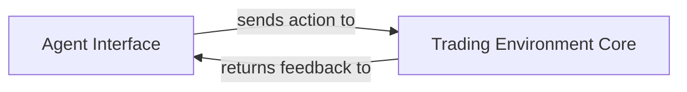

## Details

The `TradingGym` project's core subsystem facilitates the interaction between an external `Agent Interface` and the `Trading Environment Core`. The `Agent Interface` conceptually defines the contract for any intelligent agent, dictating the format of actions it can provide to the environment. The `Trading Environment Core`, exemplified by the `trading_env.envs.training_v1.Env` class and its `step` method, serves as the simulation engine. It receives actions from the agent, processes market dynamics, updates its internal state, and subsequently provides observations, rewards, and termination signals back to the agent. This clear separation ensures that various external agents can be developed and tested against a consistent and well-defined trading simulation environment.

### Agent Interface [[Expand]](./Agent_Interface.md)
Represents the intelligent entity (e.g., a Reinforcement Learning agent) that interacts with the `Trading Environment Core`. It is responsible for observing the environment's state and providing actions. As an external and pluggable component, its concrete implementation resides outside the `TradingGym` project, adhering to the interaction patterns defined by the `Trading Environment Core`. This component is fundamental as it embodies the "Agent" in the Agent-Environment interaction pattern.

**Related Classes/Methods**: _None_

### Trading Environment Core [[Expand]](./Trading_Environment_Core.md)
The central simulation environment that receives actions from the `Agent Interface`, processes them, updates its internal state, and provides feedback (new state, reward, done signal) back to the agent. It defines the interaction patterns and rules for external agents. This component is crucial as it represents the "Environment" in the Agent-Environment interaction pattern, providing the context for agent learning and decision-making.

**Related Classes/Methods**:

- <a href="https://github.com/Yvictor/TradingGym/blob/master/trading_env/envs/training_v1.py#L177-L271" target="_blank" rel="noopener noreferrer">`trading_env.envs.training_v1.step`:177-271</a>

### [FAQ](https://github.com/CodeBoarding/GeneratedOnBoardings/tree/main?tab=readme-ov-file#faq)