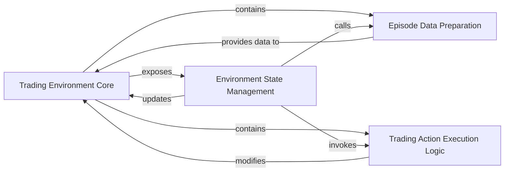

## Details

Analysis of the Trading Environment Core Subsystem, focusing on its central components and their interactions within the trading simulation engine.

### Trading Environment Core [[Expand]](./Trading_Environment_Core.md)
This is the central class that defines and manages the entire trading simulation environment. It holds the current market state, the agent's portfolio, and orchestrates the simulation flow, acting as the primary interface for agents.

**Related Classes/Methods**:

- <a href="https://github.com/Yvictor/TradingGym/blob/master/trading_env/envs/training_v1.py#L12-L381" target="_blank" rel="noopener noreferrer">`trading_env.envs.training_v1.trading_env`:12-381</a>

### Environment State Management
This component is responsible for controlling the lifecycle of a simulation episode. The `reset` method initializes the environment for a new episode, while the `step` method processes an agent's action, updates the environment's state, calculates rewards, and determines if the episode has concluded.

**Related Classes/Methods**:

- <a href="https://github.com/Yvictor/TradingGym/blob/master/trading_env/envs/training_v1.py#L78-L126" target="_blank" rel="noopener noreferrer">`trading_env.envs.training_v1.reset`:78-126</a>
- <a href="https://github.com/Yvictor/TradingGym/blob/master/trading_env/envs/training_v1.py#L177-L271" target="_blank" rel="noopener noreferrer">`trading_env.envs.training_v1.step`:177-271</a>

### Trading Action Execution Logic
This component encapsulates the specific business logic for executing various trading operations. Each method handles the financial calculations and state updates (e.g., portfolio changes, cash balance adjustments) corresponding to a particular trading action.

**Related Classes/Methods**:

- <a href="https://github.com/Yvictor/TradingGym/blob/master/trading_env/envs/training_v1.py#L129-L141" target="_blank" rel="noopener noreferrer">`trading_env.envs.training_v1._long`:129-141</a>
- <a href="https://github.com/Yvictor/TradingGym/blob/master/trading_env/envs/training_v1.py#L143-L155" target="_blank" rel="noopener noreferrer">`trading_env.envs.training_v1._short`:143-155</a>
- <a href="https://github.com/Yvictor/TradingGym/blob/master/trading_env/envs/training_v1.py#L165-L171" target="_blank" rel="noopener noreferrer">`trading_env.envs.training_v1._long_cover`:165-171</a>
- <a href="https://github.com/Yvictor/TradingGym/blob/master/trading_env/envs/training_v1.py#L157-L163" target="_blank" rel="noopener noreferrer">`trading_env.envs.training_v1._short_cover`:157-163</a>
- <a href="https://github.com/Yvictor/TradingGym/blob/master/trading_env/envs/training_v1.py#L173-L175" target="_blank" rel="noopener noreferrer">`trading_env.envs.training_v1._stayon`:173-175</a>

### Episode Data Preparation
Responsible for selecting and preparing the historical market data segment that will be used for a given simulation episode. This ensures that each training episode can utilize a different, randomly chosen section of the available data.

**Related Classes/Methods**:

- <a href="https://github.com/Yvictor/TradingGym/blob/master/trading_env/envs/training_v1.py#L68-L76" target="_blank" rel="noopener noreferrer">`trading_env.envs.training_v1._random_choice_section`:68-76</a>

### [FAQ](https://github.com/CodeBoarding/GeneratedOnBoardings/tree/main?tab=readme-ov-file#faq)