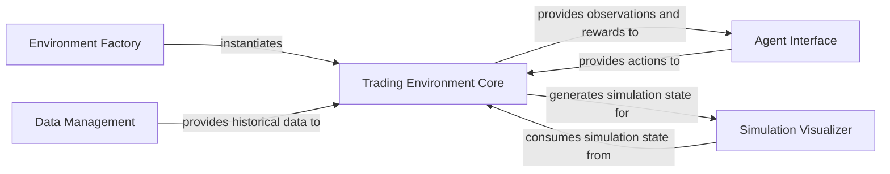

## Details

The `TradingGym` framework is designed around a clear separation of concerns, facilitating the simulation and analysis of trading strategies. At its core, the `Environment Factory` is responsible for dynamically creating `Trading Environment Core` instances, which serve as the central simulation engine. This core environment interacts with an external `Agent Interface`, receiving actions and providing observations and rewards, thereby enabling the integration of various intelligent agents. The `Data Management` component feeds historical market data into the `Trading Environment Core` to drive simulations. Finally, the `Simulation Visualizer` consumes simulation state from the core environment to render and plot trading progress, offering crucial insights for analysis and debugging. This modular design promotes extensibility and maintainability, allowing for independent development and enhancement of each component.

### Environment Factory
Manages the creation and registration of various trading environments available within the `TradingGym` framework.

**Related Classes/Methods**:

- <a href="https://github.com/Yvictor/TradingGym/blob/master/trading_env/__init__.py#L8-L26" target="_blank" rel="noopener noreferrer">`trading_env.__init__.make`:8-26</a>
- <a href="https://github.com/Yvictor/TradingGym/blob/master/trading_env/__init__.py" target="_blank" rel="noopener noreferrer">`trading_env.__init__.available_envs`</a>

### Trading Environment Core [[Expand]](./Trading_Environment_Core.md)
The central simulation engine that models the trading market, processes agent actions, manages the state of the trading simulation, and calculates rewards. It encapsulates core trading logic, data loading for episodes, and triggers visualization.

**Related Classes/Methods**:

- <a href="https://github.com/Yvictor/TradingGym/blob/master/trading_env/envs/training_v1.py#L78-L126" target="_blank" rel="noopener noreferrer">`trading_env.envs.training_v1.reset`:78-126</a>
- <a href="https://github.com/Yvictor/TradingGym/blob/master/trading_env/envs/training_v1.py#L177-L271" target="_blank" rel="noopener noreferrer">`trading_env.envs.training_v1.step`:177-271</a>
- <a href="https://github.com/Yvictor/TradingGym/blob/master/trading_env/envs/training_v1.py#L68-L76" target="_blank" rel="noopener noreferrer">`trading_env.envs.training_v1._random_choice_section`:68-76</a>
- <a href="https://github.com/Yvictor/TradingGym/blob/master/trading_env/envs/training_v1.py#L129-L141" target="_blank" rel="noopener noreferrer">`trading_env.envs.training_v1._long`:129-141</a>
- <a href="https://github.com/Yvictor/TradingGym/blob/master/trading_env/envs/training_v1.py#L143-L155" target="_blank" rel="noopener noreferrer">`trading_env.envs.training_v1._short`:143-155</a>
- <a href="https://github.com/Yvictor/TradingGym/blob/master/trading_env/envs/training_v1.py#L165-L171" target="_blank" rel="noopener noreferrer">`trading_env.envs.training_v1._long_cover`:165-171</a>
- <a href="https://github.com/Yvictor/TradingGym/blob/master/trading_env/envs/training_v1.py#L157-L163" target="_blank" rel="noopener noreferrer">`trading_env.envs.training_v1._short_cover`:157-163</a>
- <a href="https://github.com/Yvictor/TradingGym/blob/master/trading_env/envs/training_v1.py#L173-L175" target="_blank" rel="noopener noreferrer">`trading_env.envs.training_v1._stayon`:173-175</a>

### Agent Interface [[Expand]](./Agent_Interface.md)
Represents the intelligent entity (e.g., a Reinforcement Learning agent) that interacts with the `Trading Environment Core` by observing states and taking actions. This component is external and pluggable, defined by the interaction patterns expected by the `Trading Environment Core`.

**Related Classes/Methods**:

- <a href="https://github.com/Yvictor/TradingGym/blob/master/trading_env/envs/training_v1.py#L177-L271" target="_blank" rel="noopener noreferrer">`trading_env.envs.training_v1.step`:177-271</a>

### Data Management
Responsible for storing, selecting, and providing specific historical market data segments to the `Trading Environment Core` at the beginning of each simulation episode.

**Related Classes/Methods**:

- <a href="https://github.com/Yvictor/TradingGym/blob/master/trading_env/envs/training_v1.py" target="_blank" rel="noopener noreferrer">`trading_env.envs.training_v1.py:df`</a>
- <a href="https://github.com/Yvictor/TradingGym/blob/master/trading_env/envs/training_v1.py" target="_blank" rel="noopener noreferrer">`trading_env.envs.training_v1.py:_random_choice_section`</a>

### Simulation Visualizer
Handles the rendering and plotting of the trading simulation's progress, including trade executions and market data, for visual analysis and debugging.

**Related Classes/Methods**:

- <a href="https://github.com/Yvictor/TradingGym/blob/master/trading_env/envs/training_v1.py#L333-L381" target="_blank" rel="noopener noreferrer">`trading_env.envs.training_v1.render`:333-381</a>
- <a href="https://github.com/Yvictor/TradingGym/blob/master/trading_env/envs/training_v1.py#L284-L330" target="_blank" rel="noopener noreferrer">`trading_env.envs.training_v1._plot_trading`:284-330</a>
- <a href="https://github.com/Yvictor/TradingGym/blob/master/trading_env/envs/training_v1.py#L273-L282" target="_blank" rel="noopener noreferrer">`trading_env.envs.training_v1._gen_trade_color`:273-282</a>

### [FAQ](https://github.com/CodeBoarding/GeneratedOnBoardings/tree/main?tab=readme-ov-file#faq)