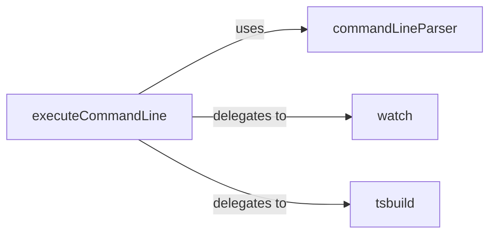

## Details

CLI & Build Orchestration subsystem, responsible for user interaction and managing the compilation lifecycle, including parsing command-line arguments, single-project continuous compilation, and multi-project solution builds.

### executeCommandLine
Acts as the main dispatcher for the compiler's command-line interface. It receives raw command-line input, delegates parsing to `commandLineParser`, and based on the parsed options, decides whether to perform a single compilation, initiate a watch session (delegating to `watch`), or manage a multi-project build (delegating to `tsbuild`). It also handles top-level system interactions like process exit and error reporting.

**Related Classes/Methods**:

- <a href="https://github.com/microsoft/TypeScript/blob/main/src/compiler/executeCommandLine.ts" target="_blank" rel="noopener noreferrer">`src/compiler/executeCommandLine.ts:executeCommandLine`</a>

### commandLineParser
Dedicated to parsing raw command-line arguments and converting them into structured configuration options that the compiler's core components can consume. It provides a standardized way for the compiler to interpret user-provided flags and values.

**Related Classes/Methods**:

- <a href="https://github.com/microsoft/TypeScript/blob/main/src/compiler/commandLineParser.ts" target="_blank" rel="noopener noreferrer">`src/compiler/commandLineParser.ts:commandLineParser`</a>

### watch
Manages the continuous compilation loop for single projects. It sets up file system watchers, detects changes in source files or configuration, and triggers incremental recompilations. It provides the "always-on" compilation experience, essential for developer productivity.

**Related Classes/Methods**:

- <a href="https://github.com/microsoft/TypeScript/blob/main/src/compiler/watch.ts" target="_blank" rel="noopener noreferrer">`src/compiler/watch.ts:watch`</a>

### tsbuild
Orchestrates complex multi-project builds (solution builds). It determines the correct build order based on project dependencies, manages the build state of individual projects within the solution, handles cleaning build outputs, and monitors configuration/input file changes across multiple projects for rebuilds. This component is vital for managing large, interconnected codebases.

**Related Classes/Methods**:

- <a href="https://github.com/microsoft/TypeScript/blob/main/src/compiler/tsbuild.ts" target="_blank" rel="noopener noreferrer">`src/compiler/tsbuild.ts:tsbuild`</a>

### [FAQ](https://github.com/CodeBoarding/GeneratedOnBoardings/tree/main?tab=readme-ov-file#faq)