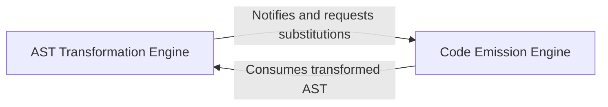

## Details

The TypeScript compiler's backend primarily consists of two tightly integrated components: the AST Transformation Engine and the Code Emission Engine. The AST Transformation Engine is responsible for preparing the Abstract Syntax Tree (AST) by applying various transformations, such as downleveling ECMAScript features, handling JSX, and managing lexical environments. Once the AST is transformed and optimized, the Code Emission Engine takes this processed AST and generates the final output, including JavaScript code, TypeScript Declaration files, and Source Maps. This engine handles the precise formatting, comment inclusion, and source mapping. The AST Transformation Engine notifies and requests specific emission-related behaviors or substitutions from the Code Emission Engine during its transformation process, while the Code Emission Engine primarily consumes the transformed AST provided by the AST Transformation Engine to produce the final compiler output.

### AST Transformation Engine
This component is responsible for applying various modifications to the AST. Its core functions include "downleveling" ECMAScript features (e.g., converting modern syntax to older versions for broader compatibility), handling specific syntax transformations like JSX, and managing lexical environments and hoisting mechanisms within the AST. It prepares the AST for the subsequent code emission process, ensuring it is in a suitable and optimized state for code generation.

**Related Classes/Methods**:

- <a href="https://github.com/microsoft/TypeScript/blob/main/src/compiler/transformer.ts#L248-L666" target="_blank" rel="noopener noreferrer">`transformNodes`:248-666</a>
- <a href="https://github.com/microsoft/TypeScript/blob/main/src/compiler/transformer.ts#L120-L125" target="_blank" rel="noopener noreferrer">`getTransformers`:120-125</a>
- <a href="https://github.com/microsoft/TypeScript/blob/main/src/compiler/transformer.ts#L480-L498" target="_blank" rel="noopener noreferrer">`startLexicalEnvironment`:480-498</a>
- <a href="https://github.com/microsoft/TypeScript/blob/main/src/compiler/transformer.ts#L449-L459" target="_blank" rel="noopener noreferrer">`hoistFunctionDeclaration`:449-459</a>
- <a href="https://github.com/microsoft/TypeScript/blob/main/src/compiler/transformer.ts#L393-L396" target="_blank" rel="noopener noreferrer">`enableEmitNotification`:393-396</a>
- <a href="https://github.com/microsoft/TypeScript/blob/main/src/compiler/transformer.ts#L626-L636" target="_blank" rel="noopener noreferrer">`requestEmitHelper`:626-636</a>

### Code Emission Engine
This component takes the potentially transformed AST and converts it into the final output files. This includes generating JavaScript code, TypeScript Declaration files (`.d.ts`), and Source Maps. It handles the precise formatting and structural integrity of the output code, manages the inclusion of comments, and maps generated code back to original source locations for debugging purposes. Essentially, it acts as the "printer" for the AST, translating the tree structure into a linear text stream.

**Related Classes/Methods**:

- <a href="https://github.com/microsoft/TypeScript/blob/main/src/compiler/emitter.ts#L1194-L6312" target="_blank" rel="noopener noreferrer">`createPrinter`:1194-6312</a>
- <a href="https://github.com/microsoft/TypeScript/blob/main/src/compiler/emitter.ts#L804-L867" target="_blank" rel="noopener noreferrer">`emitJsFileOrBundle`:804-867</a>
- <a href="https://github.com/microsoft/TypeScript/blob/main/src/compiler/emitter.ts#L869-L951" target="_blank" rel="noopener noreferrer">`emitDeclarationFileOrBundle`:869-951</a>
- <a href="https://github.com/microsoft/TypeScript/blob/main/src/compiler/emitter.ts" target="_blank" rel="noopener noreferrer">`emitSourceMaps`</a>
- <a href="https://github.com/microsoft/TypeScript/blob/main/src/compiler/emitter.ts" target="_blank" rel="noopener noreferrer">`emitComments`</a>

### [FAQ](https://github.com/CodeBoarding/GeneratedOnBoardings/tree/main?tab=readme-ov-file#faq)