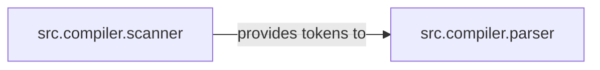

## Details

The `Compiler Frontend (Lexical & Syntactic Analysis)` subsystem is the initial phase of the TypeScript compiler, dedicated to transforming raw source code into a structured Abstract Syntax Tree (AST).

### src.compiler.scanner
This component is solely responsible for **lexical analysis**. It reads the raw source code and transforms it into a stream of tokens (e.g., keywords, identifiers, literals, operators). It handles whitespace, comments, and maintains precise source code position information for each token, which is crucial for error reporting and tooling. Its design allows for adaptive scanning based on parsing context (e.g., JSX).

**Related Classes/Methods**:

- <a href="https://github.com/microsoft/TypeScript/blob/main/src/compiler/scanner.ts" target="_blank" rel="noopener noreferrer">`src.compiler.scanner`</a>

### src.compiler.parser
This component performs **syntactic analysis**. It consumes the token stream provided by the scanner and constructs the Abstract Syntax Tree (AST) according to the language's grammar rules. Its responsibilities include validating token sequences against the syntax, reporting syntactic errors, and establishing the hierarchical parent-child relationships within the AST. It also supports efficient re-parsing for optimized AST management.

**Related Classes/Methods**:

- <a href="https://github.com/microsoft/TypeScript/blob/main/src/compiler/parser.ts" target="_blank" rel="noopener noreferrer">`src.compiler.parser`</a>

### [FAQ](https://github.com/CodeBoarding/GeneratedOnBoardings/tree/main?tab=readme-ov-file#faq)