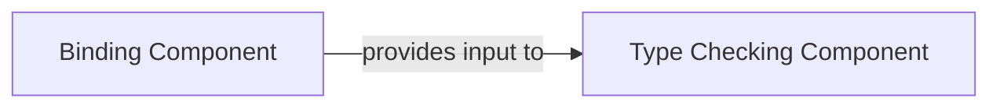

## Details

The `Compiler Semantic Analysis (Binding & Type Checking)` subsystem is a critical phase in the TypeScript compiler pipeline, responsible for transforming the purely syntactic Abstract Syntax Tree (AST) into a semantically rich representation and ensuring the program adheres to the language's type system and semantic rules.

### Binding Component
This component is responsible for establishing the symbolic relationships within the AST. It traverses the AST to create Symbol objects for declarations, populate SymbolTables (scopes), resolve references to declared names, and build a basic control flow graph (CFG). Its primary output is a semantically annotated AST, where declarations and their scopes are explicitly linked.

**Related Classes/Methods**:

- <a href="https://github.com/microsoft/TypeScript/blob/main/src/compiler/binder.ts" target="_blank" rel="noopener noreferrer">`src/compiler/binder.ts`</a>

### Type Checking Component
This component performs static semantic analysis, inferring and verifying types, and reporting semantic errors. It consumes the symbolic information generated by the Binding Component to resolve types, verify type compatibility, check language rules (e.g., inheritance, access modifiers), and perform control flow-based type narrowing. This component ensures the program adheres to the language's type system and semantic rules.

**Related Classes/Methods**:

- <a href="https://github.com/microsoft/TypeScript/blob/main/src/compiler/checker.ts" target="_blank" rel="noopener noreferrer">`src.compiler.checker.ts`</a>

### [FAQ](https://github.com/CodeBoarding/GeneratedOnBoardings/tree/main?tab=readme-ov-file#faq)