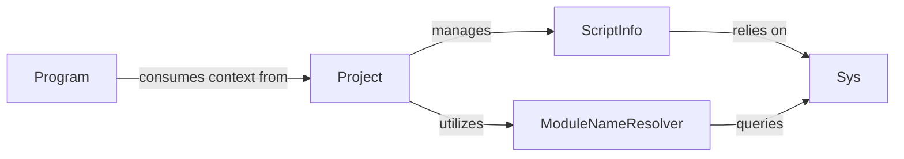

## Details

The `File System & Project Management` subsystem is crucial for a compiler, providing the foundational capabilities to interact with the operating system, manage source file states, and define the overall compilation scope. It acts as the data preparation layer for the subsequent compilation phases.

### Sys
Serves as the primary abstraction layer for all low-level file system interactions and environment access. It provides functionalities such as reading and writing files, directory listing, path manipulation, and accessing environment variables, effectively isolating the compiler from the underlying operating system's specifics.

**Related Classes/Methods**:

- <a href="https://github.com/microsoft/TypeScript/blob/main/src/tsserver/nodeServer.ts" target="_blank" rel="noopener noreferrer">`Sys`</a>

### ScriptInfo
Manages the in-memory state and content of individual source files. For each file, it tracks its content, version, and potentially caches derived information like parsed Abstract Syntax Trees (ASTs) to optimize performance for language service features.

**Related Classes/Methods**:

- <a href="https://github.com/microsoft/TypeScript/blob/main/src/harness/harnessLanguageService.ts#L192-L194" target="_blank" rel="noopener noreferrer">`ScriptInfo`:192-194</a>

### Project
Defines and manages the overall compilation scope. It aggregates `ScriptInfo` objects for all files relevant to the project, loads and interprets compiler configuration (e.g., from `tsconfig.json`), and orchestrates the initial discovery and inclusion of source files based on configuration and dependencies.

**Related Classes/Methods**:

- <a href="https://github.com/microsoft/TypeScript/blob/main/src/services/types.ts" target="_blank" rel="noopener noreferrer">`Project`</a>

### ModuleNameResolver
Implements the complex logic for resolving module specifiers (e.g., `import 'my-module'`) to their concrete file paths on the file system. This involves applying various resolution strategies (e.g., Node.js module resolution, path mapping) defined in the project configuration.

**Related Classes/Methods**:

- <a href="https://github.com/microsoft/TypeScript/blob/main/src/compiler/moduleNameResolver.ts#L1761-L1768" target="_blank" rel="noopener noreferrer">`ModuleNameResolver`:1761-1768</a>

### Program
The `Program` component is a central component of the Compiler Core or Compilation Orchestration. It acts as a primary consumer of the output from the `File System & Project Management` subsystem. `Program` takes the resolved project context (files, options, resolved modules) and then drives the core compilation phases (parsing, binding, type checking, emission).

**Related Classes/Methods**:

- <a href="https://github.com/microsoft/TypeScript/blob/main/src/services/transpile.ts" target="_blank" rel="noopener noreferrer">`Program`</a>

### [FAQ](https://github.com/CodeBoarding/GeneratedOnBoardings/tree/main?tab=readme-ov-file#faq)