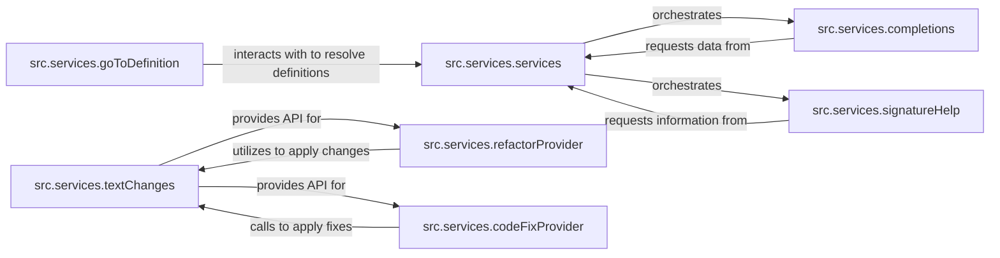

## Details

The `TypeScript` language services subsystem is designed around a central `src.services.services` component, which acts as the primary orchestrator and data provider. This core component manages the overall project context and integrates with the compiler, serving as the backbone for various language features. Specialized services such as `src.services.completions`, `src.services.signatureHelp`, `src.services.refactorProvider`, `src.services.codeFixProvider`, and `src.services.goToDefinition` interact with `src.services.services` to perform their respective functions, often querying it for necessary compiler data or context. Code modifications are standardized through the `src.services.textChanges` component, which offers a robust API consumed by refactoring and code fix providers to ensure consistent and correct application of changes. This architecture promotes a clear separation of concerns, with the central service managing state and coordination, while other components focus on specific language feature implementations.

The `src.services.services` component acts as the central hub, orchestrating various language service features. It manages the project's state, including source file snapshots, and provides the necessary context and compiler data to other specialized services. Components like `src.services.completions` and `src.services.signatureHelp` are invoked by `src.services.services` to perform their specific tasks, and in turn, these components query `src.services.services` for the data required to fulfill their operations. The `src.services.textChanges` component provides a foundational API for modifying code, which is utilized by features like `src.services.refactorProvider` and `src.services.codeFixProvider` to apply their respective changes. `src.services.goToDefinition` also relies on `src.services.services` to resolve symbol definitions.

**Critical Interaction Pathways:**
- `src.services.services` orchestrates and provides context to `src.services.completions` and `src.services.signatureHelp`.
- `src.services.completions` and `src.services.signatureHelp` request data/information from `src.services.services`.
- `src.services.textChanges` provides its API to `src.services.codeFixProvider` and `src.services.refactorProvider`.
- `src.services.codeFixProvider` and `src.services.refactorProvider` utilize `src.services.textChanges` to apply code modifications.
- `src.services.goToDefinition` interacts with `src.services.services` for definition resolution.

### src.services.services
The central dispatcher and orchestrator for all language service operations. It manages source file snapshots, provides common utilities, and serves as the primary interface for editor-specific features, integrating with the core compiler.

**Related Classes/Methods**:

- <a href="https://github.com/microsoft/TypeScript/blob/main/src/services/services.ts" target="_blank" rel="noopener noreferrer">`src.services.services`</a>

### src.services.textChanges
Provides a robust and standardized API for creating, applying, and managing text edits to source files, ensuring correct formatting and application of changes. It acts as a utility for other components that modify code.

**Related Classes/Methods**:

- <a href="https://github.com/microsoft/TypeScript/blob/main/src/services/textChanges.ts" target="_blank" rel="noopener noreferrer">`src.services.textChanges`</a>

### src.services.completions
Generates and filters code completion suggestions, including symbol completions, keyword completions, and import suggestions, based on the current cursor position and context.

**Related Classes/Methods**:

- <a href="https://github.com/microsoft/TypeScript/blob/main/src/services/completions.ts" target="_blank" rel="noopener noreferrer">`src.services.completions`</a>

### src.services.refactorProvider
Discovers and provides a list of applicable refactoring actions (e.g., rename, extract method) for a given code selection or position, delegating to specific refactoring implementations.

**Related Classes/Methods**:

- <a href="https://github.com/microsoft/TypeScript/blob/main/src/services/refactors/" target="_blank" rel="noopener noreferrer">`src.services.refactorProvider`</a>

### src.services.codeFixProvider
Identifies and provides automated code fixes for reported diagnostics (compiler errors or warnings), leveraging specific code fix implementations to resolve common issues.

**Related Classes/Methods**:

- <a href="https://github.com/microsoft/TypeScript/blob/main/src/services/codeFixProvider.ts" target="_blank" rel="noopener noreferrer">`src.services.codeFixProvider`</a>

### src.services.signatureHelp
Provides detailed information about function or constructor signatures, including parameter names, types, and documentation, typically displayed when typing arguments.

**Related Classes/Methods**:

- <a href="https://github.com/microsoft/TypeScript/blob/main/src/services/signatureHelp.ts" target="_blank" rel="noopener noreferrer">`src.services.signatureHelp`</a>

### src.services.goToDefinition
Determines the definition location(s) for a symbol at a given position within the source code, enabling quick navigation to declarations.

**Related Classes/Methods**:

- <a href="https://github.com/microsoft/TypeScript/blob/main/src/services/goToDefinition.ts" target="_blank" rel="noopener noreferrer">`src.services.goToDefinition`</a>

### [FAQ](https://github.com/CodeBoarding/GeneratedOnBoardings/tree/main?tab=readme-ov-file#faq)