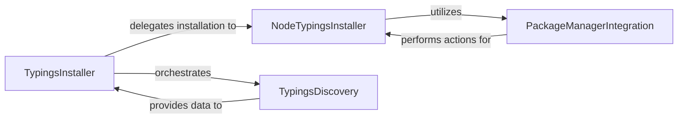

## Details

The Typings Installation subsystem, centered around the `TypingsInstaller` component, is responsible for dynamically acquiring and managing type definitions for JavaScript projects. It acts as a crucial part of the Language Service, enabling rich IDE features like autocompletion and type checking for external libraries. The `TypingsInstaller` receives requests from the language service, such as discovering typings for a project or installing a specific package. It orchestrates the process by first leveraging `TypingsDiscovery` to identify necessary type definitions based on project context and existing metadata. For the actual installation, particularly in Node.js environments, it delegates to the `NodeTypingsInstaller`, which in turn utilizes `PackageManagerIntegration` to execute system-level commands (e.g., `npm install`) to fetch and place the required type packages. Throughout this process, `TypingsInstaller` manages internal state, handles caching, and sends responses back to the caller, ensuring a responsive and efficient typings management experience. File watching for typings locations is also managed internally by the `TypingsInstaller` to keep the type information up-to-date.

### TypingsInstaller
The core orchestrator of the typings management process. It initializes the installation environment, handles incoming requests (e.g., `discover`, `closeProject`, `installPackage`), manages the lifecycle of typings installations, and coordinates internal processes such as typings discovery, metadata handling, and response sending. It also manages file watchers for project-specific typings.

**Related Classes/Methods**:

- <a href="https://github.com/microsoft/TypeScript/blob/main/src/typingsInstaller/nodeTypingsInstaller.ts" target="_blank" rel="noopener noreferrer">`ts.server.TypingsInstaller`</a>

### NodeTypingsInstaller
A concrete implementation of `TypingsInstaller` specifically designed for Node.js environments. It extends the base typings installation logic by integrating with Node.js-specific package management tools (e.g., npm) to acquire and install typings packages. This component bridges the internal typings logic with external system-level package management commands.

**Related Classes/Methods**:

### TypingsDiscovery
Responsible for analyzing project files and unresolved imports to identify required typings. It leverages typings metadata and existing caches to determine which new typings need to be installed. This component acts as a pre-processing step, preparing the list of typings for installation.

**Related Classes/Methods**:

### PackageManagerIntegration
Handles the execution of external package manager commands (e.g., `npm install`) to fetch and install typings. It encapsulates the logic for constructing and running these commands, ensuring that the necessary type definition files are placed in the correct locations.

**Related Classes/Methods**:

### [FAQ](https://github.com/CodeBoarding/GeneratedOnBoardings/tree/main?tab=readme-ov-file#faq)