```mermaid
graph LR
    CLI_Build_Orchestration["CLI & Build Orchestration"]
    File_System_Project_Management["File System & Project Management"]
    Compiler_Frontend_Lexical_Syntactic_Analysis_["Compiler Frontend (Lexical & Syntactic Analysis)"]
    Compiler_Semantic_Analysis_Binding_Type_Checking_["Compiler Semantic Analysis (Binding & Type Checking)"]
    Compiler_Backend_AST_Transformation_Emission_["Compiler Backend (AST Transformation & Emission)"]
    Language_Service_Features["Language Service & Features"]
    Typings_Management["Typings Management"]
    CLI_Build_Orchestration -- "initiates compilation" --> File_System_Project_Management
    CLI_Build_Orchestration -- "orchestrates" --> Compiler_Frontend_Lexical_Syntactic_Analysis_
    CLI_Build_Orchestration -- "orchestrates" --> Compiler_Semantic_Analysis_Binding_Type_Checking_
    CLI_Build_Orchestration -- "orchestrates" --> Compiler_Backend_AST_Transformation_Emission_
    File_System_Project_Management -- "provides source text" --> Compiler_Frontend_Lexical_Syntactic_Analysis_
    File_System_Project_Management -- "provides context/files" --> Compiler_Semantic_Analysis_Binding_Type_Checking_
    File_System_Project_Management -- "writes output" --> Compiler_Backend_AST_Transformation_Emission_
    Language_Service_Features -- "accesses & modifies" --> File_System_Project_Management
    File_System_Project_Management -- "initiates typings installation" --> Typings_Management
    Compiler_Frontend_Lexical_Syntactic_Analysis_ -- "produces AST for" --> Compiler_Semantic_Analysis_Binding_Type_Checking_
    Compiler_Semantic_Analysis_Binding_Type_Checking_ -- "provides bound AST to" --> Compiler_Backend_AST_Transformation_Emission_
    Compiler_Semantic_Analysis_Binding_Type_Checking_ -- "provides semantic info to" --> Language_Service_Features
    Compiler_Semantic_Analysis_Binding_Type_Checking_ -- "uses module resolution from" --> File_System_Project_Management
    Compiler_Backend_AST_Transformation_Emission_ -- "writes output via" --> File_System_Project_Management
    Language_Service_Features -- "queries semantic info from" --> Compiler_Semantic_Analysis_Binding_Type_Checking_
    Typings_Management -- "manages" --> File_System_Project_Management
    click CLI_Build_Orchestration href "https://github.com/CodeBoarding/GeneratedOnBoardings/blob/main/TypeScript/CLI_Build_Orchestration.md" "Details"
    click File_System_Project_Management href "https://github.com/CodeBoarding/GeneratedOnBoardings/blob/main/TypeScript/File_System_Project_Management.md" "Details"
    click Compiler_Frontend_Lexical_Syntactic_Analysis_ href "https://github.com/CodeBoarding/GeneratedOnBoardings/blob/main/TypeScript/Compiler_Frontend_Lexical_Syntactic_Analysis_.md" "Details"
    click Compiler_Semantic_Analysis_Binding_Type_Checking_ href "https://github.com/CodeBoarding/GeneratedOnBoardings/blob/main/TypeScript/Compiler_Semantic_Analysis_Binding_Type_Checking_.md" "Details"
    click Compiler_Backend_AST_Transformation_Emission_ href "https://github.com/CodeBoarding/GeneratedOnBoardings/blob/main/TypeScript/Compiler_Backend_AST_Transformation_Emission_.md" "Details"
    click Language_Service_Features href "https://github.com/CodeBoarding/GeneratedOnBoardings/blob/main/TypeScript/Language_Service_Features.md" "Details"
    click Typings_Management href "https://github.com/CodeBoarding/GeneratedOnBoardings/blob/main/TypeScript/Typings_Management.md" "Details"
```

## Details

The TypeScript compiler is structured as a pipeline, transforming source code through several distinct phases, orchestrated by a central command-line interface and build system. The core compilation process involves lexical and syntactic analysis, followed by in-depth semantic analysis, and finally, AST transformation and code emission. Complementing this core compiler, a robust Language Service provides rich editor-centric features by leveraging the compiler's internal structures. All these operations rely heavily on a dedicated File System & Project Management component, which abstracts file interactions and maintains the overall project context. Additionally, a Typings Management component ensures proper type resolution for external JavaScript libraries by interacting with the file system.

### CLI & Build Orchestration [[Expand]](./CLI_Build_Orchestration.md)
Manages command-line arguments, orchestrates the overall build process (including incremental compilation and watch mode), and handles project-level configuration.

**Related Classes/Methods**:

- <a href="https://github.com/microsoft/TypeScript/blob/main/src/compiler/executeCommandLine.ts" target="_blank" rel="noopener noreferrer">`src/compiler/executeCommandLine.ts`</a>
- <a href="https://github.com/microsoft/TypeScript/blob/main/src/compiler/watch.ts" target="_blank" rel="noopener noreferrer">`src/compiler/watch.ts`</a>
- <a href="https://github.com/microsoft/TypeScript/blob/main/src/compiler/tsbuild.ts" target="_blank" rel="noopener noreferrer">`src/compiler/tsbuild.ts`</a>

### File System & Project Management [[Expand]](./File_System_Project_Management.md)
Provides an abstract interface for all file system operations, manages in-memory source file representations, and maintains the overall project context (files, compiler options, dependencies, module resolution).

**Related Classes/Methods**:

- <a href="https://github.com/microsoft/TypeScript/blob/main/src/compiler/sys.ts" target="_blank" rel="noopener noreferrer">`src/compiler/sys.ts`</a>
- <a href="https://github.com/microsoft/TypeScript/blob/main/src/server/scriptInfo.ts" target="_blank" rel="noopener noreferrer">`src/server/scriptInfo.ts`</a>
- <a href="https://github.com/microsoft/TypeScript/blob/main/src/server/project.ts" target="_blank" rel="noopener noreferrer">`src.server.project.ts`</a>
- <a href="https://github.com/microsoft/TypeScript/blob/main/src/compiler/program.ts" target="_blank" rel="noopener noreferrer">`src.compiler.program.ts`</a>
- <a href="https://github.com/microsoft/TypeScript/blob/main/src/compiler/moduleNameResolver.ts" target="_blank" rel="noopener noreferrer">`src.compiler.moduleNameResolver.ts`</a>

### Compiler Frontend (Lexical & Syntactic Analysis) [[Expand]](./Compiler_Frontend_Lexical_Syntactic_Analysis_.md)
The initial phase, responsible for tokenizing raw source code and constructing the Abstract Syntax Tree (AST).

**Related Classes/Methods**:

- <a href="https://github.com/microsoft/TypeScript/blob/main/src/compiler/scanner.ts" target="_blank" rel="noopener noreferrer">`src/compiler/scanner.ts`</a>
- <a href="https://github.com/microsoft/TypeScript/blob/main/src/compiler/parser.ts" target="_blank" rel="noopener noreferrer">`src/compiler/parser.ts`</a>

### Compiler Semantic Analysis (Binding & Type Checking) [[Expand]](./Compiler_Semantic_Analysis_Binding_Type_Checking_.md)
Establishes symbolic relationships within the AST (binding) and performs static semantic analysis, inferring and verifying types, and reporting errors.

**Related Classes/Methods**:

- <a href="https://github.com/microsoft/TypeScript/blob/main/src/compiler/binder.ts" target="_blank" rel="noopener noreferrer">`src/compiler/binder.ts`</a>
- <a href="https://github.com/microsoft/TypeScript/blob/main/src/compiler/checker.ts" target="_blank" rel="noopener noreferrer">`src.compiler.checker.ts`</a>

### Compiler Backend (AST Transformation & Emission) [[Expand]](./Compiler_Backend_AST_Transformation_Emission_.md)
Transforms the AST (e.g., downleveling, JSX) and converts the final AST into executable JavaScript code and declaration files.

**Related Classes/Methods**:

- <a href="https://github.com/microsoft/TypeScript/blob/main/src/compiler/transformer.ts" target="_blank" rel="noopener noreferrer">`src/compiler/transformer.ts`</a>
- <a href="https://github.com/microsoft/TypeScript/blob/main/src/compiler/emitter.ts#L969-L973" target="_blank" rel="noopener noreferrer">`src.compiler.emitter.ts`:969-973</a>
- <a href="https://github.com/microsoft/TypeScript/blob/main/src/compiler/emitter.ts#L969-L973" target="_blank" rel="noopener noreferrer">`src.compiler.emitter.ts`:969-973</a>

### Language Service & Features [[Expand]](./Language_Service_Features.md)
The central API layer for editor-specific features, providing advanced code intelligence like autocompletion, refactorings, and quick info, by leveraging the compiler's internal structures.

**Related Classes/Methods**:

- <a href="https://github.com/microsoft/TypeScript/blob/main/src/services/services.ts" target="_blank" rel="noopener noreferrer">`src/services/services.ts`</a>
- <a href="https://github.com/microsoft/TypeScript/blob/main/src/services/codeFixProvider.ts" target="_blank" rel="noopener noreferrer">`src/services/codeFixProvider.ts`</a>
- <a href="https://github.com/microsoft/TypeScript/blob/main/src/services/textChanges.ts" target="_blank" rel="noopener noreferrer">`src/services/textChanges.ts`</a>
- <a href="https://github.com/microsoft/TypeScript/blob/main/src/services/completions.ts" target="_blank" rel="noopener noreferrer">`src/services/completions.ts`</a>
- <a href="https://github.com/microsoft/TypeScript/blob/main/src/services/refactors/" target="_blank" rel="noopener noreferrer">`src/services/refactors/`</a>

### Typings Management [[Expand]](./Typings_Management.md)
Automatically acquires and installs declaration files (.d.ts) for JavaScript libraries to enable type checking for untyped code.

**Related Classes/Methods**:

- <a href="https://github.com/microsoft/TypeScript/blob/main/src/typingsInstallerCore/typingsInstaller.ts" target="_blank" rel="noopener noreferrer">`src/typingsInstallerCore/typingsInstaller.ts`</a>

### [FAQ](https://github.com/CodeBoarding/GeneratedOnBoardings/tree/main?tab=readme-ov-file#faq)