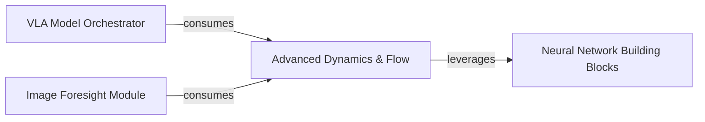

## Details

One paragraph explaining the functionality which is represented by this graph. What the main flow is and what is its purpose.

### Advanced Dynamics & Flow [[Expand]](./Advanced_Dynamics_Flow.md)
This core component encapsulates specialized mathematical and dynamic modeling utilities. It provides the foundational elements for handling continuous-time dynamics, including ODE solvers and flow matching techniques, potentially operating on various mathematical manifolds. It is crucial for advanced research in areas like generative models and continuous control within the VLA context, supporting advanced modeling paradigms.

**Related Classes/Methods**:

- <a href="https://github.com/HeegerGao/VLA-OS/blob/main/utils/flow_matching_utils.py#L62-L100" target="_blank" rel="noopener noreferrer">`utils.flow_matching_utils.ConvexScheduler` (62:100)</a>
- <a href="https://github.com/HeegerGao/VLA-OS/blob/main/utils/flow_matching/path/scheduler/scheduler.py#L62-L100" target="_blank" rel="noopener noreferrer">`utils.flow_matching.path.scheduler.scheduler.ConvexScheduler` (62:100)</a>
- <a href="https://github.com/HeegerGao/VLA-OS/blob/main/utils/flow_matching/utils/manifolds/sphere.py#L12-L44" target="_blank" rel="noopener noreferrer">`utils.flow_matching.utils.manifolds.sphere.Sphere` (12:44)</a>
- <a href="https://github.com/HeegerGao/VLA-OS/blob/main/vlaos/models/vla/ode_solver.py#L90-L111" target="_blank" rel="noopener noreferrer">`vlaos.models.vla.ode_solver.CFGScaledModel` (90:111)</a>

### VLA Model Orchestrator
A higher-level VLA component responsible for integrating and managing various VLA sub-components, including those from Advanced Dynamics & Flow. It orchestrates the overall flow and interaction of different models to achieve complex VLA tasks.

**Related Classes/Methods**:

- <a href="https://github.com/HeegerGao/VLA-OS/blob/main/vlaos/models/vla/hierarchical_vla.py#L24-L347" target="_blank" rel="noopener noreferrer">`vlaos.models.vla.hierarchical_vla.HierarchicalVLA` (24:347)</a>
- <a href="https://github.com/HeegerGao/VLA-OS/blob/main/vlaos/models/vla/integrated_vla.py#L14-L143" target="_blank" rel="noopener noreferrer">`vlaos.models.vla.integrated_vla.IntegratedVLA` (14:143)</a>

### Image Foresight Module
A specialized, higher-level VLA component that consumes capabilities from Advanced Dynamics & Flow. It likely utilizes dynamic models for predictive vision tasks, enabling the system to anticipate future states or outcomes based on current visual information and learned dynamics.

**Related Classes/Methods**:

- <a href="https://github.com/HeegerGao/VLA-OS/blob/main/vlaos/models/vla/image_foresight_head.py#L547-L721" target="_blank" rel="noopener noreferrer">`vlaos.models.vla.image_foresight_head.ImageForesightPlanningHead` (547:721)</a>

### Neural Network Building Blocks
This foundational component provides the essential building blocks for constructing neural networks, such as various layers, activation functions, and common network architectures. It is leveraged by Advanced Dynamics & Flow and other model components to implement their computational graphs.

**Related Classes/Methods**:

- <a href="https://github.com/HeegerGao/VLA-OS/blob/main/vlaos/models/vla/nn_utils.py#L1-L1" target="_blank" rel="noopener noreferrer">`vlaos.models.vla.nn_utils` (1:1)</a>

### [FAQ](https://github.com/CodeBoarding/GeneratedOnBoardings/tree/main?tab=readme-ov-file#faq)