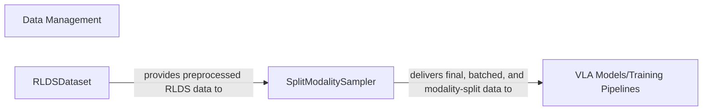

## Details

One paragraph explaining the functionality which is represented by this graph. What the main flow is and what is its purpose.

### Data Management [[Expand]](./Data_Management.md)
Responsible for loading, preprocessing, and batching diverse datasets, including specialized formats like RLDS, and handling modality splitting to prepare data for VLA models.

**Related Classes/Methods**: _None_

### RLDSDataset
Manages the loading and initial preprocessing of specialized RLDS (Robotics Language Dataset) formatted datasets. This component is fundamental for ingesting the specific data types required by VLA models, ensuring data integrity and initial preparation.

**Related Classes/Methods**:

- `vlaos.datasets.rlds_dataset.RLDSDataset` (1:1)

### SplitModalitySampler
Orchestrates the batching of preprocessed data and performs the crucial step of splitting data into its respective modalities (e.g., vision, language, action). This ensures that the diverse inputs required by VLA models are correctly isolated and prepared for efficient consumption during training or inference.

**Related Classes/Methods**:

- <a href="https://github.com/HeegerGao/VLA-OS/blob/main/utils/batching_utils.py#L1-L1" target="_blank" rel="noopener noreferrer">`utils.batching_utils.SplitModalitySampler` (1:1)</a>

### VLA Models/Training Pipelines
Represents the core components responsible for defining, training, and potentially evaluating VLA (Vision-Language-Action) models. This includes the model architectures themselves and the training infrastructure that consumes processed data from the `Data Management` components.

**Related Classes/Methods**: _None_

### [FAQ](https://github.com/CodeBoarding/GeneratedOnBoardings/tree/main?tab=readme-ov-file#faq)